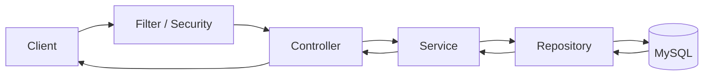

# Study Plan — 취업 증거 중심 Spring Backend 학습 트랙

> 기준일: 2026-07-22  
> 목표: 강의를 많이 들은 사람이 아니라, Java/Spring 백엔드 기능을 설계·구현·검증·배포하고 그 판단을 설명할 수 있는 신입 개발자가 된다.  
> 대표 명령: `week N 구현해`  
> 핵심 원칙: 기능 개수보다 깊이, 기술 이름보다 측정 결과, 완성 코드보다 설명 가능한 코드.

---

## 0. 이 문서의 사용법

이 파일은 학습 일정표이면서 AI가 따라야 할 실행 명세다. 저장소 루트에서 다음처럼 요청한다.

```text
week 3 구현해
week 4 강의자료 정리해
week 5 검증해
bridge 구현해
```

AI는 먼저 이 문서 전체와 해당 주차 섹션, 기존 코드, `study_docs/LEARNING_GUIDE_TEMPLATE.md`를 읽는다. 그다음 현재 상태에서 빠진 것만 구현하고 테스트한 뒤 강의자료까지 갱신한다.

### 2026-07-22 저장소 기준선

| 구간 | 현재 상태 | 다시 명령했을 때 할 일 |
|---|---|---|
| Week 0 | 미실행 | 저장소 구조 전환(5.5), Spring Core 실험, CI Skeleton |
| Week 1 | InMemory Todo API 구현됨 | 코드는 `archive/`로 동결. 문서와 누락 테스트만 보강 |
| Week 2 | JPA/MySQL StudyRoom CRUD 구현됨 | 코드는 `archive/`로 동결. 문서만 보강 |
| Week 3 | Access JWT 기본형과 통합 테스트 5개 구현됨 | 기존 테스트를 유지하고 Refresh Token·만료·로그아웃만 보강 후 `app/`으로 이전 |
| Bridge 이후 | 미구현 | `app/` 한 프로젝트에 누적해 구현 |

Week 1~3은 각각 독립 Gradle 프로젝트로 복사되어 있다. 이 방식은 Week 3에서 끝난다. Week 4부터는 5.5의 단일 프로젝트 구조를 사용한다.

파일이 존재한다는 이유만으로 완료 처리하지 않는다. 완료 기준은 실행 결과, 테스트, 학습자료, 설명 가능 여부로 판단한다.

### 이 트랙에서 말하는 ‘완주’

다음 네 가지가 모두 있어야 완주다.

1. **동작**: 요구 API가 실제 DB와 배포 환경에서 동작한다.
2. **검증**: 정상·실패·경계·동시성 테스트가 통과한다.
3. **증거**: 쿼리 수, 동시 요청 결과, EXPLAIN 등 개선 전후 수치가 남아 있다.
4. **설명**: 핵심 선택과 실패 원인을 본인의 말로 설명하고 주요 코드를 다시 작성할 수 있다.

---

# 1. 최종 취업 역량 목표

## 1.1 필수 역량

- Java 17+ 문법과 객체지향 설계
- Spring Boot, Spring MVC, IoC/DI, Bean, AOP Proxy
- REST API와 HTTP 상태 코드
- JPA/Hibernate, 영속성 컨텍스트, Transaction
- MySQL 데이터 모델링, SQL, Constraint, Index, EXPLAIN
- Spring Security, BCrypt, JWT 인증
- JUnit 5, MockMvc, Repository Test, Testcontainers
- Git Branch, Pull Request, Code Review, GitHub Actions
- Docker, 환경변수, Linux 기초, 외부 배포
- 로그, Request ID, Health Check, 장애 추적

## 1.2 이 프로젝트가 증명할 차별점

- 동시 예약 100건에서 문제를 재현하고 정확히 1건만 성공하도록 방어한다.
- N+1 쿼리를 재현하고 쿼리 수 Before/After를 기록한다.
- 검색 쿼리의 EXPLAIN을 비교하고 인덱스를 Flyway Migration으로 관리한다.
- PR마다 테스트와 Docker Build가 자동 실행된다.
- 외부에서 접근 가능한 API와 재현 가능한 실행 방법을 제공한다.

## 1.3 별도로 준비하는 영역

다음은 중요하지만 이 문서의 구현 트랙과 분리한다.

- 자료구조와 알고리즘 코딩테스트
- 운영체제, 네트워크, 데이터베이스 등 CS 면접
- 이력서 지원 전략과 기업별 면접 준비

단, 프로젝트에서 만난 CS 개념은 반드시 `study_docs/interview-notes.md`에 연결해 기록한다.

## 1.4 기본 트랙에서 넣지 않는 기술

다음 기술은 현재 문제를 해결하는 명확한 이유가 생기기 전에는 추가하지 않는다.

- Kubernetes
- Kafka
- MSA
- WebFlux
- 복잡한 디자인 패턴
- 성공 응답까지 감싸는 과도한 공통 Wrapper
- 기술 이름을 늘리기 위한 Redis
- 두 번째 평범한 CRUD 프로젝트

---

# 2. 개강 전 실행 일정

Week 1과 Week 2는 완료된 기준선으로 보고, 아래 일정은 원리 복습과 Week 3 이후 구현에 사용한다.

| 기간 | 실행 구간 | 핵심 결과 | 일수 |
|---|---|---|---:|
| 7/22~7/24 | Week 0 | Spring Core 원리 + 저장소 구조 확정 + Git/PR + 기본 CI | 3 |
| 7/25~7/27 | Week 3 | Refresh Token·로그아웃·만료 테스트 보강 | 3 |
| 7/28~8/1 | Bridge | JPA 원리(실험 기반) + Flyway + Testcontainers + CI 통합 | 5 |
| 8/2~8/5 | Week 4 | 예약 도메인 + 시간 모델링 + Transaction 실험 | 4 |
| 8/6~8/10 | Week 5 | 동시성 재현·해결·멀티스레드 검증 | 5 |
| 8/11 | Buffer A | Week 5 지연 흡수 전용 | 1 |
| 8/12~8/16 | Week 6 | 리뷰 + 검색/페이징 + N+1 개선 + Seed Data | 5 |
| 8/17 | Buffer B | Week 6 지연 흡수 전용 | 1 |
| 8/18~8/21 | Week 7 | 테스트 전략 + ErrorCode + Swagger + 로그 | 4 |
| 8/22~8/24 | Week 8 | EXPLAIN + 인덱스 개선 | 3 |
| 8/25~8/29 | Week 9 | Docker + 실배포 + 루트 README | 5 |
| 8/30~9/1 | Buffer C | 복습, 면접 설명 연습, Velog 마무리 | 3 |

합계는 42일이다.

### Buffer 사용 규칙

Buffer는 세 곳에 나눠 배치한다. 마지막에 몰아 두면 앞 구간이 밀릴 때 "나중에 하면 된다"로 넘어가고, 결국 Week 9 배포가 Buffer를 통째로 잡아먹는다.

- **Buffer A(8/11), B(8/17)**: 바로 앞 구간이 밀렸을 때만 사용한다. 앞 구간이 제때 끝났으면 그날은 복습과 면접 노트 정리에 쓴다. 다음 구간을 당겨서 시작하지 않는다.
- **Buffer C(8/30~9/1)**: 기능 구현에 사용하지 않는다. 여기까지 기능이 밀렸다면 Week 10~12가 아니라 Week 6 리뷰 기능부터 축소한다.
- Week 9(배포)에 5일을 배정한 이유는 첫 배포가 거의 항상 하루를 소모하기 때문이다. 배포를 Buffer C로 미루지 않는다.

### 시간 부족 시 자르는 순서

1. Week 11 k6와 Connection Pool
2. Week 10 Redis
3. Week 6 찜 기능은 구현하지 않음
4. Refresh Token의 고급 재사용 탐지
5. 부가적인 리뷰 수정·삭제 기능

동시성, N+1, 인덱스, 테스트, CI, 배포는 자르지 않는다.

---

# 3. AI가 반드시 지켜야 할 공통 규칙

## 3.1 작업 전

1. `Study_plan.md` 전체와 해당 주차 섹션을 읽는다.
2. 기존 `README.md`, `LEARNING_GUIDE.md`, 테스트, 설정을 확인한다.
3. `git status`를 확인하고 사용자의 변경을 덮어쓰지 않는다.
4. 이전 주차의 완료 기준이 현재 구현에 필요한 만큼 충족됐는지 점검한다.
5. 이번 주차에서 구현할 것과 구현하지 않을 것을 짧게 알린다.

## 3.2 구현 중

- Controller에서 Repository를 직접 호출하지 않는다.
- Entity 또는 Domain 객체를 API 응답으로 직접 노출하지 않는다.
- 비밀번호, JWT, Refresh Token, Cookie, DB Secret을 로그나 Git에 남기지 않는다.
- 현재 주차 범위를 넘는 기술은 넣지 않는다.
- 학습자가 설명하기 어려운 추상화와 계층을 만들지 않는다.
- 코드는 ‘무엇을 하는지’보다 ‘왜 이렇게 선택했는지’가 필요한 곳에만 주석을 단다.
- 요구사항·DB Constraint·Service 검증·테스트가 서로 같은 규칙을 표현하게 한다.
- 시간, 인증, 동시성 테스트는 우연히 통과하지 않도록 결정적으로 작성한다.
- 불안정한 최신 정보는 공식 문서를 확인하고 출처를 가이드에 남긴다.

## 3.3 기존 주차를 다시 실행할 때

- 디렉터리를 삭제하거나 프로젝트를 새로 만들지 않는다.
- **Week 4 이후에는 `weekN/` 디렉터리를 새로 만들지 않는다.** 코드는 `app/` 한 곳에 누적하고 문서만 `docs/weekN/`에 둔다. 자세한 규칙은 5.5를 따른다.
- `archive/` 아래 코드는 수정하지 않는다.
- 이미 통과하는 테스트를 삭제해 테스트 수를 줄이지 않는다.
- 기존 API 계약을 바꿔야 한다면 이유와 Migration 방법을 먼저 설명한다.
- 누락 기능, 실패 테스트, 문서 불일치만 보강한다.
- 사용자가 직접 작성한 회고와 답변은 AI 문장으로 덮어쓰지 않는다.

## 3.4 완료 전

1. 자동 테스트를 실행한다.
2. 가능하면 실제 MySQL 또는 Testcontainers 검증을 실행한다.
3. API 예제를 실제 Controller 경로와 대조한다.
4. Mermaid Fence, Markdown 링크, 한글 인코딩을 확인한다.
5. Secret과 민감정보가 포함됐는지 검색한다.
6. 완료한 항목과 아직 하지 않은 항목을 구분해 보고한다.

---

# 4. `week N 구현해` 명령 계약

## 4.1 지원 명령

| 명령 | 수행 내용 |
|---|---|
| `week N 구현해` | 해당 주차 코드·테스트·강의자료·API 예제·검증 전체 수행 |
| `N주차 구현해` | `week N 구현해`와 동일 |
| `week N 강의자료 정리해` | 코드를 변경하지 않고 현재 구현 기준 `LEARNING_GUIDE.md` 보강 |
| `week N 코드 해부해` | 요청 흐름, 계층 책임, 핵심 Annotation, SQL을 실제 코드와 연결해 설명 |
| `week N 다시 쓰기` | 파일 삭제 없이 학습자가 재작성할 순서와 작은 과제 제시 |
| `week N 검증해` | 완료 기준, 테스트, 문서, Secret, API 불일치를 점검 |
| `week N 면접 점검해` | 질문을 한 번에 하나씩 내고 답변의 정확성과 근거를 피드백 |
| `bridge 구현해` | Week 3과 Week 4 사이의 Flyway·Testcontainers·JPA 원리·CI 보강 |
| `week 0 구현해` | Spring Core 원리 학습자료와 Git/PR/CI 기반 구성 |

N은 1~12다. Week 10~12는 선택 고도화이며 개강 전 필수 범위가 아니다.

## 4.2 전체 실행 순서

`week N 구현해`를 받으면 AI는 다음 순서를 지킨다.

### A. 진단

1. 해당 주차 요구사항과 완료 기준을 추출한다.
2. 현재 구현, 테스트 수, API, DB Schema, 문서를 표로 비교한다.
3. 기존 구현이 있으면 ‘유지 / 수정 / 추가’로 작업 범위를 나눈다.

### B. 구현

4. 실패하는 테스트 또는 검증 시나리오를 먼저 만든다.
5. 학습 범위 안에서 가장 단순한 구현으로 통과시킨다.
6. DB 변경은 Flyway 도입 이후 반드시 Migration으로 관리한다.
7. 정상·실패·경계 조건을 구현한다.

### C. 강의자료

8. `study_docs/LEARNING_GUIDE_TEMPLATE.md`에 따라 `weekN/LEARNING_GUIDE.md`를 작성한다.
9. 용어를 쉬운 말 → 정확한 정의 → 현재 코드 위치 순서로 설명한다.
10. Mermaid 구조도를 최소 3개 포함한다.
11. 직접 실행할 순서, 다시 작성할 순서, FAQ, 자가 질문을 포함한다.
12. 실제 코드와 다른 일반론을 넣지 않는다.

### D. 증거와 검증

13. `README.md`와 `requests.http`를 갱신한다.
14. 해당 주차의 측정 보고서를 작성한다.
15. 모든 관련 테스트를 실행한다.
16. 테스트 개수와 성공·실패 결과를 보고한다.
17. 학습자가 직접 답할 질문은 답을 대신 꾸미지 말고 `[직접 작성]`으로 남긴다.

---

# 5. 매주 생성·갱신할 산출물

## 5.1 기본 파일

```text
weekN/
├─ README.md
├─ LEARNING_GUIDE.md
├─ requests.http
├─ src/main/...
└─ src/test/...
```

- `README.md`: 실행, 환경변수, API 목록, 테스트 명령, 가이드 링크
- `LEARNING_GUIDE.md`: 해당 주차의 통합 강의자료
- `requests.http`: 정상·실패·인증·경계 요청을 실행 순서대로 제공
- `src/test`: 학습 목표를 증명하는 자동 테스트

## 5.2 주차별 증거 문서

필요한 주차에 다음 파일을 추가한다.

| 구간 | 증거 문서 | 반드시 기록할 것 |
|---|---|---|
| Week 0 | `study_docs/spring-core-notes.md` | IoC/DI, Singleton, Proxy, OCP/DIP 답변 |
| Bridge | `study_docs/jpa-core-notes.md` | 영속성 컨텍스트, LAZY Proxy, Transaction 실험 |
| Week 4 | `docs/week4/DESIGN_DECISIONS.md` | 시간 타입, 경계 규칙, 연관관계 선택 |
| Week 5 | `docs/week5/CONCURRENCY_REPORT.md` | 재현 방법, 선택지 비교, 100건 결과 |
| Week 6 | `docs/week6/N_PLUS_ONE_REPORT.md` | 데이터 수, 쿼리 수 Before/After, Seed Data 생성 방법 |
| Week 7 | `docs/week7/TEST_STRATEGY.md` | 단위·Slice·통합 테스트 구분과 목적 |
| Week 8 | `docs/week8/INDEX_REPORT.md` | EXPLAIN, rows, 실행 시간, 인덱스 Trade-off |
| Week 9 | `docs/week9/DEPLOYMENT_RUNBOOK.md` | 배포·Health Check·로그·비용·복구 방법 |

## 5.3 학습 가이드 품질 기준

모든 `LEARNING_GUIDE.md`는 다음 8개 대단원을 유지한다.

1. 먼저 알아야 할 단어
2. 전체 구조도
3. 요청별 코드 흐름
4. 파일별 역할 지도
5. 추천 학습 순서
6. 다시 작성해 보는 순서
7. 자주 헷갈리는 질문
8. 스스로 답해 볼 완료 질문

Mermaid 구조도에는 최소한 다음이 있어야 한다.

- 시스템 또는 계층 전체 흐름
- 성공과 실패가 갈리는 판단 흐름
- 핵심 요청 Sequence Diagram

## 5.4 면접 노트

매일 학습자가 답한 문장 중 면접에서 사용할 수 있는 것을 `study_docs/interview-notes.md`에 누적한다.

```markdown
## Week N — 주제

- 질문:
- 내 답변: [직접 작성]
- 코드 근거:
- 수치 또는 테스트 근거:
- 추가로 확인할 것:
```

AI는 답변 초안을 제안할 수 있지만 학습자의 실제 경험인 것처럼 대신 작성하지 않는다.

## 5.5 저장소 구조 전략

### 지금까지의 방식과 그 한계

Week 1~3은 매주 이전 주차 디렉터리를 통째로 복사해 새 Gradle 프로젝트를 만드는 방식이었다. Week 3까지는 문제가 없었지만 Week 4부터는 다음이 전부 깨진다.

- **Flyway**: 매주 복사하면 Migration 이력이 주차마다 초기화된다. 누적된 스키마 변경 기록이라는 Flyway의 존재 이유가 사라진다.
- **CI**: GitHub Actions가 어느 프로젝트를 빌드해야 하는지 정의할 수 없다. 전부 빌드하면 느리고, 하나만 빌드하면 나머지는 죽은 코드다.
- **배포**: 배포 대상이 `week9/`라는 이름의 디렉터리가 된다.
- **채용 제출**: 담당자가 저장소를 열면 비슷한 프로젝트 9개를 보게 되고 최종본을 구분할 수 없다.

### Week 4부터 적용할 구조

Week 0에서 아래 구조로 전환하고, 이후에는 디렉터리를 복사하지 않는다.

```text
저장소 루트/
├─ README.md              ← 채용 담당자용 포트폴리오 진입점 (Week 9에서 완성)
├─ Study_plan.md
├─ AGENTS.md
├─ .gitignore             ← 루트 공통
├─ app/                   ← Week 4부터 이 프로젝트 하나만 발전시킨다
│  ├─ src/main, src/test
│  ├─ src/main/resources/db/migration/   ← Flyway
│  ├─ Dockerfile, docker-compose.yml
│  └─ build.gradle.kts
├─ docs/                  ← 주차별 증거 문서
│  ├─ week4/DESIGN_DECISIONS.md
│  ├─ week5/CONCURRENCY_REPORT.md
│  ├─ week6/N_PLUS_ONE_REPORT.md
│  ├─ week7/TEST_STRATEGY.md
│  ├─ week8/INDEX_REPORT.md
│  └─ week9/DEPLOYMENT_RUNBOOK.md
├─ archive/               ← 학습 기록으로 동결. 더 이상 수정하지 않는다
│  ├─ week1/  (InMemory Todo API)
│  ├─ week2/  (JPA CRUD)
│  └─ week3/  (인증)
└─ study_docs/
```

### 전환 규칙

- `app/`의 출발점은 Week 3 결과물이다. Week 3 완료 직후 `week3/`를 `app/`으로 옮기고, `archive/week3/`에는 그 시점의 사본을 남긴다.
- `archive/`의 코드는 읽기 전용이다. 버그를 발견해도 고치지 않고 `app/`에서만 고친다.
- Week 4~9의 `LEARNING_GUIDE.md`는 `docs/weekN/LEARNING_GUIDE.md`에 둔다. 코드는 `app/` 한 곳에만 있다.
- CI, Flyway, Docker, 배포의 대상은 언제나 `app/` 하나다.
- 5.1의 `weekN/` 디렉터리 규칙은 Week 1~3(archive)에만 적용된다.

### 저장소 위생

Week 0에서 함께 정리한다. 채용 담당자에게 그대로 보이는 부분이다.

- 루트 `.gitignore` 생성: `build/`, `.gradle/`, `.idea/`, `*.zip`, `.env`, `*.log`
- 이미 커밋된 `todo-api.zip`, `.idea/` 제거 (`git rm -r --cached`)
- 빌드 산출물과 IDE 설정이 추적되지 않는지 `git ls-files`로 확인

---

# 6. 공통 설계와 기술 기준

## 6.1 기본 요청 구조



## 6.2 계층 책임

| 계층 | 책임 | 하지 않을 일 |
|---|---|---|
| Controller | HTTP 입력·상태 코드·DTO·Validation | 업무 규칙과 Repository 호출 |
| Service | 업무 규칙·Transaction·권한 검증 | HTTP 객체 직접 처리 |
| Repository | 저장·조회·Lock·Query | API 응답 생성 |
| Entity/Domain | 상태와 불변 조건 | 요청 DTO 역할 |
| Security Filter | Token 해석과 인증 객체 생성 | 회원가입·예약 업무 처리 |

## 6.3 Java 코드 리뷰 기준

매주 다음을 함께 점검한다.

- Interface가 실제 교체 가능성이나 경계를 표현하는가?
- 생성자 주입을 사용하는가?
- Null과 빈 Collection의 계약이 명확한가?
- Entity의 `equals/hashCode`를 무심코 생성하지 않았는가?
- 시간은 `Clock`으로 테스트 가능한가?
- 변경 가능한 공유 상태가 Singleton Bean에 들어가지 않았는가?
- Stream이 반복문보다 읽기 쉬운 경우에만 사용됐는가?
- 예외 이름이 실패 원인을 표현하는가?

## 6.4 API 기준

- 생성 성공: 201
- 조회·수정 성공: 200
- 삭제 성공: 204
- 요청 값 오류: 400
- 인증 실패: 401
- 권한 부족: 403
- 자원 없음: 404
- 중복·상태 충돌·예약 충돌: 409
- 목록 API는 안정적인 정렬 기준과 Pagination을 가진다.
- 재시도될 수 있는 쓰기 요청은 Idempotency 필요 여부를 기록한다.

---

# 7. Week 0 — Spring Core, Git/PR, CI 기초

## 목표

Spring이 객체를 만들고 연결하며 Proxy로 부가기능을 적용하는 원리를 이해한다. 동시에 이후 모든 기능이 Branch → PR → CI를 거치도록 최소 개발 흐름을 만든다.

## 핵심 용어

- IoC와 DI
- ApplicationContext
- Bean 등록과 조회
- 생성자 주입
- Singleton Scope와 상태 공유 위험
- OCP와 DIP
- AOP, Proxy, Self-invocation
- Branch, Commit, Pull Request, CI

## 학습 방식 — 강의를 보지 않는다

이 트랙은 강의 시청을 학습 수단으로 사용하지 않는다. 보유 중인 김영한 PDF는 **막혔을 때만 찾아보는 사전**이고, 처음부터 읽는 교재가 아니다. 완독은 완료 기준이 아니다.

Spring Core는 개념 설명을 듣는 대신 **동작을 재현하는 코드를 직접 실행해서** 익힌다. Bridge의 JPA 학습도 같은 방식이다. 면접 답변으로도 "강의에서 그렇게 설명했습니다"보다 "직접 재현해봤고 코드는 여기 있습니다"가 낫다.

### 막혔을 때만 찾아볼 위치

| 막힌 주제 | 찾아볼 곳 |
|---|---|
| IoC/DI, 컨테이너, Bean, Singleton, Component Scan, 의존관계 주입 | `spring-basic.zip` 해당 장 |
| AOP와 Proxy | `spring-start-v20260130/7. AOP.pdf` |
| 그 외 | Spring Framework Reference — Core / Testing |

## 학습·구현 항목

### 실험 (각 항목마다 실행 가능한 코드를 남긴다)

| # | 확인할 동작 | 코드로 증명할 것 |
|---|---|---|
| 1 | DI의 효과 | Week 1의 `TodoRepository` 구현체를 교체할 때 `TodoService`가 바뀌지 않음을 보인다. OCP/DIP를 이 코드로 설명한다 |
| 2 | Singleton Scope | 같은 타입 Bean을 두 곳에서 주입받아 `==`가 참임을 확인한다 |
| 3 | Singleton 상태 공유 위험 | Bean에 변경 가능한 필드를 두고 멀티스레드로 접근해 값이 깨지는 것을 재현한다 |
| 4 | Proxy의 존재 | `@Transactional` Bean의 `getClass().getName()`에 CGLIB 표식이 붙는 것을 확인한다 |
| 5 | Component Scan 범위 | 스캔 대상 밖 패키지에 `@Component`를 두고 Bean 등록 실패를 재현한다 |
| 6 | Filter와 AOP의 차이 | Filter와 AOP Advice에 로그를 심어 실행 순서를 출력하고, 둘이 다른 기술임을 설명한다 |

Self-invocation에서 Transaction이 풀리는 재현은 Bridge 8번에서 다룬다. 여기서는 Proxy가 존재한다는 사실까지만 확인한다.

### 저장소 정비

7. **5.5의 저장소 구조로 전환한다.** `archive/` 이동, 루트 `.gitignore` 생성, `todo-api.zip`과 `.idea/` 추적 해제.
8. Feature Branch와 PR Template을 만든다.
9. GitHub Actions에서 기본 Gradle Test가 실행되는 CI Skeleton을 만든다. 빌드 대상은 `app/` 하나다.

## 필수 산출물

`study_docs/spring-core-notes.md`에 다음 질문의 답을 작성한다.

1. 생성자 주입을 쓰는 이유 세 가지는 무엇인가?
2. Singleton Bean에 변경 가능한 상태를 두면 왜 위험한가?
3. `@Transactional`이 Proxy로 동작한다는 것은 무슨 뜻인가?
4. 같은 클래스 내부 호출에서 `@Transactional`이 적용되지 않을 수 있는 이유는 무엇인가?
5. Week 1의 `TodoRepository`는 OCP/DIP와 어떤 관계인가?
6. Security Filter Chain과 Spring AOP Proxy는 어떻게 다른가?

## 완료 기준

- [ ] DI와 객체 직접 생성을 비교해 설명할 수 있다.
- [ ] Singleton 상태 공유 문제를 재현했다.
- [ ] Proxy를 거친 호출과 내부 호출의 차이를 그림으로 설명했다.
- [ ] 5.5 구조로 전환됐고 `archive/`의 Week 1~2가 동결됐다.
- [ ] `git ls-files`에 빌드 산출물·IDE 설정·zip이 없다.
- [ ] Feature Branch에서 PR을 만들었다.
- [ ] PR에서 Gradle Test가 자동 실행된다.
- [ ] 본인의 답변이 `spring-core-notes.md`에 남아 있다.

---

# 8. Week 1 — Spring MVC와 계층형 InMemory Todo API

## 목표

DB와 Security 없이 HTTP 요청이 Controller, Service, Repository, Domain을 지나 응답으로 돌아오는 기본 구조를 이해한다.

## 구현 기능

1. Hello API
2. Todo 생성
3. 전체·단건 조회
4. 제목·설명 수정
5. 완료 처리
6. 삭제
7. Validation과 공통 예외 응답
8. InMemory Repository

## 요구 API

```http
GET    /api/hello
POST   /api/todos
GET    /api/todos
GET    /api/todos/{id}
PATCH  /api/todos/{id}
PATCH  /api/todos/{id}/complete
DELETE /api/todos/{id}
```

## 핵심 학습

- Spring Boot 시작 구조
- `@RestController`, Mapping Annotation, `@RequestBody`, `@PathVariable`
- DTO와 Domain 분리
- Constructor Injection
- Interface 기반 Repository
- Domain 내부 상태 변경
- `@Valid`와 `@RestControllerAdvice`
- HTTP Method와 상태 코드

## 필수 테스트

- 생성 후 조회
- 수정과 완료 처리
- 삭제 후 404
- 잘못된 요청 400
- 존재하지 않는 ID 404

## 완료 기준

- [ ] 요청 흐름을 계층 순서대로 설명할 수 있다.
- [ ] Controller에서 Repository를 직접 호출하지 않는다.
- [ ] Domain을 응답으로 직접 노출하지 않는다.
- [ ] 서버를 다시 시작하면 데이터가 사라지는 이유를 설명한다.
- [ ] 핵심 파일을 순서대로 다시 작성할 수 있다.
- [ ] `week1/LEARNING_GUIDE.md`가 공통 템플릿 형식을 따른다.

## 직접 다시 작성할 순서

DTO → Domain → Repository Interface → InMemory 구현체 → Service → Controller → Exception Handler → Integration Test

---

# 9. Week 2 — JPA와 MySQL StudyRoom CRUD

## 목표

Week 1의 계층 구조를 유지하면서 저장 기술을 Map에서 MySQL/JPA로 바꾸고, Entity와 Transaction의 역할을 이해한다.

## 구현 기능

1. MySQL 연결
2. StudyRoom Entity
3. 생성·전체 조회·단건 조회·부분 수정·삭제
4. User Entity 기반
5. Entity와 DTO 분리
6. Validation
7. 읽기·쓰기 Transaction 분리
8. H2 기반 빠른 자동 테스트

## 요구 API

```http
POST   /api/study-rooms
GET    /api/study-rooms
GET    /api/study-rooms/{id}
PATCH  /api/study-rooms/{id}
DELETE /api/study-rooms/{id}
```

## 핵심 학습

- Table, Row, Column, PK, FK
- JPA, Hibernate, Spring Data JPA 차이
- `@Entity`, `@Id`, IDENTITY
- 영속성 컨텍스트와 1차 Cache
- 변경 감지
- `@Transactional(readOnly = true)`의 의미와 한계
- `JpaRepository` 구현체가 생성되는 방식
- MySQL과 H2 차이

## 필수 테스트

- CRUD 통합 흐름
- Entity가 아니라 Response DTO가 반환되는지
- Validation 400
- 없는 StudyRoom 404
- 수정 시 변경 감지 결과

## 완료 기준

- [ ] MySQL에 데이터가 저장된다.
- [ ] Entity와 DTO의 분리 이유를 설명한다.
- [ ] 수정 시 `save()` 없이 UPDATE되는 이유를 설명한다.
- [ ] H2 통과가 MySQL 동작을 보장하지 않는 이유를 설명한다.
- [ ] JPA가 실행한 SQL을 요청과 연결할 수 있다.
- [ ] `week2/LEARNING_GUIDE.md`가 공통 템플릿 형식을 따른다.

---

# 10. Week 3 — Spring Security, JWT, Refresh Token

## 목표

비밀번호를 안전하게 저장하고, Access Token으로 사용자를 인증하며, Refresh Token의 발급·재발급·무효화 흐름을 구현한다.

## 이번 구간의 실제 범위 (3일)

Week 3은 이미 절반 이상 구현돼 있다. 회원가입·로그인·Access JWT·내 정보 조회·통합 테스트 5개가 완료 상태이므로, 이 구간에서 새로 만드는 것은 Refresh Token 저장·재발급·Rotation·로그아웃·`Clock` 기반 만료 테스트뿐이다. 처음부터 다시 만들지 않는다.

구간 종료 시 `week3/`를 `app/`으로 옮기고 `archive/week3/`에 사본을 남긴다(5.5 참고). 이후 모든 주차는 `app/` 하나에서 진행한다.

## 기존 기준선

현재 저장소에는 회원가입, 로그인, Access JWT, 내 정보 조회와 다음 통합 테스트 5개가 있다.

- 비밀번호 BCrypt Hash 저장
- 로그인 후 JWT로 내 정보 조회
- Token 없는 보호 API 401
- 중복 이메일 409
- 틀린 비밀번호 401

이 테스트를 삭제하거나 세 개로 축소하지 않는다.

## 구현 기능

1. 회원가입
2. BCrypt 비밀번호 Hash
3. 로그인과 짧은 만료시간의 Access JWT
4. 내 정보 조회
5. DB에 Refresh Token Hash와 만료 상태 저장
6. 재발급 시 Refresh Token Rotation
7. 로그아웃 시 Refresh Token 무효화
8. 만료·위조·누락 Token 401
9. `Clock` 주입으로 결정적인 만료 테스트

## Token 설계 기준

- Access Token: JWT, 짧은 만료, API 인증에 사용
- Refresh Token: 충분히 무작위인 Opaque Token을 기본안으로 사용
- 서버 저장: DB에 원문이 아닌 Hash 저장
- 클라이언트 전달: API 학습 단계에서는 응답 Body를 사용하고, Frontend가 생기면 HttpOnly·Secure·SameSite Cookie를 별도 검토
- DB/Redis는 서버 저장 위치이고 Cookie는 클라이언트 전달 방식이므로 같은 선택지로 비교하지 않는다.

## 요구 API

```http
POST /api/auth/signup
POST /api/auth/login
POST /api/auth/reissue
POST /api/auth/logout
GET  /api/members/me
```

## 핵심 학습

- 인증과 인가
- Hash와 Encryption
- BCrypt Salt와 Cost
- JWT Header·Payload·Signature
- Bearer Token
- Stateless
- Security Filter Chain
- `SecurityContext`와 `Authentication`
- Access/Refresh Token 책임 분리
- Rotation과 Logout 무효화
- 401과 403
- CSRF와 CORS의 적용 조건

## 추가 필수 테스트

- 만료 Access Token으로 보호 API 요청 시 401
- 정상 Refresh Token 재발급 성공
- 재발급 후 이전 Refresh Token 재사용 실패
- 로그아웃 후 재발급 실패
- 위조 Token 401

## 완료 기준

- [ ] 비밀번호 원문이 DB와 응답과 로그에 없다.
- [ ] Access Token 만료를 `Clock`으로 테스트한다.
- [ ] Refresh Token 원문을 DB에 저장하지 않는다.
- [ ] 재발급 시 기존 Refresh Token이 무효화된다.
- [ ] 로그아웃 후 재발급할 수 없다.
- [ ] Filter가 Authentication을 만드는 흐름을 설명한다.
- [ ] 테스트가 기존 5개보다 줄지 않았다.
- [ ] `LEARNING_GUIDE.md`에 BCrypt·JWT·재발급 Mermaid가 있다.

## 이번 주에 하지 않을 것

- OAuth2 Social Login
- Redis Token 저장
- 역할이 여러 개인 복잡한 RBAC
- Frontend Cookie 연동

---

# 11. Bridge — Flyway, Testcontainers, JPA 원리, CI 통합

## 목표

예약과 동시성 구현 전에 Schema 변경, 실제 MySQL 테스트, JPA Proxy와 Transaction을 검증할 기반을 만든다.

## JPA 학습 방식 — 강의 없이 진행한다

JPA 전용 강의는 구매하지 않는다. Week 0과 동일하게 **동작을 증명하는 테스트를 직접 작성하는 방식**으로 진행한다.

### 막혔을 때만 찾아볼 위치

| 막힌 주제 | 찾아볼 곳 |
|---|---|
| 이미 정리한 영속성 컨텍스트·변경 감지 | `week2/LEARNING_GUIDE.md` (본인이 작성한 것) |
| 영속성 컨텍스트, Flush, Proxy, Fetching | Hibernate ORM User Guide |
| Repository, 파생 Query, `@EntityGraph` | Spring Data JPA Reference |
| Transaction 경계와 전파 | Spring Framework Reference — Data Access |
| JPA 기본 사용법 | `spring-start-v20260130/6. 스프링 DB 접근 기술.pdf` |

공식 문서는 처음부터 읽지 않는다. 아래 실험에서 막히는 지점만 찾아 읽고, 읽은 위치를 `jpa-core-notes.md`에 링크로 남긴다. 문서를 다 읽는 것은 완료 기준이 아니다.

## 5일 실행 순서

### 1~2일차 — JPA 원리 (실험으로 학습)

각 항목마다 **그 동작을 증명하는 테스트를 하나씩** 작성한다. 테스트 이름이 곧 학습 내용이 되게 쓴다.

| # | 확인할 동작 | 테스트로 증명할 것 |
|---|---|---|
| 1 | 1차 캐시 | 같은 트랜잭션에서 같은 ID를 두 번 조회하면 SELECT가 1번만 나간다 |
| 2 | 변경 감지 | `save()` 없이 필드만 바꿔도 커밋 시 UPDATE가 나간다 |
| 3 | Flush 시점 | 커밋 전에 JPQL을 실행하면 그 전에 Flush가 먼저 일어난다 |
| 4 | 동일성 보장 | 같은 트랜잭션의 두 조회 결과가 `==`로 같다 |
| 5 | LAZY Proxy | 연관 Entity가 실제 클래스가 아닌 Proxy이고, 필드 접근 시점에 SELECT가 나간다 |
| 6 | 준영속 상태 | 트랜잭션 밖에서 LAZY 필드에 접근하면 `LazyInitializationException`이 난다 |
| 7 | OSIV | OSIV를 끈 상태에서 6번이 재현되는 것을 확인하고, 끈 이유를 적는다 |
| 8 | Self-invocation | 같은 객체 내부 호출에서는 `@Transactional`이 적용되지 않는다 |

- 5·6번이 Week 6 N+1의 전제이고, 8번이 Week 4 Transaction 심화의 전제다. 여기서 건너뛰면 뒤에서 반드시 막힌다.
- 트랜잭션 활성 여부는 `TransactionSynchronizationManager.isActualTransactionActive()`로 단정한다. 로그를 눈으로 보고 판단하지 않는다.
- 쿼리 수는 Hibernate Statistics로 센다. Week 6에서 같은 도구를 그대로 쓴다.
- 8개 테스트는 `app/src/test/.../experiments/` 아래에 모아 두고 Production 코드를 일부러 훼손하지 않는다.

### 3일차 — Flyway

- 초기 Schema를 `V1__init.sql`로 표현
- 이후 변경을 새로운 Version Migration으로 추가
- 적용된 Migration을 수정하지 않고 Roll-forward
- 애플리케이션 설정을 최종적으로 `ddl-auto: validate`로 전환
- 기존 개발 DB 데이터가 있다면 삭제 전에 반드시 사용자에게 확인

### 4일차 — Testcontainers MySQL

- H2 테스트는 빠른 Feedback 용도로 유지 가능
- MySQL 고유 동작은 MySQL Container에서 검증
- `@ServiceConnection` 또는 명시적 Test 설정
- Container 생명주기와 Context Cache 이해

### 5일차 — CI 통합

- PR에서 Gradle Test
- Testcontainers MySQL Test
- Flyway Migration 검증
- 실패 시 Merge하지 않는 규칙

## 추가 실험

위 8개 외에 다음을 기록한다.

- H2와 MySQL에서 Constraint 또는 SQL 동작 차이 하나

실험 코드는 Production Service를 일부러 이상하게 만들지 말고 별도 Test 또는 `experiments` 패키지에 둔다.

## 완료 기준

- [ ] JPA 실험 8개가 모두 통과하는 테스트로 남아 있다.
- [ ] 각 실험이 무엇을 증명하는지 `study_docs/jpa-core-notes.md`에 본인 문장으로 적혀 있다.
- [ ] LAZY Proxy 초기화 시점과 `LazyInitializationException` 발생 조건을 설명한다.
- [ ] Self-invocation 실험 결과가 `jpa-core-notes.md`에 있다.
- [ ] `ddl-auto: validate`로 애플리케이션이 시작된다.
- [ ] 새 DB가 Flyway만으로 생성된다.
- [ ] MySQL Testcontainers 테스트가 로컬과 CI에서 통과한다.
- [ ] Transaction이 새 Thread로 자동 전파되지 않음을 설명한다.
- [ ] Week 4가 이 기반을 그대로 사용한다.

---

# 12. Week 4 — 예약 도메인과 시간 모델링

## 목표

사용자와 StudyRoom을 연결하는 Reservation을 설계하고, 시간·상태·소유권 규칙을 명확하게 구현한다.

## 구현 기능

1. 예약 생성
2. 내 예약 목록 조회
3. 예약 취소
4. 본인 예약만 취소
5. 과거 예약 금지
6. 시작·종료 시간 검증
7. 취소 상태 관리
8. 애플리케이션 수준 시간 중복 검사

## 시간 설계 결정

`DESIGN_DECISIONS.md`에 다음을 결정하고 이유를 적는다.

- API가 `OffsetDateTime`을 받을지
- DB에 `Instant` 또는 `LocalDateTime` 중 무엇을 저장할지
- 서비스 기준 Timezone
- 분·초 중 어느 정밀도까지 허용할지
- `기존 종료 == 새 예약 시작`을 허용할지
- 취소된 예약을 중복 검사에서 제외할지

기본 중복 조건은 다음 반개구간 규칙을 사용한다.

```text
existing.start < requested.end
AND
existing.end > requested.start
```

## Entity 기준

- `Reservation → User`: `@ManyToOne(fetch = LAZY)`
- `Reservation → StudyRoom`: `@ManyToOne(fetch = LAZY)`
- `ReservationStatus`: 최소 `ACTIVE`, `CANCELLED`
- DB FK와 NOT NULL Constraint
- 생성·수정 Schema는 Flyway Migration

## 요구 API

```http
POST  /api/reservations
GET   /api/reservations/me
PATCH /api/reservations/{id}/cancel
```

## 필수 테스트

- 정상 예약 생성
- 과거 시간 실패
- 시작이 종료보다 같거나 늦으면 실패
- 경계 시간이 맞닿은 예약 정책
- 다른 사용자의 예약 취소 403
- 이미 취소된 예약 재취소 409
- 내 예약만 조회
- 순차 요청에서 시간 중복 409

## Transaction 심화

- 조회 Service는 `readOnly = true`
- 쓰기 Service는 Transaction
- `readOnly`가 쓰기를 물리적으로 완전히 금지하는 장치가 아님을 설명
- Self-invocation은 별도 실험으로만 재현

## 완료 기준

- [ ] 시간 정책이 문서·Service·Query·Test에서 일치한다.
- [ ] 모든 To-One 연관관계가 명시적으로 LAZY다.
- [ ] 소유권 검증 위치를 설명할 수 있다.
- [ ] 취소는 삭제가 아니라 상태 전이로 구현됐다.
- [ ] 순차 중복 검사는 통과하지만 동시성 한계가 남음을 설명한다.

---

# 13. Week 5 — 예약 동시성 제어

## 목표

‘조회 후 저장’ 사이의 Race Condition을 실제 MySQL에서 재현하고, 해결책을 선택해 정확히 한 건만 성공함을 자동 테스트로 증명한다.

## 1단계 — 문제 재현

- `ExecutorService`로 같은 시간대 예약을 100건 발사
- `CountDownLatch` 또는 `CyclicBarrier`로 시작 시점을 맞춤
- 각 작업은 Spring Proxy를 통해 별도 Transaction으로 실행
- Testcontainers MySQL 사용
- 실패 해결 전 중복 예약이 두 건 이상 저장되는 결과 기록

## 2단계 — 해결책 비교

| 해결책 | 적합한 경우 | 이 도메인에서 확인할 점 |
|---|---|---|
| Unique Constraint | 동일 Slot처럼 값으로 유일성을 표현 가능 | 임의 시간 구간 겹침은 단순 Unique로 막기 어려움 |
| 비관적 Lock | 충돌 가능성이 높고 즉시 직렬화 필요 | 조회 결과가 0건일 때 잠글 Row가 있는가 |
| 낙관적 Lock | 충돌이 드물고 재시도 가능 | 예약 생성처럼 기존 Row가 없는 상황에 적합한가 |

세 방식을 Production에 모두 넣지 않는다. 문서로 비교한 뒤 한 방식을 선택한다.

## 기본 구현 후보

항상 존재하는 `StudyRoom` Row를 `PESSIMISTIC_WRITE`로 Lock한다.

```text
StudyRoom Row Lock
→ 겹치는 ACTIVE 예약 조회
→ 없으면 저장
→ Commit 후 Lock 해제
```

Lock Timeout을 설정하고, 예약 충돌은 409로 변환한다.

Deadlock에 대해서는 "가능성을 설명"하지 않는다. 위 기본안처럼 항상 존재하는 단일 `StudyRoom` Row 하나만 잠그면 Lock 획득 순서가 엇갈릴 수 없으므로 Deadlock이 구조적으로 발생하지 않는다. 대신 **"이 설계에서 Deadlock이 생기지 않는 이유는 무엇이고, 어떤 설계로 바꾸면 생기는가"**를 설명한다. 없는 위험을 설명하려 하면 근거 없는 일반론이 된다.

## 필수 테스트

- Lock 없는 재현 테스트 또는 기록
- 동시 요청 100건 중 정확히 1건 성공
- DB 최종 ACTIVE 예약 수 1건
- 나머지 요청은 정의된 충돌 예외
- 반복 실행해도 결과 동일
- 서로 다른 StudyRoom 예약은 불필요하게 직렬화되지 않음
- 서로 겹치지 않는 시간대는 모두 성공

## 필수 보고서

`CONCURRENCY_REPORT.md`:

1. 문제 상황
2. 재현 환경과 Test 구조
3. 세 해결책 비교
4. 선택한 해결책과 이유
5. 적용 전 결과
6. 적용 후 결과
7. Lock 범위와 한계
8. 실제 서비스에서 추가할 것

## 완료 기준

- [ ] Testcontainers MySQL에서 100건 검증이 통과한다.
- [ ] 정확히 한 건만 성공하고 DB 결과도 한 건이다.
- [ ] 안정적으로 Lock할 Row를 선택한 이유를 설명한다.
- [ ] Transaction이 Thread에 묶이는 의미를 설명한다.
- [ ] 결과가 README와 면접 노트에 숫자로 기록됐다.

---

# 14. Week 6 — 리뷰, 검색/페이징, N+1

## 목표

연관관계 조회에서 N+1을 의도적으로 재현하고 측정한 뒤, Pagination을 깨뜨리지 않는 방법으로 개선한다.

## 구현 기능

1. 예약 완료 회원의 리뷰 작성
2. StudyRoom 검색
3. 위치·수용 인원·키워드 Filter
4. Pagination과 안정적인 정렬
5. 평균 평점 또는 리뷰 요약 조회
6. N+1 재현과 해결

찜 기능은 개강 전 범위에서 제외한다.

## Seed Data — Week 8을 위해 여기서 미리 만든다

검색 API 테스트에도 필요하고, Week 8의 EXPLAIN은 데이터가 적으면 아무 의미가 없다. Week 8에 가서 만들면 그 구간 3일 중 반나절이 날아간다.

- 재현 가능한 생성 방법을 만든다: Flyway `R__seed.sql`, 별도 생성 Test, 또는 스크립트 중 하나
- 규모는 검색 조건의 Selectivity를 관찰할 수 있는 수준으로 정한다. 수십 건으로는 Full Scan과 Index Scan의 차이가 드러나지 않는다
- 운영 Profile에서는 실행되지 않도록 분리한다
- 생성 방법과 건수를 기록해 Week 8에서 같은 데이터로 Before/After를 비교할 수 있게 한다

## 요구 API

```http
POST /api/study-rooms/{id}/reviews
GET  /api/study-rooms/search?keyword=&location=&minCapacity=&page=&size=&sort=
```

## N+1 실험 순서

1. 고정된 수의 StudyRoom, Review, User Test Data를 만든다.
2. LAZY Association을 목록 DTO로 변환하며 N+1을 재현한다.
3. `show-sql`로 현상을 관찰한다.
4. Hibernate Statistics 또는 Query Counter로 실제 쿼리 수를 센다.
5. Fetch Join, `@EntityGraph`, Batch Fetch의 장단점을 비교한다.
6. Pagination과 To-Many 관계를 고려해 한 방식을 선택한다.
7. 같은 데이터로 Before/After를 측정한다.

## 주의점

- To-One Fetch Join과 To-Many Fetch Join을 구분한다.
- Collection Fetch Join과 Pagination 조합은 Hibernate Version에 따라 메모리 페이징 문제가 생길 수 있으므로 실제 SQL과 경고를 확인한다.
- 여러 Collection을 동시에 Fetch Join해 Cartesian Product를 만들지 않는다.
- `default_batch_fetch_size`를 만능 설정처럼 사용하지 않는다.

## 검색 기준

- 정렬 Column을 명시한다.
- 같은 값에서 순서가 흔들리지 않도록 ID를 보조 정렬로 사용한다.
- 빈 검색 조건과 최대 Page Size를 정의한다.
- Dynamic Query는 먼저 JPQL/Specification으로 이해하고, QueryDSL은 선택적으로 비교한다.

## 필수 테스트

- 리뷰 작성 권한
- 중복 리뷰 정책
- 검색 조건 조합
- 첫·마지막 Page
- 최대 Page Size
- 안정적인 정렬
- N+1 개선 전후 Query Count

## 완료 기준

- [ ] 동일 데이터에서 쿼리 수 Before/After가 숫자로 남았다.
- [ ] 선택한 Fetch 전략의 이유와 한계를 설명한다.
- [ ] Pagination이 DB에서 적용되는지 SQL로 확인했다.
- [ ] 검색 API가 Week 8의 인덱스 개선 대상이 되도록 설계됐다.
- [ ] `N_PLUS_ONE_REPORT.md`가 있다.

---

# 15. Week 7 — 테스트 전략, ErrorCode, Swagger, 로그

## 목표

Week 3~6에 분산 작성한 테스트를 목적에 따라 정리하고, API 오류·문서·로그를 운영 가능한 수준의 체계로 만든다.

## 테스트 전략

| 종류 | 목적 | 예시 |
|---|---|---|
| Unit Test | 순수 업무 규칙을 빠르게 검증 | 시간 겹침, 상태 전이 |
| Repository Test | Query, Lock, Mapping 검증 | 중복 조회, Pessimistic Lock |
| MVC/Security Test | HTTP, Validation, 인증 검증 | 400, 401, 403, 409 |
| Integration Test | 실제 계층과 DB 흐름 검증 | 예약 생성·취소 |
| Concurrency Test | Race Condition 방어 검증 | 100건 중 1건 |

Mockito는 의존성을 격리해야 할 이유가 있을 때만 사용한다. 모든 Service Test를 Mock으로 바꾸지 않는다.

## Error 체계

`ErrorCode`는 최소 다음을 가진다.

- 안정적인 문자열 Code
- 사용자 또는 API 소비자용 Message
- HTTP Status

```json
{
  "timestamp": "2026-07-22T12:00:00",
  "status": 409,
  "code": "RESERVATION_TIME_CONFLICT",
  "message": "해당 시간에는 이미 예약이 있습니다.",
  "path": "/api/reservations",
  "requestId": "..."
}
```

모든 성공 응답을 불필요하게 감싸지 않는다.

## 로그

기본 기록:

- Request ID
- Method
- URI
- Status
- 처리 시간
- 인증된 사용자 ID 또는 익명 여부

기록 금지:

- 비밀번호
- Authorization Header
- Access/Refresh Token
- Cookie
- 회원가입·로그인 원문 Body

## Swagger/OpenAPI

- 인증이 필요한 API에 Bearer Scheme 표시
- 정상 응답뿐 아니라 주요 400·401·403·404·409 예시
- DTO Validation과 문서가 일치
- 배포 환경에서 공개 범위를 검토

## 필수 산출물

- `TEST_STRATEGY.md`
- API ErrorCode 표
- Swagger UI
- Request ID Filter
- 테스트 분류와 중복 제거

## 완료 기준

- [ ] 각 테스트가 왜 Unit/Slice/Integration인지 설명한다.
- [ ] 빠른 테스트와 MySQL 테스트가 구분된다.
- [ ] Error Code가 중복 문자열로 흩어져 있지 않다.
- [ ] 민감정보가 로그에 남지 않는다.
- [ ] Swagger에서 인증 API를 시험할 수 있다.
- [ ] 테스트 수보다 핵심 위험을 검증하는지가 문서화됐다.

---

# 16. Week 8 — MySQL EXPLAIN과 인덱스 개선

## 목표

Week 6 검색 API를 실제 데이터로 측정하고, Query Pattern에 맞는 인덱스를 설계해 개선 결과와 Trade-off를 설명한다.

## 준비

- Week 6에서 만든 Seed Data를 사용한다. 여기서 새로 만들지 않는다. 없다면 Week 6으로 돌아가 먼저 만든다.
- 같은 Hardware·DB·데이터·Query로 Before/After를 비교한다.
- 실행 Query와 Parameter를 기록한다.

## 구현 순서

1. 검색 Query SQL 확인
2. 인덱스 적용 전 `EXPLAIN` 또는 `EXPLAIN ANALYZE`
3. `type`, `key`, `rows`, `Extra` 해석
4. WHERE, ORDER BY, Cardinality를 고려해 후보 설계
5. Flyway Migration으로 인덱스 추가
6. 같은 Query 재측정
7. 쓰기 비용과 저장 공간 Trade-off 기록

## 학습 항목

- Full Table Scan
- Index Range Scan
- 단일·복합 인덱스
- Leftmost Prefix
- Selectivity와 Cardinality
- Covering Index
- 정렬과 인덱스
- 인덱스가 INSERT/UPDATE를 느리게 하는 이유

## 필수 보고서

`INDEX_REPORT.md`에 다음 표를 작성한다.

| 항목 | 적용 전 | 적용 후 |
|---|---:|---:|
| 데이터 수 |  |  |
| 사용 Index |  |  |
| 예상 조회 Rows |  |  |
| 실제 실행 시간 |  |  |
| Query 수 |  |  |

## 완료 기준

- [ ] 인덱스가 없는 실행 계획을 보관했다.
- [ ] 인덱스를 Flyway로 추가했다.
- [ ] 같은 조건의 적용 후 실행 계획을 보관했다.
- [ ] 개선되지 않았다면 그 사실과 이유도 기록했다.
- [ ] 인덱스 Column 순서를 설명할 수 있다.
- [ ] README 성능 개선 섹션에 수치가 반영됐다.

---

# 17. Week 9 — Docker, 실배포, 운영 README

## 목표

누구나 같은 방법으로 애플리케이션을 실행할 수 있게 Container화하고, 외부 URL에서 Health Check와 핵심 API를 확인한다.

## 구현 기능

1. Multi-stage Dockerfile
2. 로컬 App + MySQL Docker Compose
3. Local/Test/Production Profile 분리
4. 환경변수와 Secret 분리
5. Flyway 자동 Migration
6. `/actuator/health`
7. GitHub Actions Docker Build
8. 실제 배포
9. 최종 README와 운영 Runbook

## 배포 기준

- Platform 무료 여부를 단정하지 않고 배포 시점의 공식 가격을 확인한다.
- 비용 알림 또는 사용량 한도를 설정한다.
- HTTPS를 확인한다.
- DB와 Volume의 삭제·보존 정책을 이해한다.
- Secret을 GitHub와 Docker Image에 포함하지 않는다.
- 사용하지 않는 Resource를 정리하는 절차를 남긴다.

## 운영 실습

- `curl`로 Health와 API 확인
- Container Process·Port 확인
- 로그에서 Request ID 검색
- 잘못된 DB 환경변수로 기동 실패 재현
- 정상 설정으로 복구
- 애플리케이션 재시작 후 데이터 유지 확인

## 루트 README — 채용 담당자의 첫 화면

이 구조로 작성할 파일은 **저장소 루트의 `README.md`**다. 담당자가 GitHub 링크를 열었을 때 처음 보는 화면이 학습 계획서(`Study_plan.md`)가 되어서는 안 된다.

- 루트 `README.md`: 포트폴리오 진입점. 3분 안에 무엇을 만들었고 무엇을 증명했는지 판단할 수 있어야 한다.
- `docs/weekN/`: 측정 보고서. 루트 README에서 Link한다.
- `archive/`: 학습 과정 기록. 루트 README 하단에 한 줄로만 언급한다.
- Live URL, 주요 수치(동시 100건 결과, 쿼리 수 Before/After, EXPLAIN Before/After)는 스크롤 없이 보이는 위치에 둔다.

## README 최종 구조

```text
1. 프로젝트 한 줄 소개와 Live URL
2. 해결하려는 문제
3. 핵심 기능
4. Architecture와 ERD
5. 인증 흐름
6. 예약 시간과 동시성 설계
7. N+1 Before/After
8. EXPLAIN과 인덱스 Before/After
9. 테스트 전략
10. 실행 방법
11. API 문서
12. 배포와 운영
13. 트러블슈팅
14. Trade-off와 다음 개선
```

## 완료 기준

- [ ] 깨끗한 환경에서 Docker로 실행된다.
- [ ] 외부 HTTPS URL이 있다.
- [ ] Health Check가 성공한다.
- [ ] 회원가입→로그인→예약 흐름을 외부에서 시연할 수 있다.
- [ ] Secret이 Repository History와 Image에 없다.
- [ ] `DEPLOYMENT_RUNBOOK.md`로 재배포와 정리가 가능하다.
- [ ] 루트 `README.md`가 포트폴리오 진입점으로 완성됐다.
- [ ] 저장소를 처음 여는 사람이 최종 결과물이 `app/`임을 헷갈리지 않는다.
- [ ] README의 모든 수치가 보고서·테스트와 연결된다.

---

# 18. Week 10 — Redis Cache와 Refresh 저장소 비교 (선택)

## 목표

측정된 병목에만 Redis를 적용하고 Cache 정합성과 장애 시 동작을 이해한다.

## 구현 후보

1. 자주 조회되고 변경이 적은 StudyRoom 조회 Cache
2. Cache Aside
3. TTL과 Key 설계
4. 수정·리뷰 작성 시 Cache 무효화
5. Cache Hit/Miss 측정
6. Redis 장애 시 DB Fallback
7. Week 3 Refresh Token 저장소를 DB와 Redis로 비교
8. Redis Testcontainers

## 완료 기준

- [ ] Cache 적용 전 병목 수치가 있다.
- [ ] TTL과 무효화 시점을 설명한다.
- [ ] 오래된 데이터가 노출되는 Scenario를 테스트한다.
- [ ] Redis 장애가 전체 API 장애로 번지지 않는 정책이 있다.
- [ ] DB 저장과 Redis 저장의 Trade-off를 설명한다.

---

# 19. Week 11 — k6 성능 테스트와 Connection Pool (선택)

## 목표

부하 테스트 숫자를 자랑하는 것이 아니라 병목을 가설·측정·개선하는 과정을 만든다.

## 구현 기능

1. Smoke, Average Load, Stress Scenario
2. 인증 Token 준비 방식
3. 처리량, Error Rate, p95·p99 Latency 측정
4. 서버·DB·Connection Pool 지표 함께 관찰
5. HikariCP 설정 실험
6. 변경 전후 같은 환경 비교

## 주의점

- Local Laptop 결과를 Production 성능처럼 표현하지 않는다.
- Pool Size를 무조건 크게 하지 않는다.
- Test Data와 Warm-up을 통제한다.
- 배포 Platform Limit을 결과에 기록한다.

## 완료 기준

- [ ] 재현 가능한 k6 Script가 있다.
- [ ] p95와 Error Rate를 해석한다.
- [ ] 병목 가설과 근거가 있다.
- [ ] 설정 변경의 부작용을 설명한다.

---

# 20. Week 12 — CI/CD·품질·포트폴리오 최종 고도화 (선택)

## 목표

Week 0부터 사용한 CI를 채용 제출 가능한 수준으로 정리하고, 프로젝트를 짧게 시연하고 설명할 수 있게 만든다.

## 구현 기능

1. PR Test와 Branch Protection 확인
2. Testcontainers MySQL 검증
3. Flyway Migration 검증
4. Docker Build
5. Dependency 또는 Secret Scan
6. CI Badge
7. Release Tag
8. 10분 Demo Script
9. 이력서 Bullet과 면접 질문 최종 정리

## 완료 기준

- [ ] 새 PR에서 모든 검증이 자동 실행된다.
- [ ] 실패한 CI를 한 번 재현하고 해결 기록을 남겼다.
- [ ] README만 보고 다른 사람이 실행할 수 있다.
- [ ] 10분 안에 문제·설계·증거·Trade-off를 발표할 수 있다.
- [ ] 과장 없이 본인이 직접 한 일을 이력서 문장으로 표현했다.

---

# 21. 매일 학습 루틴

## 시작 15분

1. 오늘 완료할 작은 결과 한 개를 정한다.
2. 관련 `LEARNING_GUIDE.md` 용어를 읽는다.
3. 어제 코드에서 설명하지 못하는 한 부분을 표시한다.

## 구현

4. 실패 Scenario 또는 테스트를 먼저 만든다.
5. 최소 구현으로 통과시킨다.
6. 실제 요청·SQL·로그를 확인한다.

## 복습

7. 핵심 파일 하나를 보지 않고 다시 작성한다.
8. 오늘 배운 내용을 본인의 말로 세 문장 기록한다.
9. 면접에서 물어보면 답할 문장 하나를 `interview-notes.md`에 추가한다.
10. 작업을 Commit하고 가능하면 PR 설명을 작성한다.

### 하루 완료 조건

- [ ] 실행 결과가 있다.
- [ ] 테스트 결과가 있다.
- [ ] 내가 직접 쓴 설명이 있다.
- [ ] 내일 시작할 지점이 적혀 있다.

---

# 22. 트러블슈팅 기록 형식

오류를 해결하면 정답만 남기지 않고 다음 형식으로 기록한다.

```markdown
## 문제 제목

### 증상

### 재현 방법

### 처음 세운 가설

### 확인한 로그·SQL·테스트

### 실제 원인

### 해결 방법

### 회귀 테스트

### 다음에는 어떻게 더 빨리 찾을 것인가
```

최종 README에는 가치가 큰 세 건만 요약하고 자세한 기록에 Link한다.

---

# 23. 최종 채용 제출 Checklist

## 코드

- [ ] Java/Spring 코드를 본인의 말로 설명할 수 있다.
- [ ] Build와 전체 Test가 통과한다.
- [ ] Controller/Service/Repository/DTO 책임이 분리돼 있다.
- [ ] Flyway로 Schema가 재현된다.
- [ ] Secret과 민감정보가 없다.

## 데이터베이스

- [ ] ERD와 FK·Unique·NOT NULL 근거가 있다.
- [ ] JPA Query와 실제 SQL을 연결해 설명한다.
- [ ] Transaction과 Lock 범위를 설명한다.
- [ ] N+1과 인덱스 개선 수치가 있다.

## 테스트

- [ ] 정상·실패·경계 조건이 있다.
- [ ] H2와 MySQL Test의 역할을 구분한다.
- [ ] 동시성 Test가 정확히 한 건 성공을 검증한다.
- [ ] 시간과 Token 만료 Test가 결정적이다.

## 운영

- [ ] Live URL과 Health Check가 있다.
- [ ] Docker 실행이 재현된다.
- [ ] 로그에서 Request를 추적할 수 있다.
- [ ] 배포·복구·Resource 정리 방법이 있다.

## 협업

- [ ] Issue → Branch → Commit → PR → Review → Merge 흔적이 있다.
- [ ] Commit Message가 변경 이유를 표현한다.
- [ ] PR에 Test 방법과 Screenshot 또는 수치가 있다.
- [ ] 가능하면 다른 사람의 실제 Review를 한 번 이상 받았다.

## 설명

- [ ] 1분 프로젝트 소개
- [ ] 10분 기술 Demo
- [ ] 동시성·N+1·인덱스 개선 설명
- [ ] 실패 경험 세 가지
- [ ] 적용하지 않은 기술과 이유
- [ ] AI가 만든 부분도 직접 다시 작성하고 설명 가능

---

# 24. 면접에서 반드시 답할 질문

## Spring

1. IoC와 DI는 무엇이며 생성자 주입을 왜 사용하는가?
2. Singleton Bean에 상태를 두면 왜 위험한가?
3. `@Transactional`은 어떻게 동작하는가?
4. Self-invocation에서 Transaction이 적용되지 않을 수 있는 이유는?
5. Filter와 Interceptor와 AOP Proxy는 어떻게 다른가?

## JPA와 DB

6. 영속성 컨텍스트와 변경 감지는 무엇인가?
7. Entity와 DTO를 왜 분리하는가?
8. LAZY와 EAGER의 차이는 무엇인가?
9. N+1은 왜 발생했고 어떻게 측정했는가?
10. 복합 인덱스 Column 순서를 왜 그렇게 정했는가?
11. H2 Test와 MySQL Test가 모두 필요한 이유는?

## 인증

12. BCrypt는 암호화와 어떻게 다른가?
13. JWT Payload에 비밀번호를 넣으면 안 되는 이유는?
14. Access Token과 Refresh Token의 책임은?
15. 401과 403의 차이는?

## 예약과 동시성

16. 시간 구간이 겹치는 조건은 무엇인가?
17. 사전 중복 조회만으로 동시 요청을 막지 못하는 이유는?
18. Unique·낙관적 Lock·비관적 Lock을 어떻게 비교했는가?
19. 왜 해당 Row를 Lock했는가?
20. 동시성 Test가 실제 경쟁 상태를 만든다는 것을 어떻게 보장했는가?

## 테스트와 운영

21. Unit, Repository, Integration Test를 어떻게 나눴는가?
22. 장애가 발생하면 어떤 순서로 로그와 상태를 확인하는가?
23. Request ID는 왜 필요한가?
24. 배포 환경의 Secret을 어떻게 관리하는가?
25. 가장 어려웠던 실패와 재발 방지 Test는 무엇인가?

이 질문에 외운 정의만 말하지 않고 현재 코드·테스트·수치로 답할 수 있으면 이 트랙의 목표를 달성한 것이다.

---

# 25. AI 사용 원칙

AI는 초안 생성기이자 Review 상대다. 학습자의 경험을 대신 만들어 주는 도구가 아니다.

## AI가 해도 되는 일

- 구조 초안과 작은 구현 예시
- 실패 원인 후보 정리
- Test Case 제안
- 공식 문서 탐색
- 코드 Review
- Mermaid 구조도와 학습자료 정리

## 학습자가 직접 해야 하는 일

- 실행하고 실패 결과 보기
- 핵심 코드 다시 작성
- 설계 선택
- 수치 측정
- PR 설명
- 회고와 면접 답변

## 금지

- 이해하지 못한 코드를 그대로 Commit
- 실행하지 않은 성능 수치 작성
- 구현하지 않은 기술을 README에 기재
- AI가 만든 회고를 본인의 경험처럼 제출
- 모든 선택에 ‘Best Practice라서’라고 답하기

최종 기준은 단순하다.

> 코드 한 줄을 지적받았을 때 왜 존재하는지, 없애면 어떤 일이 생기는지, 어떤 테스트로 확인할지를 답할 수 있어야 한다.
