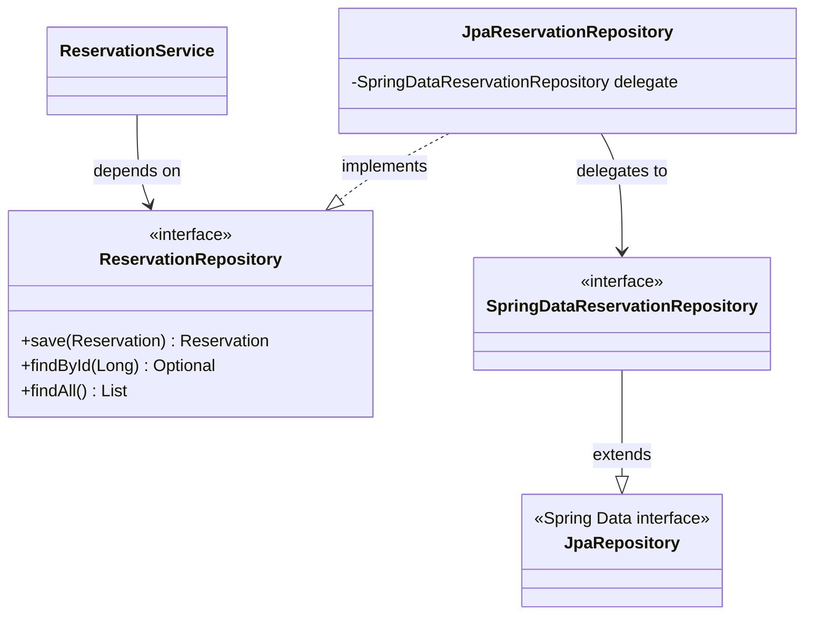
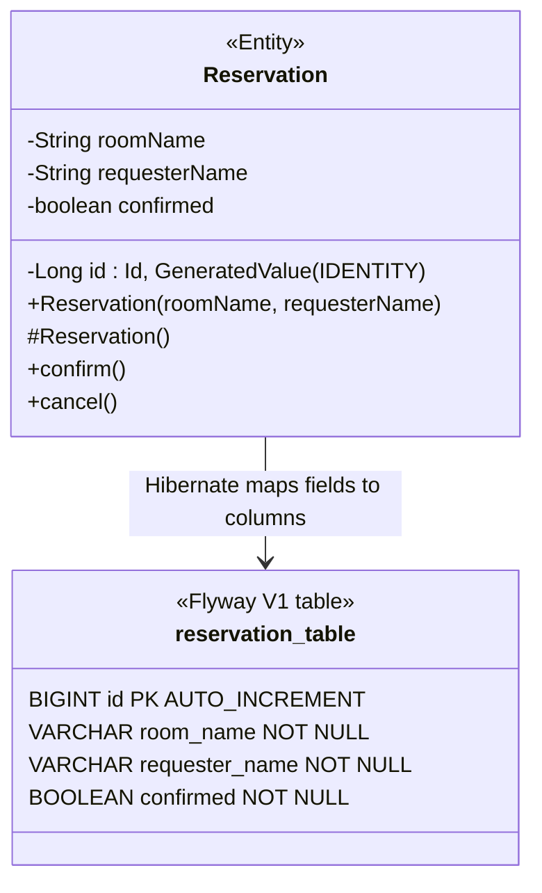
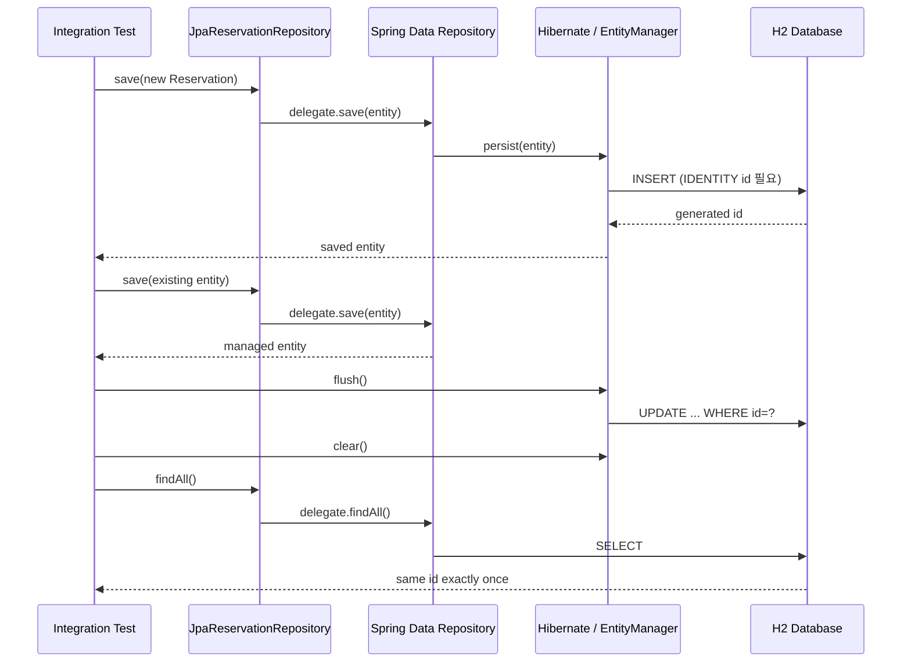

# 코드 패턴 노트 — "그래서 어떻게 쓰지?"

> ## ⚠️ 이 파일의 사용법
>
> **이건 찾아보는 참조서다. 처음부터 읽는 책이 아니다.**
>
> 순서대로 읽으면 "읽을 땐 알겠는데 못 쓰겠다"가 그대로 남는다. 본인이 쓴 글이라 술술 읽히고, 그 매끄러움을 "알고 있음"으로 착각하기 때문이다(유창성 착각).
>
> **올바른 순서:**
> `PATTERN_DRILLS.md`로 **먼저 손으로 쓴다** → 막히거나 틀린다 → **그때 여기서 찾는다**
>
> 못 떠올려 낑낑댄 시간이 기억을 만든다. 그 상태에서 정답을 봐야 박힌다.

`vocab.md`가 **용어의 뜻**(선언적 지식)이라면, 이 파일은 **코드의 형태**(절차적 지식)다. 둘은 다른 능력이라 하나로 다른 하나가 채워지지 않는다.

---

## 0. 계층 흐름 한 장

요청 하나가 지나는 길. **각 층에 붙는 애노테이션이 그 층의 정체성**이다.

```
  HTTP 요청 (JSON)
        │
        ▼
┌───────────────────────────────────────────────┐
│ @RestController   ReservationController       │  HTTP만 안다
│   @PostMapping / @RequestBody @Valid          │  DTO ↔ 문자열 변환
│   @PathVariable @Positive                     │  비즈니스 로직 없음
└───────────────┬───────────────────────────────┘
                │ 생성자 주입
                ▼
┌───────────────────────────────────────────────┐
│ @Service          ReservationService          │  로직·규칙
│   Optional → 도메인 예외로 변환               │  HTTP를 모른다
│   무상태(요청별 값은 지역변수)                │  DB를 모른다
└───────────────┬───────────────────────────────┘
                │ 생성자 주입 (인터페이스에 의존 = DIP)
                ▼
┌───────────────────────────────────────────────┐
│ interface  ReservationRepository   ← What     │  저장만 안다
│ @Repository  ...RepositoryImpl     ← How      │  로직 없음
└───────────────────────────────────────────────┘

  예외가 터지면 어느 층에서든:
        │
        ▼
┌───────────────────────────────────────────────┐
│ @RestControllerAdvice  GlobalExceptionHandler │  예외 → HTTP 상태코드
└───────────────────────────────────────────────┘
```

**층을 가르는 기준 한 줄:** 위층은 아래층을 알지만, **아래층은 위층을 절대 모른다.** Service에 `ResponseEntity`가 등장하면 그건 층이 무너진 것이다.

---

# Week A — 웹 계층

## P1. 엔드포인트 하나 받기 — Controller

**[언제]** 새 URL을 열 때.

**[골격]**

```java
@RestController                                    // ① Bean 등록 + 반환값을 JSON/문자열 본문으로
public class ReservationController {

    private final ReservationService reservationService;   // ② final — 조립 후 안 바뀐다

    public ReservationController(ReservationService reservationService) {  // ③ 생성자 주입
        this.reservationService = reservationService;
    }

    @PostMapping("/reservations")                                  // ④ 메서드 + 경로
    public String reserve(@RequestBody @Valid ReservationRequest request) {
        Reservation reservation = reservationService.reserve(       // ⑤ 즉시 위임
                request.roomName(), request.requesterName());
        return "예약 번호" + reservation.getId() + " ...";
    }

    @PostMapping("/reservations/cancel/{id}")                      // ⑥ {id} ↔ @PathVariable 짝
    public String cancel(@PathVariable @Positive(message = "예약 번호는 1 이상이어야 합니다") Long id) {
        Reservation reservation = reservationService.cancel(id);
        return reservation.getRequesterName() + "님이 ...";
    }
}
```

**[판단]**
- Controller에는 **HTTP 입출력만** 둔다. `if`로 업무 규칙을 판단하기 시작하면 그건 Service 일이다(SRP).
- `@RequestBody`는 **본문(JSON)** 을, `@PathVariable`은 **URL 경로 조각**을 받는다. 받는 위치가 다르다.
- `@Positive`가 `@PathVariable`에 직접 붙는다. Spring Boot 3.2+는 컨트롤러 파라미터 검증이 기본 내장이라 `@Validated`를 클래스에 안 붙여도 동작한다.

**[❌ 흔한 실수]**

| 실수 | 실제로 터진 것 |
|---|---|
| 같은 이름·같은 파라미터 메서드를 애노테이션만 다르게 2개 선언 | **컴파일 에러.** 컴파일러는 애노테이션을 안 본다. **이름 + 파라미터**만으로 중복을 판단한다 (D01) |
| `@PathVariable Long id`는 썼는데 경로에 `{id}`를 안 넣음 | **컴파일 통과, `./gradlew test`도 통과.** 실제 요청이 와서야 500: `Required URI template variable 'id' for method parameter type Long is not present` (D04) |
| 상태코드를 `201` 같은 **정수**로 반환 | 컴파일 에러. `HttpStatus.CREATED`를 쓴다 (D01) |

> **D04가 이 패턴의 핵심 교훈이다.** 애노테이션과 문자열의 짝은 **문자열끼리의 약속**이라 컴파일러 사정권 밖이다. 초록불이어도 안전하지 않다.

**[근거]** `controller/ReservationController.java:14-38`

---

## P2. 요청 DTO — `record` + 검증

**[언제]** 클라이언트가 보내는 JSON을 받을 때.

**[골격]**

```java
public record ReservationRequest(
        @NotBlank(message = "방 이름은 비어있을 수 없습니다")   String roomName,
        @NotBlank(message = "예약자 이름은 비어있을 수 없습니다.") String requesterName
) {}
```

호출은 이렇게:

```java
request.roomName()        // ✅ 필드 이름 그대로
request.getRoomName()     // ❌ record에는 이런 메서드가 없다
```

**[판단]**
- **DTO는 `record`, Domain은 `class`.** 로드맵 §7 규칙이기도 하다. DTO는 값을 옮기기만 하니 불변이면 되고, Domain은 상태가 바뀌어야 하니 불변이면 안 된다.
- 검증 애노테이션은 **DTO에 붙인다.** 잘못된 입력을 계층 초입에서 끊기 위해서다.
- 이것만으로는 검증이 안 돌아간다. **Controller 파라미터에 `@Valid`가 있어야** 실행된다. 둘은 한 쌍이다.

**[❌ 흔한 실수]**

| 실수 | 실제로 터진 것 |
|---|---|
| `request.getRoomName()` 호출 | `cannot find symbol`. record 접근자는 **필드명 그대로**이고 JavaBean `getXxx` 관례를 안 따른다 (D02) |
| 필드는 `roomname`, 호출은 `roomName()` | `cannot find symbol`. 자바는 대소문자를 구분한다 (D02) |
| DTO에 `@NotBlank`만 달고 Controller에 `@Valid`를 안 붙임 | 검증이 **조용히 안 돈다.** 빈 문자열이 그대로 통과 |

**[근거]** `dto/ReservationRequest.java:6` · `@Valid` 짝은 `controller/ReservationController.java:24`

---

## P3. Domain 클래스 — 가변 + 캡슐화

**[언제]** 업무 규칙을 가진 객체가 필요할 때.

**[골격]**

```java
public class Reservation {                 // record 아님 — 상태가 바뀌어야 하니까
    private final String roomName;         // 한 번 정하면 안 바뀌는 것 → final
    private final String requesterName;
    private boolean confirmed;             // 바뀌는 것 → final 아님
    private Long id;                       // 저장 전엔 null

    public Reservation(String roomName, String requesterName) {
        this.roomName = roomName;
        this.requesterName = requesterName;
        this.confirmed = false;            // 시작 상태를 생성자가 강제한다
    }

    public void confirm() { this.confirmed = true; }    // 상태 변경은 "이름 있는 행동"으로만
    public void cancel()  { this.confirmed = false; }

    public void assignId(Long id) { this.id = id; }     // setXxx가 아닌 이유: 저장소만 부르라고
}
```

**[판단]**
- **`setConfirmed(boolean)`을 만들지 않는다.** `confirm()` / `cancel()`처럼 **업무 의미가 담긴 이름**만 연다. 그래야 "언제 true가 되는가"를 이 클래스 하나만 읽고 알 수 있다.
- `confirmed`의 초기값을 생성자가 `false`로 못 박는다. 외부에서 확정 상태로 만들어진 예약이 태어날 수 없다.
- **`id`는 저장소가 붙인다.** 그래서 `final`이 아니고, 그래서 `assignId`라는 별도 문이 필요하다.

**[❌ 흔한 실수]**

| 실수 | 실제로 터진 것 |
|---|---|
| `cancel()` 처리에서 `findById` 없이 `new Reservation(...)` 으로 새 객체를 만들어 저장 | **새 예약이 하나 더 생기고** 원본은 `confirmed: true` 그대로 남았다. 값이 같아도 자바에겐 다른 인스턴스이고, 저장소도 구별할 **식별자가 없었다** (D04) |

> **이게 "식별자(PK)가 왜 필요한가"를 몸으로 배운 지점이다.** 갱신하려면 먼저 **찾아야** 하고, 찾으려면 **고유한 값**이 있어야 한다.

**[근거]** `domain/Reservation.java:8-48`

---

## P4. 도메인 예외

**[언제]** 업무적으로 의미 있는 실패를 표현할 때.

**[골격]**

```java
public class ReservationNotFoundException extends RuntimeException {
    public ReservationNotFoundException(Long id) {
        super("예약을 찾을 수 없습니다. (id: " + id + ")");   // 메시지 조립을 예외가 책임진다
    }
}
```

**[판단]**
- **`RuntimeException`을 상속**한다. checked 예외로 만들면 모든 호출부가 `throws`를 달아야 해서 계층이 오염된다.
- **메시지를 생성자 안에서 만든다.** 호출부는 `new ReservationNotFoundException(id)` 한 줄이면 되고, 메시지 형식이 한 곳에만 있다.
- 이름이 `NotFound`인 것과 응답이 404인 것은 **별개**다. 연결은 P5의 전역 처리기가 한다. **도메인은 HTTP를 몰라야 한다.**

**[근거]** `exception/ReservationNotFoundException.java:3-7`

---

## P5. 전역 예외 처리 — 핸들러 4종

**[언제]** 예외를 HTTP 응답으로 바꿀 때. **한 번 만들어두고 계속 추가**하는 파일이다.

**[골격]**

```java
@RestControllerAdvice                      // 전역 예외 후보로 수집된다
public class GlobalExceptionHandler {

    private static final Logger log = LoggerFactory.getLogger(GlobalExceptionHandler.class);

    // ① @Valid (본문 DTO) 실패 → 400 + 필드별 메시지
    @ExceptionHandler(MethodArgumentNotValidException.class)
    public ResponseEntity<Map<String, String>> handleValidation(MethodArgumentNotValidException ex) {
        Map<String, String> errors = new LinkedHashMap<>();
        ex.getBindingResult().getFieldErrors()
                .forEach(error -> errors.put(error.getField(), error.getDefaultMessage()));
        return ResponseEntity.status(HttpStatus.BAD_REQUEST).body(errors);
    }

    // ② 파라미터 검증(@PathVariable @Positive) 실패 → 400
    @ExceptionHandler(HandlerMethodValidationException.class)
    public ResponseEntity<Map<String, Object>> handleMethodValidation(HandlerMethodValidationException ex) {
        List<String> errors = ex.getAllErrors().stream().map(e -> e.getDefaultMessage()).toList();
        return ResponseEntity.status(HttpStatus.BAD_REQUEST).body(Map.of("errors", errors));
    }

    // ③ 도메인 예외 → 404
    @ExceptionHandler(ReservationNotFoundException.class)
    public ResponseEntity<Map<String, String>> handleNotFound(ReservationNotFoundException ex) {
        return ResponseEntity.status(HttpStatus.NOT_FOUND).body(Map.of("error", ex.getMessage()));
    }

    // ④ 최후의 그물 → 500. 원인은 로그로, 사용자에겐 일반 문구만
    @ExceptionHandler(Exception.class)
    public ResponseEntity<Map<String, String>> handleUnexpected(Exception ex) {
        log.error("처리하지 못한 예외", ex);                     // 스택트레이스 전부 (두 번째 인자로!)
        return ResponseEntity.status(HttpStatus.INTERNAL_SERVER_ERROR)
                .body(Map.of("error", "요청 처리 중 오류가 발생했습니다."));
    }
}
```

**[판단]**
- **검증 실패가 두 종류**라 핸들러도 둘이다. 본문 DTO(`@RequestBody @Valid`)는 `MethodArgumentNotValidException`, 파라미터(`@PathVariable @Positive`)는 `HandlerMethodValidationException`. **하나만 만들면 나머지 한 종류가 500으로 샌다.**
- ④에서 **`ex.getMessage()`를 응답에 넣지 않는다.** SQL문·파일 경로·라이브러리 버전이 그대로 새어 나간다. **원인은 안으로(로그), 사용자에겐 최소한만.**
- `log.error("...", ex)` — 예외를 **두 번째 인자**로 넘겨야 스택트레이스가 남는다. 문자열에 이어붙이면 메시지만 남고 추적이 사라진다.

**[❌ 흔한 실수]**

| 실수 | 실제로 터진 것 |
|---|---|
| 두 번째 `@ExceptionHandler` 메서드를 **클래스 닫는 `}` 뒤**에 작성 | 컴파일 에러. `}` 이후는 파일 최상위라 `class`/`interface`/`enum`/`record`만 올 수 있다 (D03) |
| `ResponseE ntity` — 타입 이름 중간에 공백 | `')' or ',' expected`. 공백이 토큰을 둘로 가른다 (D03) |
| `newLinkedHashMap<>()` — `new` 뒤 공백 누락 | 컴파일 에러 (D03) |
| 검증 실패 응답에 **모든 필드**가 나올 거라 예측 | `getFieldErrors()`는 **실패한 필드만** 담는다. 통과한 필드는 애초에 목록에 없다 (D03) |

**[근거]** `exception/GlobalExceptionHandler.java:17-49`

---

## P6. Repository — 인터페이스 + 저장 계약

**[언제]** 저장소가 필요할 때. **인터페이스와 구현을 반드시 분리**한다.

**[골격 — 인터페이스: What만]**

```java
public interface ReservationRepository {
    Reservation save(Reservation reservation);
    List<Reservation> findAll();
    Optional<Reservation> findById(Long id);       // 없을 수 있음을 반환형에 드러낸다
}
```

**[골격 — 구현: How]**

```java
public class InMemoryReservationRepository implements ReservationRepository {
    private final List<Reservation> store = new ArrayList<>();
    private long nextId = 1;

    @Override
    public Reservation save(Reservation reservation) {
        if (reservation.getId() == null) {              // ① 신규 → 추가
            reservation.assignId(nextId++);
            store.add(reservation);
            return reservation;
        }
        for (int i = 0; i < store.size(); i++) {        // ② 기존 → 교체
            if (store.get(i).getId().equals(reservation.getId())) {   // equals! (== 아님)
                store.set(i, reservation);
                return reservation;
            }
        }
        throw new IllegalArgumentException("저장소에 없는 예약 번호입니다: " + reservation.getId());
    }
}
```

**[판단]**
- **`save()`의 계약: ID 없으면 추가, 있으면 교체.** 이 분기가 저장소의 핵심이다. 빠뜨리면 취소할 때마다 행이 하나씩 늘어난다.
- **`Optional`로 부재를 표현**하고, 예외로 바꾸는 건 Service가 한다(P7). 저장소는 "없다"까지만 말한다.
- `Long`은 Wrapper라 **`.equals()`로 비교**한다. `==`는 참조 비교라 작은 값에선 캐싱 때문에 우연히 맞는 것처럼 보인다 — 더 나쁘다.
- **인터페이스를 분리하는 이유는 테스트다.** 실행은 DB 구현, 테스트는 메모리 구현. Week B에서 JDBC → JPA로 갈아탈 때 Service가 한 줄도 안 바뀐 게 이 설계의 값이다.

**[❌ 흔한 실수]**

| 실수 | 실제로 터진 것 |
|---|---|
| `for` 루프가 못 찾은 경우의 `return`을 안 씀 | `missing return statement`. 모든 실행 경로가 값을 돌려줘야 한다 (D04) |
| `if (r.getId() == id))` — 괄호 짝 안 맞음 | `illegal start of expression`. 파서가 그 지점부터 문법을 못 읽는다 (D04) |
| 인터페이스만 같으면 계약도 같을 거라 가정 | **인터페이스는 시그니처만 강제하고 의미는 강제 못 한다.** JDBC 구현은 이 분기가 없어 무조건 INSERT였고, 취소할 때마다 복사본이 생겼다 (D09) |

**[근거]** `repository/ReservationRepository.java:8-12` · `repository/InMemoryReservationRepository.java:12-50`

---

## P7. Service — 조율 + `Optional` → 도메인 예외

**[언제]** 업무 규칙이 필요할 때. **Controller와 Repository 사이는 항상 여기를 지난다.**

**[골격]**

```java
@Service
public class ReservationService {

    private final ReservationRepository reservationRepository;   // 구현체 아닌 인터페이스에 의존 (DIP)

    public ReservationService(ReservationRepository reservationRepository) {
        this.reservationRepository = reservationRepository;
    }

    public Reservation reserve(String roomName, String requesterName) {
        Reservation reservation = new Reservation(roomName, requesterName);
        reservation.confirm();                          // 규칙: 예약하면 확정
        return reservationRepository.save(reservation);
    }

    public Reservation cancel(Long id) {
        Reservation reservation = reservationRepository.findById(id)
                .orElseThrow(() -> new ReservationNotFoundException(id));   // 부재 → 도메인 예외
        reservation.cancel();                           // 상태 변경은 도메인에게 시킨다
        reservationRepository.save(reservation);
        return reservation;
    }
}
```

**[판단]**
- **찾기 → 바꾸기 → 저장**이 갱신의 3단계다. `new`로 시작하면 갱신이 아니라 추가가 된다(P3 참조).
- **`Optional`이 여기서 끝난다.** `orElseThrow`로 도메인 예외로 바꿔 위층에 넘기면, Controller는 예외를 몰라도 되고 전역 처리기가 404로 만든다.
- **상태 변경을 Service가 직접 하지 않는다.** `reservation.setConfirmed(false)`가 아니라 `reservation.cancel()`. 규칙은 도메인이 갖는다.
- **필드에 요청별 값을 두지 않는다.** Bean은 싱글톤 하나를 모든 스레드가 공유한다. 요청마다 달라지는 값은 **매개변수·지역변수**로.

**[❌ 흔한 실수]**

| 실수 | 실제로 터진 것 |
|---|---|
| Controller의 생성자를 복사해 붙이고 클래스명을 안 바꿈 | `return type required`. 이름이 다르면 생성자가 아니라 **반환형 없는 메서드**로 파싱된다 (D05) |
| 필드명·의존 타입을 안 맞춤 | `cannot find symbol`, `incompatible types` (D05) |
| 요청별 값을 싱글톤 Service의 필드에 저장 | 여러 스레드가 같은 객체를 공유하므로 요청끼리 값이 섞인다. 해결책은 `final`이 아니라 **애초에 필드에 안 두는 것** (D05·D09 오답) |

**[근거]** `service/ReservationService.java:8-29`

---

## P8. Bean 등록과 조립 (DI)

**[언제]** 항상. 위 패턴들이 **실제로 연결되는 방식**이다.

**[골격]**

```java
@RestController  class ReservationController { ... }     // 층마다 다른 이름, 하는 일은 같다:
@Service         class ReservationService    { ... }     //   "이 클래스를 Bean으로 등록해라"
@Repository      class JdbcReservationRepository { ... }
```

조립은 Spring이 한다:

```
Repository Bean 생성 → Service 생성자에 주입 → Controller 생성자에 주입
```

**[판단]**
- **애노테이션은 "Bean으로 등록"만 시킨다.** `@Service`와 `@Repository`는 기능 차이보다 **읽는 사람에게 층을 알려주는** 의미가 크다.
- **주입은 타입으로 이뤄진다.** `ReservationRepository` 타입 Bean을 찾아 넣는다. 그래서 **후보가 0개거나 2개면 기동이 실패**한다.
- **생성자 주입을 쓴다.** 필수 의존성이 타입으로 드러나고, `final`이 가능해 조립 후 안 바뀐다.

**[❌ 흔한 실수]**

| 실수 | 실제로 터진 것 |
|---|---|
| `@Repository`를 뗐다 | 컴파일은 **성공**, `contextLoads()` 실패 → `NoSuchBeanDefinitionException`. **사라진 건 자바의 구현 관계가 아니라 Bean 등록**이다 (D05) |
| `@Repository` 붙은 구현체가 2개 | `NoUniqueBeanDefinitionException: expected single matching bean but found 2`. 스프링은 임의로 고르지 않고 **즉시 죽는다** — 잘못 고른 채 도는 사고가 더 조용하기 때문 (D09) |

> **부수 관찰:** 컨텍스트가 못 뜨면 그 위의 **모든 테스트가 함께 죽는다.** 실패 6개가 떴다고 원인이 6개인 게 아니다.

**[근거]** `service/ReservationService.java:8` · `repository/JdbcReservationRepository.java:16` · `StudyRoomApiApplicationTests.java:21`

---

## P9. 테스트 3종 — 무엇을 어디까지 검증하나

**[언제]** 코드를 고정하고 싶을 때. **무엇을 쓸지는 "무엇을 지나게 하고 싶은가"로 정한다.**

| 종류 | 스프링 뜨나 | 지나는 구간 | 언제 |
|---|---|---|---|
| **순수 단위** | ❌ | 내 클래스 + 대역 | 로직·계약 |
| **핸들러 단위** | ❌ | 그 클래스 하나 | 변환 규칙 |
| **MockMvc** | ✅ | URL 매핑 → 검증 → 컨트롤러 → 예외 리졸버 → JSON | 층이 실제로 이어지는지 |
| **컨텍스트** | ✅ | Bean 조립 전체 | 기동·싱글톤 |

**[골격 ① 순수 단위 — `new`로 직접 조립]**

```java
class ReservationServiceTest {
    @Test
    void cancelUpdatesExistingReservationWithoutAddingDuplicate() {
        InMemoryReservationRepository repository = new InMemoryReservationRepository();  // 대역
        ReservationService service = new ReservationService(repository);
        Long id = service.reserve("A-101", "민지").getId();

        service.cancel(id);

        assertEquals(1, repository.findAll().size());          // 행이 안 늘었나
        assertFalse(repository.findById(id).orElseThrow().isConfirmed());
    }
}
```
> **생성자 주입의 값이 여기서 나온다.** 스프링 없이 `new`만으로 조립된다.

**[골격 ② 핸들러 단위]**

```java
class GlobalExceptionHandlerTest {
    private final GlobalExceptionHandler handler = new GlobalExceptionHandler();

    @Test
    void unexpectedExceptionDoesNotExposeInternalMessage() {
        String internalMessage = "jdbc:password=secret";
        ResponseEntity<Map<String, String>> response =
                handler.handleUnexpected(new RuntimeException(internalMessage));

        assertEquals(HttpStatus.INTERNAL_SERVER_ERROR, response.getStatusCode());
        assertFalse(response.getBody().toString().contains(internalMessage));  // 새어나가지 않았나
    }
}
```

**[골격 ③ MockMvc — 포트 없이 전 구간]**

```java
@SpringBootTest
@AutoConfigureMockMvc
class ReservationControllerHttpTest {

    @Autowired private MockMvc mockMvc;

    @Test
    void reserveReturns400ForBlankBodyFields() throws Exception {
        mockMvc.perform(post("/reservations")
                        .contentType(MediaType.APPLICATION_JSON)
                        .content("""
                                { "roomName": "", "requesterName": "" }
                                """))                                  // 텍스트 블록 — 이스케이프 지옥 회피
                .andExpect(status().isBadRequest())
                .andExpect(jsonPath("$.roomName").value("방 이름은 비어있을 수 없습니다"));
    }

    @Test
    void cancelReturns404WhenReservationDoesNotExist() throws Exception {
        mockMvc.perform(post("/reservations/cancel/{id}", 999_999L))
                .andExpect(status().isNotFound())
                .andExpect(jsonPath("$.error").value("예약을 찾을 수 없습니다. (id: 999999)"));
    }
}
```

**[판단]**
- **P1의 `@PathVariable` 버그는 MockMvc만 잡는다.** URL 매핑을 실제로 지나야 드러나기 때문이다. 단위 테스트를 아무리 늘려도 안 잡힌다.
- 한글 JSON은 **텍스트 블록(`"""`)** 으로 쓴다. curl/PowerShell로 보내면 인코딩과 따옴표 이스케이프에서 깨진다 (D02에서 실제로 겪음).
- **초록불은 "버그가 없다"가 아니라 "지금 확인한 것들에는 문제가 없다"이다.** 테스트 10개가 전부 통과하는 동안 JDBC 구현은 취소할 때마다 복사본을 만들고 있었다 (D09).

**[근거]** `ReservationServiceTest.java:11-30` · `GlobalExceptionHandlerTest.java:12-36` · `ReservationControllerHttpTest.java:15-64` · `StudyRoomApiApplicationTests.java:14-29`

---

## Week A 요약 — 엔드포인트 하나를 0층부터 만드는 순서

```
1. DTO       record + @NotBlank                        (P2)
2. Domain    class + 규칙 메서드                        (P3)
3. Repository interface 먼저, 구현 나중                 (P6)
4. Service   @Service + 생성자 주입 + orElseThrow       (P7)
5. Controller @RestController + @PostMapping + @Valid   (P1)
6. 예외      도메인 예외 + 전역 처리기에 핸들러 추가     (P4·P5)
7. 테스트    단위 → MockMvc                             (P9)
```

**아래층부터 위로** 만든다. Controller를 먼저 만들면 주입할 게 없어 컴파일이 안 된다.

---

# Week B — 데이터 접근

> **이 주의 한 줄:** 저장이 메모리에서 DB로 내려간다. 스키마의 주인은 **Flyway**, 매핑의 주인은 **엔티티**다.

## P10. Flyway — 스키마를 코드로

**[언제]** 테이블을 만들거나 바꿀 때. **DB 콘솔에서 직접 `CREATE TABLE`을 치지 않는다.**

**[골격]**

```
src/main/resources/db/migration/V1__init.sql      ← 경로·파일명 모두 규약
                                 │ │└ 설명
                                 │ └─ 언더바 2개 (1개면 인식 안 됨)
                                 └─── 버전
```

```sql
CREATE TABLE reservation (
    id BIGINT NOT NULL AUTO_INCREMENT,
    room_name VARCHAR(100) NOT NULL,        -- 길이는 계약이다
    requester_name VARCHAR(50) NOT NULL,    -- 주석은 -- 로 (# 은 MySQL 방언)
    confirmed BOOLEAN NOT NULL DEFAULT FALSE,
    PRIMARY KEY (id)
);
```

```kotlin
implementation("org.flywaydb:flyway-core")   // H2·HSQLDB는 core에 포함
runtimeOnly("com.h2database:h2")             // 실행할 때만 필요
```

**[판단]**
- Flyway는 **버전 SQL을 순서대로 한 번씩만** 실행하고, 이력과 **체크섬**을 `flyway_schema_history` 장부에 남긴다. git이 커밋 이력을 관리하는 것과 같은 구조다.
- **적용된 마이그레이션은 불변이다.** 고치지 말고 `V2__widen_room_name.sql`을 새로 쌓는다. **push한 커밋을 rebase하지 않는 것과 같은 규칙.**
- 자바 이름은 camelCase, SQL은 snake_case로 쓴다. Hibernate 기본 네이밍 전략이 `requesterName` → `requester_name`으로 **단어를 분리**해준다(단순 소문자화가 아니다).

**[❌ 흔한 실수]**

| 실수 | 실제로 터진 것 |
|---|---|
| SQL 주석을 `#`으로 씀 | `Syntax error in SQL statement ... [*]#Java는...` — `#`은 MySQL 방언이다. **`MODE=MySQL`이 걸려 있어도 막힌다.** 호환 모드는 타입·함수 등 동작 일부만 맞추고 **파서는 H2 그대로**다 (D08) |
| 이미 적용된 파일에 **주석 한 줄** 추가 | `FlywayValidateException: Migration checksum mismatch for migration version 1`. Flyway는 SQL을 해석해 비교하지 않고 **파일 전체의 해시**를 대조한다. "주석이라 의미 없음" 같은 판단을 아예 하지 않는다 (D08) |
| 실패한 마이그레이션을 고치고 그냥 재기동 | 장부에 `success = FALSE` 행이 남아 **다음 기동을 막는다.** 운영은 `flyway repair`, 개발은 DB 파일 삭제 (D08) |

> **체크섬 실패로 테스트 6개가 함께 죽었다.** 그중엔 SQL과 무관한 `reservationServiceBeanIsSingleton`도 있었다. **Flyway가 실패하면 스프링 컨텍스트가 못 뜨고, 그 위의 모든 테스트가 같이 죽는다.** 실패 개수는 원인 개수가 아니다.

**[근거]** `src/main/resources/db/migration/V1__init.sql` · `build.gradle.kts:26-32`

---

## P11. DB 제약 vs 앱 검증 — 층이 다르다

**[언제]** "`@NotBlank` 있는데 `NOT NULL`도 필요한가?" 싶을 때. **필요하다. 막는 구멍이 다르다.**

**[판단 표 — 이게 패턴의 전부다]**

| 입력 | `@NotBlank` (앱) | `NOT NULL` (DB) |
|---|---|---|
| `null` | 막음 | 막음 |
| `""` · `"   "` | **막음** | **통과** ← |
| HTTP를 안 거친 직접 INSERT | **못 봄** ← | 막음 |

- **`NOT NULL`이 검사하는 건 "값이 있는가" 하나뿐이다.** `''`는 값이 없는 게 아니라 **길이 0인 값이 있는 것**이다.
- 앱 검증은 **UX**(친절한 400 메시지), DB 제약은 **무결성**(모든 경로 차단). 중복이 아니라 **계층별 방어**다.
- `''`까지 DB에서 막으려면 `CHECK` 제약이 필요하다 → 기술부채 등록됨(Week B D7).

**[❌ 흔한 실수]**

| 실수 | 실제로 터진 것 |
|---|---|
| `''` INSERT가 `NOT NULL`에 막힐 거라 예측 | `(Update count: 1)` — **통과했다.** `CHAR_LENGTH(room_name) = 0`인 행이 실제로 들어갔다 (D08 실험 2) |
| PK가 1, 2, 5처럼 띄엄띄엄한 걸 버그로 봄 | 정상이다. **실패·롤백된 INSERT도 번호를 소비하고 되돌리지 않는다.** 되돌리려면 채번을 직렬화해야 해서 동시 INSERT가 전부 대기한다. `AUTO_INCREMENT`는 "연속"이 아니라 **"겹치지 않음"만** 보장 (D08) |
| 소문자로 만든 테이블을 소문자로 조회 | `table_name='reservation'` → **0행.** 따옴표 없는 SQL 식별자는 **대문자로 접힌다.** 그래서 `RESERVATION`과 `"flyway_schema_history"`가 한 DB에 공존한다 (D08) |

**[근거]** `V1__init.sql` · 기술부채.md「나중에 고칠 것」의 `CHECK` 항목

---

## P12. JDBC로 저장하기 — 4단계 + 자원 반납

**[언제]** SQL을 직접 쓸 때. **JPA를 쓰면 이 코드는 사라진다.** 그래도 아래에서 무슨 일이 일어나는지는 알아야 한다.

**[골격]**

```java
@Repository
public class JdbcReservationRepository implements ReservationRepository {

    private final DataSource dataSource;            // ① 커넥션 풀(HikariCP). Boot가 만들어 둔 걸 주입만

    public JdbcReservationRepository(DataSource dataSource) {
        this.dataSource = dataSource;
    }

    @Override
    public Reservation save(Reservation reservation) {
        String sql = "INSERT INTO reservation (room_name, requester_name, confirmed) VALUES (?,?,?)";

        try (Connection con = dataSource.getConnection();                     // ② 빌린다
             PreparedStatement ps = con.prepareStatement(sql, Statement.RETURN_GENERATED_KEYS)) {

            ps.setString(1, reservation.getRoomName());        // ③ 인덱스는 1부터 (0 아님)
            ps.setString(2, reservation.getRequesterName());
            ps.setBoolean(3, reservation.isConfirmed());
            ps.executeUpdate();                                // 영향받은 행 수를 돌려준다

            try (ResultSet keys = ps.getGeneratedKeys()) {     // ④ DB가 붙인 id 회수
                if (keys.next()) {
                    reservation.assignId(keys.getLong(1));
                }
            }
            return reservation;

        } catch (SQLException e) {                             // ⑤ checked라 안 잡으면 컴파일 안 됨
            throw new IllegalStateException("예약 저장 실패", e);   // 원인 e를 반드시 넘긴다
        }
    }
}
```

**[판단]**
- **값을 문자열로 이어붙이지 않고 `?`로 자리만 비운다.** DB가 SQL **구조를 먼저 파싱해 굳힌 뒤** 값을 채우므로, 값에 무엇이 들어와도 구조를 못 바꾼다 — **SQL Injection이 막히는 원리가 이것**이다.
- **try-with-resources**는 소괄호 안에서 연 자원을 블록 이탈 시 **역순으로** 자동 `close()`한다. 예외가 났든 안 났든. 커넥션을 반납 안 하면 **풀이 말라 서버 전체가 멈춘다.**
- `SQLException`은 **checked 예외**라 안 잡으면 컴파일이 안 된다. 감쌀 때 **원인 `e`를 두 번째 인자로 반드시 넘겨야** 스택트레이스가 보존된다(P5의 `log.error("...", ex)`와 같은 규칙).
- 매번 새로 접속하지 않는 이유: **TCP 연결 + 인증은 수십 ms짜리 비용**이다. 미리 열어둔 걸 빌렸다 반납하는 편이 압도적으로 싸다.

**[❌ 흔한 실수]**

| 실수 | 실제로 터진 것 |
|---|---|
| `save()`에 **신규/갱신 분기를 안 만들고** INSERT만 | 취소할 때마다 **복사본 행이 생겼다.** 만든 적 없는 3번 예약이 1번의 복사본이었고, 1번의 `confirmed`는 여전히 `true`였다 (D09 실험 5) |
| 그런데 **테스트 10개는 전부 통과했다** | `ReservationServiceTest`는 InMemory 구현을 쓰고, 취소 HTTP 테스트는 404 케이스만 본다. **성공 후 행 개수를 아무도 안 셌다** (D09) |
| 클래스명 중간에 공백 — `public JdbcReservation Repository(...)` | **문법상 합법이라 파싱은 통과.** 반환타입 `JdbcReservation` + 메서드 `Repository`로 해석돼, 생성자가 아닌 곳에서 `final` 필드에 대입하게 되고 `cannot assign a value to final variable`이 따라왔다 (D09 실험 3) |

> **인터페이스는 시그니처만 강제하고 의미는 강제하지 못한다.** 같은 `Reservation save(Reservation)`이라도 계약을 지키는지는 구현자 책임이다. 이게 P6 저장 계약이 Week B에서 다시 걸린 지점이다.

**[근거]** `repository/JdbcReservationRepository.java:16-52`

---

## P13. `ResultSet` → 객체 매핑 (`mapRow`)

**[언제]** SELECT 결과를 도메인 객체로 바꿀 때.

**[골격]**

```java
private Reservation mapRow(ResultSet rs) throws SQLException {
    // ① 생성자로 만든다 — 생성자가 받는 건 문자열 2개뿐
    Reservation reservation = new Reservation(
            rs.getString("room_name"), rs.getString("requester_name"));

    // ② DB가 붙인 id를 심는다 (생성자로는 못 넣으니 별도 메서드)
    reservation.assignId(rs.getLong("id"));

    // ③ 확정 상태면 도메인 메서드로 바꾼다 (필드 직접 대입 아님)
    if (rs.getBoolean("confirmed")) {
        reservation.confirm();
    }
    return reservation;
}
```

호출부:

```java
try (ResultSet rs = ps.executeQuery()) {
    if (rs.next()) { return Optional.of(mapRow(rs)); }   // 단건
    return Optional.empty();
}
// 목록이면
while (rs.next()) { result.add(mapRow(rs)); }
```

**[판단]**
- **`ResultSet`은 커서다.** 결과 전체를 담은 컬렉션이 **아니다.**
  - `rs.next()` — 커서를 **다음 행으로 이동**하고, 행이 있으면 `true`
  - `rs.getXxx("컬럼명")` — 지금 커서가 있는 행에서 **값만 읽는다. 이동하지 않는다**
- **`mapRow`가 3단계인 이유가 캡슐화의 대가다.** 생성자가 `(roomName, requesterName)`만 받고 `confirmed`를 항상 `false`로 시작하도록 막아뒀는데(P3), DB엔 이미 확정된 행이 있다. 그래서 만들고 → id 심고 → 필요하면 `confirm()`.
- **이 3단계 전체가 JPA로 가면 사라진다.** "왜 JPA인가"의 답이 여기다 — 늘어난 코드 중 **비즈니스 로직은 한 줄도 없다.** 전부 자바 객체와 SQL 행 사이의 왕복이다.

**[❌ 흔한 실수]**

| 실수 | 결과 |
|---|---|
| `mapRow` **안에서** `rs.next()`를 부름 | 행이 **하나 걸러 하나씩 사라진다.** 컴파일도 되고 예외도 안 나는 종류의 버그 (D09) |
| 컬럼명에 따옴표를 안 씀 | `rs.getString(room_name)` → `cannot find symbol`. 컬럼명은 **문자열**이다 |

**[근거]** `repository/JdbcReservationRepository.java:98-110`

---

## P14. 테스트 환경 격리 — 환경변수가 yml을 이긴다

**[언제]** 테스트를 만들 때. **한 번 넣어두고 계속 쓰는 안전장치다.**

**[골격]** `build.gradle.kts`

```kotlin
tasks.withType<Test> {
    useJUnitPlatform()
    // 테스트는 실행하는 사람의 OS 환경변수에 좌우되면 안 된다.
    environment("SPRING_DATASOURCE_URL", "jdbc:h2:mem:testdb;MODE=MySQL;DB_CLOSE_DELAY=-1")
    environment("SPRING_DATASOURCE_USERNAME", "sa")
    environment("SPRING_DATASOURCE_PASSWORD", "")
    environment("SPRING_PROFILES_ACTIVE", "test")
}
```

**[판단]**
- **설정 우선순위:** 커맨드라인 > **OS 환경변수** > `application-{profile}.yml` > `application.yml`
- 환경변수 이름 변환: `SPRING_DATASOURCE_URL` → `spring.datasource.url` (대문자·`_` → 소문자·`.`)
- 이 우선순위 자체는 **같은 jar를 환경만 바꿔 배포하기 위한 장치**다(Week E). 문제는 다른 프로젝트용 값에 의도치 않게 걸릴 때다.
- **임시방편이 아니라 원래 있어야 할 것이다.** 테스트는 실행하는 사람의 환경이 무엇이든 항상 같은 DB에서 돌아야 재현 가능하다.

**[❌ 흔한 실수]**

| 실수 | 실제로 터진 것 |
|---|---|
| `application.yml`에 H2를 써놨으니 H2로 붙을 거라 가정 | `Failed to load driver class org.postgresql.Driver`. 사용자 계정 환경변수에 `SPRING_DATASOURCE_URL=jdbc:postgresql://...neon.tech/...`와 `SPRING_PROFILES_ACTIVE=prod`가 걸려 있었다 (D09 실험 2) |

> **위험했던 지점:** `prod` 프로필 + 원격 운영 DB 주소 + `flyway.enabled: true` 조합이었다. PostgreSQL 드라이버가 의존성에 없어 커넥션 단계에서 막혔지만, **있었다면 로컬 실행이 원격 DB에 `V1__init.sql`을 실행했을 것이다.**

**[근거]** `build.gradle.kts:39-49`

---

## P15. Spring Data 어댑터 구조

> **검증 완료:** 실제 Spring Context에서 Spring Data Repository 인터페이스 1개가 발견됐고, 어댑터를 통한 신규 저장·조회·기존 ID 갱신 테스트가 통과했다.

**[언제]** JDBC 구현을 Spring Data JPA로 바꿀 때. Day4에 뽑은 인터페이스를 **버리지 않고** 얹는 방법이다.

**[골격]**

```java
// ① Spring Data가 구현체를 만들어 준다 → interface여야 한다. 본문 비움.
public interface SpringDataReservationRepository
        extends JpaRepository<Reservation, Long> { }
```

```java
// ② 어댑터. 내 인터페이스를 Spring Data 위에 얹는다.
@Repository
public class JpaReservationRepository implements ReservationRepository {

    private final SpringDataReservationRepository delegate;   // 상속(is-a)이 아니라 보유(has-a)

    public JpaReservationRepository(SpringDataReservationRepository delegate) {
        this.delegate = delegate;
    }

    @Override public Reservation save(Reservation r)        { return delegate.save(r); }
    @Override public Optional<Reservation> findById(Long id) { return delegate.findById(id); }
    @Override public List<Reservation> findAll()             { return delegate.findAll(); }
}
```

**[UML 관계도]** — 화살표 방향이 의존성의 방향이다.



**[판단]**
- **`SpringDataReservationRepository`는 `class`가 아니라 `interface`다.** 구현체를 우리가 안 쓴다 — 기동 시 Spring Data가 **프록시 구현체를 만들어 Bean으로 등록**한다. `class`로 쓰면 만들 대상이 없다.
- **어댑터를 끼우는 이유는 DIP 유지다.** Service가 스프링 타입을 모르게 하고, `InMemoryReservationRepository`를 테스트 대역으로 계속 쓸 수 있게 한다.
- **어제의 20줄이 `delegate.save(r)` 한 줄이 된다.** 그리고 손으로 써야 했던 `if (getId() == null) INSERT else UPDATE` 분기를 **Spring Data `save()`가 대신 판단한다.** 없앤 게 SQL만이 아니라 **저장 계약의 분기 판단**까지다.
- **3층 구조:** JPA(명세 `jakarta.persistence`) / Hibernate(구현 `org.hibernate`) / Spring Data JPA(편의층). **JDBC↔드라이버와 같은 구조**다.

**[❌ 흔한 실수 — 오늘 실제로]**

| 실수 | 결과 |
|---|---|
| `class SpringDataReservationRepository extends JpaReservationRepository` | 두 파일의 관계를 **거꾸로** 잡았다. 상속 관계가 아니라 **보유** 관계다 |
| `import`를 **선언부보다 먼저** 타이핑 | IntelliJ *Optimize imports on the fly*가 **안 쓰이는 import를 즉시 지운다.** 선언부를 먼저 고치면 살아남는다. **에디터가 한 일이지 컴파일러가 한 일이 아니다** |
| `@Id`를 `assignId()` **메서드** 위에 붙임 | `@Id` 위치가 **접근 방식(access type)** 까지 결정한다. 필드에 붙이면 필드 접근, getter에 붙이면 프로퍼티 접근. `assignId`는 getter도 setter도 아니라 프로퍼티로 인식되지 않는다 |
| `@Repository` 구현체가 셋이 됨 | `NoUniqueBeanDefinitionException` (P8과 같은 실패) |

**[근거]** `src/main/java/com/example/studyroom/repository/SpringDataReservationRepository.java:7` · `src/main/java/com/example/studyroom/repository/JpaReservationRepository.java:10` · `src/test/java/com/example/studyroom/repository/JpaReservationRepositoryTest.java:28`

---

## P16. JPA Entity 매핑 — 식별자와 기본 생성자

**[언제]** 기존 Domain 객체를 JPA가 DB 행으로 저장하고 복원하게 만들 때.

**[골격]**

```java
@Entity
public class Reservation {
    private String roomName;
    private String requesterName;
    private boolean confirmed;

    @Id
    @GeneratedValue(strategy = GenerationType.IDENTITY)
    private Long id;

    public Reservation(String roomName, String requesterName) {
        this.roomName = roomName;
        this.requesterName = requesterName;
        this.confirmed = false;
    }

    protected Reservation() {
    }
}
```

**[매핑 구조]**



**[판단]**
- `@Id`를 **필드에** 두면 필드 접근 방식이 선택된다. 같은 Entity에서 getter 접근과 섞지 않는다.
- `IDENTITY`는 DB의 `AUTO_INCREMENT`에 ID 생성을 맡긴다. INSERT가 실행된 뒤 생성된 키가 `id`에 들어온다.
- `protected` 기본 생성자는 Hibernate가 조회 결과를 객체로 복원할 통로다. 일반 코드에는 의미 없는 빈 객체 생성을 감춘다.
- 현재 구현은 빈 생성자와 함께 쓰기 위해 `roomName`·`requesterName`의 `final`을 제거했다. `final`은 객체 전체의 불변 표시가 아니라 **모든 생성자 경로에서 초기화되어야 하는 변수 제약**이다.
- `ddl-auto: none`으로 Hibernate의 DDL 생성을 막았다. 스키마 생성·변경의 주인은 Flyway다.

**[❌ 흔한 실수 — 실제 기록]**

| 실수 | 실제 결과 |
|---|---|
| `final` 필드 둘을 둔 채 빈 기본 생성자도 컴파일된다고 예측 — 학습자 답 `"된다"` | 빈 생성자 경로에서 `final` 필드를 초기화하지 못한다. 완성 코드에서는 두 필드의 `final`을 제거했다 (D10 실험 1) |
| `@Id`를 `assignId()` 위에 붙임 | `@Id` 위치는 접근 방식까지 결정한다. `assignId`는 식별자 getter가 아니므로 필드 `id`로 옮겼다 (D10 진행 기록) |
| `protected Reservation()}`로 입력 | `{`가 빠진 파싱 오류로 의미 분석 전에 컴파일이 멈췄다 (D10 진행 기록) |

**[근거]** `src/main/java/com/example/studyroom/domain/Reservation.java:7` · `src/main/java/com/example/studyroom/domain/Reservation.java:13` · `src/main/java/com/example/studyroom/domain/Reservation.java:50` · `study_docs/days/WeekB/Day10_0807/explain-log.md:7`

---

## P17. JPA 저장 계약 통합 테스트 — flush·clear·상대 행 수

**[언제]** Repository 구현을 바꾼 뒤 `save()`의 신규/갱신 계약과 실제 SQL을 함께 검증할 때.

**[골격]**

```java
@SpringBootTest
@Transactional
class JpaReservationRepositoryTest {

    @Autowired ReservationRepository repository;
    @Autowired EntityManager entityManager;

    @Test
    void savingExistingReservationUpdatesWithoutAddingDuplicate() {
        int countBeforeSave = repository.findAll().size();
        Reservation reservation = new Reservation("B202", "minji");
        reservation.confirm();
        Reservation saved = repository.save(reservation);
        entityManager.flush();

        saved.cancel();
        repository.save(saved);
        entityManager.flush();
        entityManager.clear();

        List<Reservation> all = repository.findAll();
        List<Reservation> sameIdRows = all.stream()
                .filter(candidate -> candidate.getId().equals(saved.getId()))
                .toList();

        assertEquals(countBeforeSave + 1, all.size());
        assertEquals(1, sameIdRows.size());
        assertFalse(sameIdRows.get(0).isConfirmed());
    }
}
```

**[UML 시퀀스]** — 기존 ID의 `save()` 호출과 UPDATE 실행 시점은 같은 사건이 아니다.



**[판단]**
- `flush()`는 쓰기 SQL을 검증 지점까지 DB로 보낸다. 정확한 자동 flush 시점과 변경 감지는 D11~D12에서 더 다룬다.
- `clear()`는 1차 캐시를 비운다. 이후 조회가 메모리에 남은 객체가 아니라 DB 결과를 다시 읽게 한다.
- UPDATE 로그만 확인하면 추가 INSERT가 없었다고 보장할 수 없다. **저장 전후 상대 행 수가 +1인지**와 **같은 ID가 정확히 한 행인지**를 함께 검사한다.
- `@Transactional`로 각 테스트의 변경을 롤백하지만, 다른 Context가 남긴 데이터가 없다고 가정하지 않는다.

**[❌ 흔한 실수 — 실제 기록]**

| 실수 | 실제 결과 |
|---|---|
| 전체 행 수를 무조건 `1`로 단언 | 단독 실행은 통과했지만 전체 12개 실행에서 다른 통합 테스트의 행 때문에 실패했다. `countBeforeSave + 1`과 같은 ID 1행 검사로 교정했다 (D10 자동 검증) |

**[근거]** `src/test/java/com/example/studyroom/repository/JpaReservationRepositoryTest.java:45` · `src/test/java/com/example/studyroom/repository/JpaReservationRepositoryTest.java:62` · `study_docs/days/WeekB/Day10_0807/explain-log.md:72`

---

## Week B 요약 — 저장을 DB로 내리는 순서

```
1. 의존성      flyway-core + starter-jdbc(또는 data-jpa) + h2       (P10)
2. 스키마      db/migration/V1__init.sql — 여기가 유일한 주인       (P10)
3. 제약        NOT NULL / DEFAULT / PK — 앱 검증과 층이 다르다      (P11)
4. 테스트 격리  build.gradle.kts test 태스크에 환경변수 고정         (P14)
5. Entity      @Entity + @Id + @GeneratedValue + 기본 생성자         (P16)
6. 구현        JDBC(직접) 또는 Spring Data 어댑터(위임)             (P12·P13·P15)
7. 검증        flush·clear 뒤 상대 행 수와 동일 ID 개수 확인         (P17)
8. 설정        ddl-auto: none — Hibernate는 스키마를 안 건드린다     (P16)
```

**스키마의 주인은 하나여야 한다.** Flyway와 `ddl-auto`가 동시에 스키마를 만들면 장부와 실제가 어긋난다.

---

# Week C — 트랜잭션·프록시·성능

> Week C 진행 후 작성한다.
