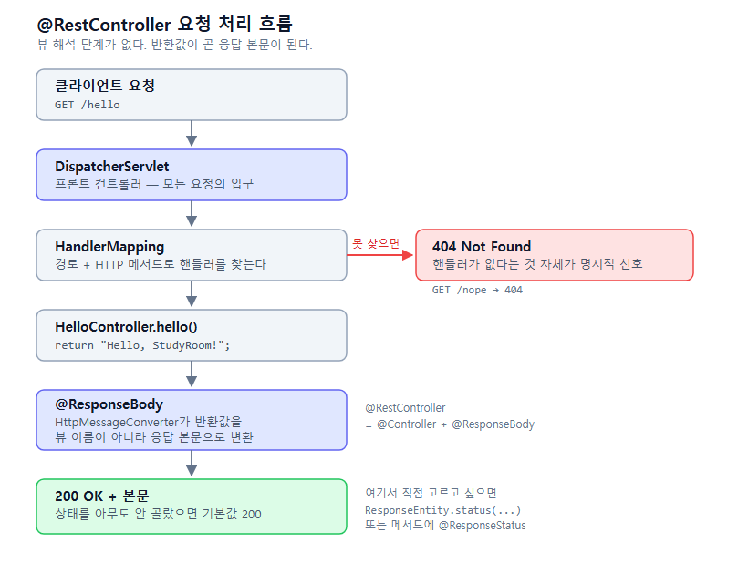

# [백엔드 기본기 Day1] 컨트롤러 하나로 들여다본 요청→응답 왕복

> 새 5주 로드맵의 첫날. `app/`을 빈 스켈레톤으로 새로 시작하면서, 컨트롤러 하나로 "요청이 어떻게 응답이 되는가"를 손으로 짚어봤다. 별거 아닌 것 같았는데, 상태코드를 파고들다 보니 하루치 분량이 나왔다.

## 1. 개념 설명

오늘 정리한 용어부터.

| 용어 | 한줄뜻 | 코드 모습 |
|---|---|---|
| HTTP 상태코드 5계열 | 1xx정보 / 2xx성공 / 3xx리다이렉션 / 4xx클라이언트오류 / 5xx서버오류 | `HttpStatus.OK` / `.status(201)` |
| URL 경로 ≠ 메서드 이름 | 공개 주소와 내부 식별자는 목적이 다르다. 같게 지을 수는 있어도 같아야 하는 건 아니다 | `@GetMapping("/hello")` vs `hello()` |
| 기본 응답 상태코드 | 정상 반환하면 Spring이 자동으로 200 부여 | `return "Hello";` → 200 |
| 404 자동 반환 | 매핑된 핸들러가 없으면 Spring이 자동으로 404 | `/nope` 호출 → 404 |
| `ResponseEntity` | body와 상태코드를 함께 제어하는 래퍼 타입 | `.status(HttpStatus.OK).body("OK")` |
| static import | 클래스 이름 없이 static 멤버를 쓰는 Java 문법 | `import static ...HttpStatus.OK;` |
| 메서드 시그니처 중복 | 이름+파라미터가 같은 메서드 2개 → 컴파일 에러 (파라미터가 다르면 오버로딩으로 허용) | `health()` 2개 선언 시 에러 |
| bootRun 재시작 | 코드를 고쳐도 실행 중인 앱에는 반영 안 됨 | `./gradlew bootRun` 재실행 |

**HTTP 응답은 상태코드·헤더·본문으로 이뤄진 계약이다.** 클라이언트는 본문보다 상태코드를 먼저 보고 성공 여부를 판단한다.

그럼 요청 하나가 응답이 되기까지 누가 뭘 하는가.



이 흐름이 오늘 헷갈렸던 것들을 한 줄씩 설명해준다.

**200이 "자동"인 이유** — 마지막 단계다. 예외 없이 여기까지 왔고 아무도 상태를 안 골랐으니 "이상 신호 없음 = 성공"으로 200이 붙는다. Spring이 알아서 해주는 마법이 아니라, 흐름의 끝에 있는 기본값이다.

**404가 "자동"인 이유** — 세 번째 단계다. `/nope`는 `HandlerMapping`이 맞는 핸들러를 못 찾아서 컨트롤러에 닿지도 못했다. 4xx가 뜨려면 "이상하다"는 명시적 신호가 필요한데, **핸들러가 없다는 것 자체가 그 신호**다. 네트워크 시간에 배운 400·404가 4xx 계열이라는 것도 여기서 이어졌다.

**`String`을 반환했는데 본문이 되는 이유** — `@RestController`가 `@Controller` + `@ResponseBody`이기 때문이다. `@ResponseBody`가 붙으면 반환값을 뷰 이름으로 해석하지 않고 `HttpMessageConverter`를 거쳐 응답 본문으로 변환한다. `@GetMapping`은 그 앞 단계에서 경로를 메서드에 연결하는 역할이다.

오늘 만든 **정상 응답**에서 상태코드를 정하는 방법은 두 가지였다.

- **기본값에 맡기기** — 정상 반환 + 상태 미지정 → 200
- **직접 지정** — `ResponseEntity`로 상태코드와 본문을 한 객체에 담아 반환

"방법이 이 둘뿐"이라는 뜻은 아니다. 위의 404처럼 요청이 컨트롤러에 닿기도 전에 정해지는 경우가 있고, 메서드에 `@ResponseStatus`를 붙이는 방법도 있다(오늘은 안 썼다). 오늘 관찰한 범위가 둘이었을 뿐이다.

**2xx 안에서도 뜻이 갈린다.** `200 OK`는 "요청을 정상 처리했다"이고, `201 Created`는 "새 리소스를 만들었다"는 뜻이다. `/bye`에서 201을 반환해봤는데 코드에는 `.status(201)`처럼 숫자를 그대로 썼다. `HttpStatus.CREATED`를 쓰면 값은 같으면서 의미가 이름으로 드러난다.

**DTO와 상태코드는 다른 층이다.** DTO는 응답 데이터의 *형태*이고 상태코드는 응답 *메타데이터*다. 200이 붙는 이유를 DTO에서 찾으면 안 된다 — 오늘 가장 크게 틀린 지점이라 아래 자문자답에서 다시 다뤘다.

**URL 경로와 자바 메서드 이름은 목적이 다르다.** `@GetMapping("/hello")`의 `/hello`는 클라이언트에게 공개되는 주소이고, `hello()`는 코드 안에서 개발자가 구분하려고 붙인 이름이다. 관례도 달라서 URL은 소문자·하이픈·명사 위주로, 메서드는 동사+명사 카멜케이스로 짓는다.

표의 나머지 세 용어(static import, 시그니처 중복, bootRun 재시작)는 이론으로 배운 게 아니라 구현하다 걸린 것들이다.

> **더 볼 것**
> - [DispatcherServlet — Spring Framework Reference](https://docs.spring.io/spring-framework/reference/web/webmvc/mvc-servlet.html): 위 흐름의 앞부분
> - [@ResponseBody — Spring Framework Reference](https://docs.spring.io/spring-framework/reference/web/webmvc/mvc-controller/ann-methods/responsebody.html): `@RestController`가 `@Controller` + `@ResponseBody`라는 근거
> - [HTTP response status codes — MDN](https://developer.mozilla.org/en-US/docs/Web/HTTP/Reference/Status): 5계열 전체 목록
> - 아직 안 본 것 — `@ResponseStatus`, 오버로딩, `DevTools` 핫리로드

## 2. 코드 구현

### `/hello` — 가장 단순한 형태부터

```java
@RestController
public class HelloController {

    @GetMapping("/hello")
    public String hello() {
        return "Hello, StudyRoom!";
    }
}
```

`curl.exe -i http://localhost:8080/hello`로 호출하니 `200 OK`가 나왔다. 예상은 했지만, "왜 200인지"는 막상 설명하려니 막혔다.

기본값과 대조해보려고 등록하지도 않은 경로를 찔러봤다.

```
curl.exe -i http://localhost:8080/nope
→ 404 Not Found
```

핸들러가 아예 매핑되어 있지 않으니 Spring이 자동으로 404를 반환했다. "기본 성공 vs 명시적 실패 신호"라는 대조가 이때 확실해졌다.

### `/health` — 상태코드를 직접 명시하기

이번엔 200을 자동으로 받는 대신 `ResponseEntity`로 직접 명시해봤다.

```java
@GetMapping("/health")
public ResponseEntity<String> health() {
    return ResponseEntity
            .status(HttpStatus.OK)
            .body("OK");
}
```

`HttpStatus.OK`를 채우는 게 빈칸이었는데, 400=`BAD_REQUEST`, 404=`NOT_FOUND`처럼 이름 있는 상수가 있을 거란 생각으로 IDE 자동완성에서 `HttpStatus.`까지 치고 찾아냈다. 결과는 어차피 200이라 겉보기 동작은 `/hello`와 똑같지만, 코드에는 "이 값을 의도적으로 골랐다"는 사실이 남는다.

### `/bye` — 201 Created, 그리고 컴파일 에러 4개

혼자 힌트 없이 `/bye`를 만들어 201을 반환하라는 과제였는데, 작성한 코드가 컴파일부터 안 됐다. 코드 리뷰를 받고서야 이유를 하나씩 알았다.

1. **미완성 구문** — 자동완성 탐색하다 지우지 않은 `HttpStatus.` 한 줄이 그대로 남아있었다.
2. **import 누락** — `ResponseEntity`는 import했는데 `HttpStatus`는 빠져 있었다.
3. **세미콜론 누락** — `.body("OK")` 뒤에 `;`이 없었다.
4. **메서드 시그니처 중복** — `health()`라는 이름을 두 메서드에 똑같이 써서 "이미 정의된 메서드"라는 에러가 났다.

앞의 세 개는 단순 오타지만 마지막 하나는 층이 다른 문제라서, 아래 자문자답에서 따로 다뤘다. 네 개를 다 고치고 나서야 `/bye` 호출 시 `201 Created`가 제대로 나왔다.

### bootRun은 코드 수정할 때마다 다시 돌려야 한다

디버깅하면서 자연스럽게 알게 된 것 — **코드를 고쳐도 실행 중인 애플리케이션에는 반영되지 않는다.** 실행 중인 JVM 프로세스는 이미 로드된 클래스를 그대로 들고 있기 때문에, `.java` 파일을 수정했으면 `./gradlew bootRun`을 다시 돌려야 반영된다. 하마터면 옛날 응답을 새 코드의 결과로 읽을 뻔했다. (`spring-boot-devtools`를 쓰면 저장 시 자동 재시작되는 기능도 있다는데, 오늘 범위 밖이라 존재만 알아둔다.)

### 오늘 확인한 것

시작점은 빈 스켈레톤이었다(Spring Boot 3.5.3 · Java 17 · web + validation, 롬복 없음). 컨트롤러를 만들기 전에 저장소 루트에서 `./gradlew test`가 green인지부터 확인하고 출발했다.

그다음 네 경로를 `curl.exe -i`로 하나씩 찔러본 결과다.

- `GET /hello` → `200 OK`
- `GET /health` → `200 OK`
- `GET /nope` → `404 Not Found`
- `GET /bye` → 컴파일 에러를 고친 뒤 `201 Created`

전부 수동 확인이다. 오늘 코드는 [`76a0fe5` 커밋](https://github.com/enderpawar/8week_Spring_Study/commit/76a0fe5)에 있다.

## 3. 스스로 답한 질문

### Q. `hello()`에 상태코드를 안 적었는데 왜 200이 나왔을까?

처음엔 **"HTTP 요청 반환 형식이 DTO로 미리 저장되어있어서 그런가?"** 라고 답했다. 완전히 틀린 방향이었다. DTO는 계층 사이에서 옮길 데이터의 형태이고 상태코드는 응답 메타데이터라, 애초에 같은 층의 개념이 아니다.

제대로 된 답은 이렇다. `hello()`가 예외 없이 정상 반환했고 다른 상태를 지정하지 않았으니 Spring이 기본값 200을 붙인 것이고, 반환한 문자열은 어딘가에 담기는 게 아니라 그대로 응답 본문이 된다. 이 항목은 정답을 본 직후 바로 재설명한 거라 진짜 인출인지 확신이 안 서서, 복습큐에 **+1일 재시험**으로 등록해뒀다.

### Q. `@GetMapping` 경로가 다른데 왜 같은 이름의 메서드를 못 쓸까?

`/bye`를 만들 때 경로만 바꾸고 메서드 이름은 `health()` 그대로 뒀다. 경로가 다르니 될 줄 알았는데 안 됐다.

경로가 다르다는 건 Spring이 **런타임에** 요청을 분기할 때 쓰는 정보다. 그런데 같은 클래스 안에 그 메서드를 선언해도 되는지는 그보다 훨씬 앞에서 Java 컴파일러가 판단하고, 컴파일러는 애노테이션을 보지 않고 이름과 파라미터 목록만 본다. 시그니처가 같으면 그냥 중복 선언이다. 프레임워크 규칙과 언어 규칙이 서로 다른 시점에 적용된다는 걸 에러로 체감했다.

### Q. `HttpStatus.OK` 대신 그냥 `OK`만 써도 되는 이유는?

곁가지로 나온 질문이었는데, IDE가 `import static org.springframework.http.HttpStatus.OK;`를 자동으로 넣어줘서 그런 거였다. static import는 클래스 이름 없이 static 멤버를 바로 쓰게 해주는 Java 문법일 뿐이고, 가리키는 대상은 `HttpStatus.OK`와 완전히 같다.

## 4. 정리하며

오늘의 핵심은 **"응답은 body와 상태코드로 이뤄진 계약이고, 상태코드는 기본값이거나 개발자가 의도적으로 선택하는 값"** 이라는 것. 별거 아닌 컨트롤러 하나였는데 상태코드 계열 개념·`ResponseEntity`·static import·메서드 시그니처 컴파일 규칙까지 얽혀서 예상보다 알차게 하루가 채워졌다.

상태코드 자체는 네 경로 다 예상대로 나왔는데 정작 "왜"를 설명하려니 막혔다는 게 오늘 제일 크게 남는다. 결과를 맞히는 것과 메커니즘을 아는 건 다른 일이었다.

남은 것도 있다. 지금 테스트는 `contextLoads()` 하나뿐이라 네 경로의 상태코드나 본문이 바뀌어도 빌드는 그냥 통과한다. 오늘 확인한 게 다음 커밋에서도 유지된다는 보장이 없어서, 테스트를 제대로 배울 때 갚을 부채로 적어뒀다. 그리고 `GET /bye`가 201을 반환하는 건 상태 지정 방법을 확인하려고 만든 학습 코드일 뿐이다. GET은 리소스를 만들지 않으니 실제 API 계약으로 쓸 모양은 아니고, 생성 기능은 나중에 POST로 따로 설계한다.

오늘 공부한 소스코드: [8week_Spring_Study/app](https://github.com/enderpawar/8week_Spring_Study/tree/master/app)
