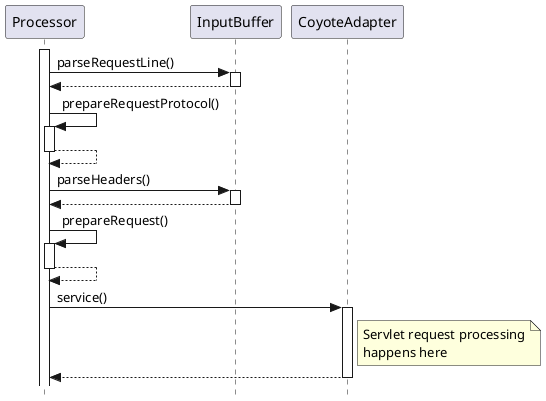

# [백엔드 기본기 Day1] Request-Response의 왕복 — 기본 HTTP Status Code와 `ResponseEntity`

새 5주 로드맵의 첫날이다. `app/`을 빈 스켈레톤으로 다시 시작하고, `HelloController` 하나로 GET 요청이 응답이 되기까지의 경로를 따라갔다. 다루는 범위는 상태코드가 정해지는 지점과 반환값이 본문이 되는 지점까지다. 요청 본문 처리와 입력 검증은 Day2·Day3에서 다룬다.

> `/hello`·`/health`·`/bye`·`/nope` 네 경로를 `curl.exe -i`로 호출해 기본값 200, 명시한 200, 명시한 201, 자동 404를 확인했다. 200이 붙는 이유를 처음에 "DTO로 미리 저장돼서"라고 잘못 설명했다가, 예외 없는 정상 반환에 붙는 기본값이라는 설명으로 교정했다. 검증은 전부 수동 호출이고 자동 테스트는 `contextLoads()` 하나뿐이다.

## 1. 개념 설명

| 용어 | 한줄뜻 | 현재 프로젝트 적용 지점 |
|---|---|---|
| HTTP 상태코드 5계열 | 1xx 정보 / 2xx 성공 / 3xx 리다이렉션 / 4xx 클라이언트 오류 / 5xx 서버 오류 | `/hello` 200, `/bye` 201, `/nope` 404 |
| 기본 응답 상태코드 | 컨트롤러가 예외 없이 정상 반환하고 상태를 지정하지 않으면 붙는 200 | `hello()`의 `return "Hello,StudyRoom!";` |
| 404 자동 반환 | 요청을 처리할 핸들러를 찾지 못하면 컨트롤러 없이 돌아가는 응답 | `GET /nope` |
| `ResponseEntity` | 본문과 상태코드(와 헤더)를 한 객체로 지정하는 반환 타입 | `health()`, `bye()` |
| URL 경로와 메서드 이름 | 외부에 공개되는 주소와 코드 안의 기능 이름. 목적이 다르다 | `@GetMapping("/hello")`와 `hello()` |
| static import | 클래스 이름 없이 static 멤버를 쓰게 하는 Java 문법 | `import static ...HttpStatus.OK;` |
| 메서드 시그니처 중복 | 같은 클래스에 이름과 파라미터 목록이 같은 메서드 두 개 → 컴파일 에러 | `health()` 두 개 선언 |
| bootRun 재시작 | 코드 수정을 실행 중인 앱에 반영하려면 다시 실행해야 함 | `./gradlew bootRun` |

### HTTP 응답의 구성과 Status Code 계열

HTTP 응답은 **상태줄(상태코드) · 헤더 · 본문** 세 부분으로 이뤄진 계약이다. 클라이언트는 본문을 읽기 전에 상태코드로 결과의 종류를 먼저 판단한다.

본문만 있고 상태코드가 없다면 클라이언트는 `"OK"`라는 문자열이 성공을 뜻하는지, 오류 메시지를 담은 것인지 구분할 수 없다. 상태코드는 본문 내용과 독립적으로 "이 요청이 어떻게 끝났는가"를 전달하는 메타데이터다.

| 계열 | 의미 | 오늘 만난 값 |
|---|---|---|
| 2xx | 요청을 성공적으로 처리함 | `200 OK`, `201 Created` |
| 4xx | 요청 쪽에 문제가 있음 | `404 Not Found` |
| 5xx | 서버가 처리 중 실패함 | 오늘은 발생하지 않음 |

같은 2xx 안에서도 뜻이 갈린다. `200 OK`는 "요청을 정상 처리했다"이고, `201 Created`는 "새 리소스를 만들었다"다. 네트워크 수업에서 배운 400·404가 4xx 계열이라는 점도 여기서 연결됐다.

HTTP 의미론으로 보면 `GET /bye`가 201을 돌려주는 것은 어긋난다. GET은 리소스를 조회하는 메서드이고 새 리소스를 만들지 않는다. `/bye`는 상태코드를 직접 지정하는 방법을 확인하려는 학습 코드였고, 실제 생성 기능은 POST로 따로 설계한다.

> **정리.** 상태코드는 본문의 일부가 아니라 응답의 결과 종류를 알리는 별도 필드다. 2xx 안에서도 200과 201의 의미는 다르다.

### 요청 한 건의 처리 순서

`@RestController`와 `@GetMapping`만 써도 요청이 메서드에 닿는 이유는, 그 사이를 Spring MVC의 `DispatcherServlet`이 중계하기 때문이다. 모든 요청은 먼저 이 서블릿에 도착한다.

```text
클라이언트: GET /hello
→ DispatcherServlet이 요청 수신
→ HandlerMapping에 "GET /hello를 처리할 메서드"를 조회
→ HelloController.hello() 호출
→ 반환값 "Hello,StudyRoom!"를 응답 본문으로 변환
→ 상태를 지정한 곳이 없으므로 200 OK와 함께 응답
```

산문으로 풀면 이렇다. 애플리케이션이 뜰 때 `@GetMapping("/hello")`가 붙은 메서드가 "GET /hello → `hello()`" 매핑으로 등록된다. 요청이 오면 `DispatcherServlet`이 이 매핑 표에서 처리할 메서드를 찾아 호출하고, 반환값을 HTTP 응답으로 바꿔 내보낸다.

`/nope`처럼 매핑 표에 없는 경로는 컨트롤러까지 가지 않는다. 처리할 핸들러가 없다는 사실 자체가 "요청 쪽 경로가 잘못됐다"는 신호가 되어 404가 된다.


<!-- velog 업로드: 이 줄 위 이미지 자리에 app/study_docs/assets/day01-request-flow.png 파일을 드래그해 교체 -->

그림은 오늘 관찰한 결과를 설명하기 위해 단순화한 흐름이다. Spring Boot 기본 설정에는 정적 리소스를 처리하는 핸들러도 등록되므로, `/nope`가 404가 되기까지의 실제 내부 경로는 그림보다 단계가 더 있을 수 있다. 오늘은 **컨트롤러에 닿지 않고 404가 돌아왔다**는 결과까지만 확인했다(내부 경로는 미검증).

`DispatcherServlet`보다 앞에는 Spring Boot가 띄운 내장 Tomcat이 있다. Tomcat 공식 문서는 Tomcat이 HTTP 요청 줄과 헤더를 해석한 뒤 `CoyoteAdapter.service()`를 거쳐 서블릿 처리로 넘기는 앞단을 다음처럼 그린다.


<!-- velog 업로드: 이 줄 위 이미지 자리에 app/study_docs/assets/day01-web-tomcat-http11-request.png 파일을 드래그해 교체 -->

*출처: [Apache Tomcat 10.1 — Request Process Flow](https://tomcat.apache.org/tomcat-10.1-doc/architecture/requestProcess.html) — © The Apache Software Foundation, Apache License 2.0*

### 기본 Status Code와 명시적 Status Code

오늘 만든 정상 응답에서 상태코드가 정해지는 방식은 두 가지였다.

| 방식 | 코드 | 결과 |
|---|---|---|
| 기본값에 맡김 | `hello()`가 `String` 반환 | 200 |
| 직접 지정 | `ResponseEntity.status(HttpStatus.OK)` | 200 |
| 직접 지정 | `ResponseEntity.status(201)` | 201 |

기본값 200의 조건은 "메서드가 예외 없이 정상 반환했고, 누구도 다른 상태를 지정하지 않았다"이다. 이상 신호가 없으면 성공으로 해석한다는 암묵적 규칙이다. 반대로 4xx·5xx가 나오려면 404의 "핸들러 없음"처럼 명시적인 실패 신호가 있어야 한다.

`/health`는 `HttpStatus.OK`를 명시했지만 결과는 `/hello`와 같은 200이다. 겉보기 동작은 같아도 코드에는 "이 값을 의도적으로 골랐다"는 판단이 남는다. 나중에 조건에 따라 다른 상태를 돌려줘야 할 때 바꿀 자리도 이미 드러나 있다.

`/bye`는 커밋된 코드에서 `.status(201)`처럼 정수를 그대로 썼다. `HttpStatus.CREATED`를 쓰면 값은 같으면서 의미가 이름으로 드러난다. `HttpStatus.`까지 입력하고 IDE 자동완성에서 `OK`를 찾은 것도 "400=`BAD_REQUEST`처럼 이름 있는 상수가 있을 것"이라는 추측에서 출발했다.

보장 범위도 적어둔다. 이 두 가지가 상태코드를 정하는 방법의 전부는 아니다. 404처럼 컨트롤러에 닿기 전에 정해지는 경우가 있고, 메서드에 `@ResponseStatus`를 붙이는 방법도 있다. 오늘 관찰한 정상 응답의 범위가 둘이었을 뿐이다(`@ResponseStatus`는 사용하지 않음).

> **정리.** 200은 흐름의 끝에 붙는 기본값이고, `ResponseEntity`는 그 기본값 대신 개발자가 고른 상태를 코드에 남기는 수단이다.

### 반환값과 응답 본문 변환

`hello()`는 `String`을 반환했을 뿐인데 그 문자열이 그대로 응답 본문이 됐다. 이는 `@RestController`가 `@Controller`와 `@ResponseBody`를 합친 애노테이션이기 때문이다.

```text
@Controller만 있을 때:   반환한 String → 뷰 이름으로 해석
@RestController일 때:    반환한 String → HttpMessageConverter → 응답 본문
```

`@ResponseBody`가 붙은 메서드의 반환값은 뷰 이름으로 해석되지 않는다. 메시지 컨버터가 반환 타입에 맞게 본문으로 직렬화한다. `@GetMapping`은 그보다 앞 단계에서 경로를 메서드에 연결하는 역할만 맡는다.

여기서 오늘 가장 크게 혼동한 짝이 나온다.

| 구분 | 본문(데이터) | 상태코드(메타데이터) |
|---|---|---|
| 무엇을 말하나 | 응답에 담긴 내용 | 요청이 어떻게 끝났는가 |
| 오늘 정해진 곳 | 반환값 → 메시지 컨버터 | 기본값 200 또는 `ResponseEntity` |
| 관련 없는 것 | 상태코드 결정 | 본문 타입(DTO 여부) |

DTO는 계층 사이에서 옮길 데이터의 **형태**이고, 상태코드는 응답의 **메타데이터**다. 200이 붙은 이유를 반환 데이터의 형태에서 찾으면 층이 어긋난다. 아래 Q1이 바로 이 혼동이었다.

### URL 경로와 메서드 이름의 분리

`@GetMapping("/hello")`와 `hello()`가 같은 단어라 둘을 통일해야 하는지 의문이 생겼다. 답은 소스 주석에만 남아 있었다. 둘은 목적이 다르다.

- **URL 경로**: 클라이언트에게 공개되는 주소. 어떤 자원을 요청할지 지정한다. 관례상 소문자·하이픈·명사 위주(`/user-profiles`)
- **메서드 이름**: 코드 안에서 개발자가 기능을 구분하려고 붙인 이름. 관례상 동사+명사 카멜케이스(`getUserProfiles()`)

Spring은 매핑 애노테이션의 문자열로 요청을 연결하고, 메서드 이름은 매핑에 쓰지 않는다. 그래서 같게 지을 수는 있어도 같아야 하는 것은 아니다. Day2에서 `/reservations/cancel`·`cancel()`·`canceled()`로 이름이 층마다 갈라지는 모습으로 다시 등장한다.

### Compile Time 규칙과 Runtime 규칙

표의 마지막 세 용어는 이론이 아니라 구현 중에 걸린 것들이다. 공통점은 **Spring의 규칙이 아니라 Java와 JVM의 규칙**이라는 점이다.

```text
.java 작성
→ [컴파일 시점] javac: 문법, import, 메서드 시그니처 중복 검사
→ .class 생성
→ [실행 시점] bootRun: JVM이 클래스 로드, Spring이 @GetMapping 매핑 등록
→ 요청 처리
```

**메서드 시그니처 중복.** `/bye`를 만들며 경로만 바꾸고 메서드 이름을 `health()` 그대로 뒀더니 컴파일 에러가 났다. 경로 분기는 실행 시점에 Spring이 쓰는 정보이고, 같은 클래스에 메서드를 선언해도 되는지는 그보다 앞서 컴파일러가 판단한다. 컴파일러는 애노테이션 값이 아니라 이름과 파라미터 목록만 본다. 파라미터 목록이 다르면 오버로딩으로 허용된다.

**static import.** `import static org.springframework.http.HttpStatus.OK;`를 두면 `HttpStatus.OK` 대신 `OK`만 쓸 수 있다. 컴파일 시점에 이름을 줄여 해석하는 문법일 뿐이고, 가리키는 대상은 같다.

**bootRun 재시작.** 실행 중인 JVM 프로세스는 이미 로드한 클래스를 그대로 들고 있다. `.java`를 고쳐도 다시 컴파일하고 앱을 재시작하기 전에는 옛 코드가 응답한다. 재시작 없이 호출하면 옛날 응답을 새 코드의 결과로 읽을 수 있다. `spring-boot-devtools`의 자동 재시작은 존재만 확인했고 사용하지 않았다.

> **정리.** 경로가 달라도 메서드 중복이 에러인 것은 프레임워크 규칙(실행 시점)과 언어 규칙(컴파일 시점)이 서로 다른 시점에 적용되기 때문이다.

> **더 볼 것**
> - [DispatcherServlet — Spring Framework Reference](https://docs.spring.io/spring-framework/reference/web/webmvc/mvc-servlet.html): 요청 처리 흐름의 앞부분
> - [@ResponseBody — Spring Framework Reference](https://docs.spring.io/spring-framework/reference/web/webmvc/mvc-controller/ann-methods/responsebody.html): `@RestController`가 `@Controller` + `@ResponseBody`라는 근거
> - [ResponseEntity — Spring Framework Reference](https://docs.spring.io/spring-framework/reference/web/webmvc/mvc-controller/ann-methods/responseentity.html): `@ResponseBody`에 상태와 헤더를 더한 반환 타입
> - [HTTP response status codes — MDN](https://developer.mozilla.org/en-US/docs/Web/HTTP/Reference/Status): 5계열 전체 목록
> - 아직 안 본 것 — `@ResponseStatus`, 오버로딩, `DevTools` 자동 재시작

## 2. 코드 구현

### 기본값과 명시값을 나란히 둔 컨트롤러

시작점은 빈 스켈레톤이었다(Spring Boot 3.5.3 · Java 17 · web + validation, 롬복 없음). 컨트롤러를 만들기 전에 `./gradlew test`가 green인지부터 확인했다.

```java
@RestController
public class HelloController{
    @GetMapping("/hello")
    public String hello(){
        return "Hello,StudyRoom!";
    }
    @GetMapping("/health")
    public ResponseEntity<String> health(){
        return ResponseEntity
                .status(HttpStatus.OK)
                .body("OK");
    }
    @GetMapping("/bye")
    public ResponseEntity<String> bye(){
        return ResponseEntity
                .status(201)
                .body("Created");
    }
}
```

세 메서드는 상태코드를 정하는 방식만 다르다. `hello()`는 기본값, `health()`는 이름 있는 상수, `bye()`는 정수를 썼다. 대조군으로 등록하지 않은 `/nope`를 호출해 "기본 성공 대 명시적 실패 신호"를 비교했다.

### `/bye` 작성 중의 컴파일 에러 네 개

힌트 없이 `/bye`를 만들어 201을 반환하는 과제였는데, 작성한 코드가 컴파일되지 않았다. 코드 리뷰로 원인을 하나씩 찾았다.

1. **미완성 구문**: 자동완성을 탐색하다 지우지 않은 `HttpStatus.` 한 줄
2. **import 누락**: `ResponseEntity`는 import했지만 `HttpStatus`는 빠짐
3. **세미콜론 누락**: `.body("OK")` 뒤의 `;`
4. **메서드 시그니처 중복**: `health()`라는 이름을 두 메서드에 사용

앞의 셋은 입력 실수이고, 네 번째는 컴파일 시점 규칙을 오해한 것이었다(Q2). 네 개를 고친 뒤 `/bye`가 `201 Created`를 반환했다.

### 자동 검증 결과

| 요청 | 결과 | 확인 방법 |
|---|---|---|
| `GET /hello`, `GET /health` | `200 OK` | `curl.exe -i` 수동 |
| `GET /bye` | 컴파일 에러 수정 후 `201 Created` | `curl.exe -i` 수동 |
| `GET /nope` | `404 Not Found` | `curl.exe -i` 수동 |

자동 테스트는 `contextLoads()` 하나라서 네 경로의 상태코드나 본문이 바뀌어도 빌드는 통과한다. 오늘 코드는 [`76a0fe5` 커밋](https://github.com/enderpawar/8week_Spring_Study/commit/76a0fe5)에 있다.

## 3. 스스로 답한 질문

### Q1. 기본 HTTP Status Code 200의 발생 원인

**질문.** `hello()`에 상태코드를 명시하지 않았는데 왜 200이 나왔을까?

**A1.** 처음에는 **"HTTP 요청 반환 형식이 DTO로 미리 저장되어있어서 그런가?"**라고 답했다. 완전히 틀린 방향이었다. DTO는 옮길 데이터의 형태이고 상태코드는 응답 메타데이터라, 같은 층의 개념이 아니다.

교정된 답은 이렇다. `hello()`가 예외 없이 정상 반환했고 다른 상태를 지정한 곳이 없으니 기본값 200이 붙었다. 반환한 문자열은 어딘가에 저장되는 것이 아니라 메시지 컨버터를 거쳐 그대로 응답 본문이 된다.

정답을 본 직후 다시 설명한 것이라 진짜 인출인지 확신할 수 없었다. 그래서 복습큐에 **+1일 재시험**으로 등록했다.

### Q2. 경로가 다른 메서드의 이름 중복

**질문.** `@GetMapping` 경로가 다른데 왜 같은 이름의 메서드를 선언할 수 없을까?

**A2.** 경로가 다르니 될 거라고 예측했지만 컴파일 에러가 났다. 경로는 Spring이 **실행 시점에** 요청을 분기할 때 쓰는 정보다. 같은 클래스에 그 메서드를 선언해도 되는지는 그보다 앞서 Java 컴파일러가 판단하고, 컴파일러는 애노테이션을 보지 않고 이름과 파라미터 목록만 본다.

재발 방지 기준은 "이 규칙을 누가 언제 검사하는가"를 먼저 구분하는 것이다. 프레임워크 규칙과 언어 규칙은 적용 시점이 다르다.

### Q3. `OK`만으로 상수를 참조한 원인

**질문.** `HttpStatus.OK` 대신 `OK`만 써도 되는 이유는?

**A3.** 곁가지로 나온 질문이었다. IDE가 `import static org.springframework.http.HttpStatus.OK;`를 자동으로 넣었기 때문이다. static import는 클래스 이름 없이 static 멤버를 쓰게 하는 문법일 뿐이고, 가리키는 대상은 `HttpStatus.OK`와 같다.

## 4. 학습 정리와 다음 범위

오늘 바뀐 것은 "응답"을 보는 단위다. 전에는 컨트롤러가 돌려준 문자열이 곧 응답이라고 생각했다. 지금은 응답을 상태코드와 본문으로 나눠 보고, 상태코드는 흐름 끝의 기본값이거나 개발자가 의도적으로 고른 값이라고 설명할 수 있다.

상태코드 자체는 네 경로 모두 예상대로 나왔다. 그런데 "왜"를 설명하려니 막혔다. 결과를 맞히는 것과 메커니즘을 아는 것은 다른 일이었다.

**아직 남은 것**은 두 가지다. 첫째, 네 경로의 상태코드를 고정하는 자동 테스트가 없다. **나중에 고칠 것(Week A D7)**으로 분류했고, 이후 Day07에서 Reservation API의 200·400·404를 MockMvc로 고정하면서 요청 수준 테스트가 처음 들어왔다. 둘째, `GET /bye`의 201은 HTTP 의미에 맞지 않지만 상태 지정 방법을 확인하려는 학습 코드라 **고치지 않을 것**으로 두고, 생성 기능은 POST로 따로 설계한다.

면접에서 다시 답해볼 항목을 남긴다.

- 정상 반환에 200이 붙는 조건과 404가 컨트롤러 없이 정해지는 조건의 차이

---

오늘 공부한 소스코드: `app/src/main/java/com/example/studyroom/HelloController.java` ([`76a0fe5`](https://github.com/enderpawar/8week_Spring_Study/commit/76a0fe5))
