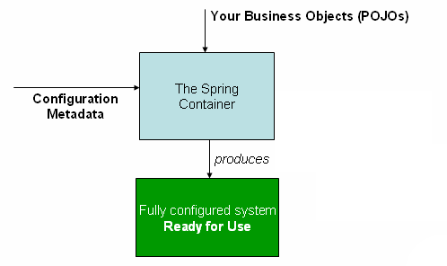
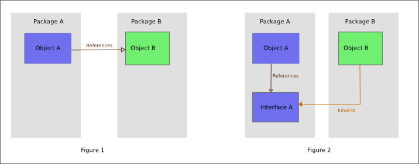

# [백엔드 기본기 Day5] IoC와 DI — Constructor Injection과 Singleton Bean

Day4에서 `cancel()`을 Service로 옮기면서 `ReservationService`는 `ReservationRepository` 인터페이스를 생성자로 받는 모양이 됐다. 그런데 Service 코드 어디에도 `new InMemoryReservationRepository()`가 없어서, 생성자 위에 `//원리는 5일 차에서 배우기..`라는 주석을 달아두고 넘어갔었다. 이번에는 그 주석을 지웠다. 객체를 누가 만들어 어디에 넣는지까지만 다루고, scope 종류 전체나 동시성 재현은 범위 밖으로 둔다.

> Service가 구현체를 직접 만들지 않는데도 도는 이유를 IoC와 DI로 나눠서 설명했다. `@Repository`를 떼고 돌려보니 컴파일은 통과하고 컨텍스트 조립이 `NoSuchBeanDefinitionException`으로 멈췄고, 같은 Service Bean을 두 번 꺼내 비교한 `assertSame`은 통과했다. 공유 인스턴스에서 생길 수 있는 경쟁 상태는 설명만 했고 실행으로 재현하지는 않았다.

## 1. 개념 설명

| 용어 | 한줄뜻 | 현재 프로젝트 적용 지점 |
|---|---|---|
| IoC (제어의 역전) | 객체를 생성하고 연결하는 제어권이 애플리케이션 코드가 아니라 Spring 컨테이너에 있는 것 | Repository → Service → Controller 순서의 Bean 조립 |
| DI (의존성 주입) | 필요한 의존성을 직접 만들지 않고 외부에서 전달받는 것 | `ReservationService(ReservationRepository ...)` |
| Bean | Spring 컨테이너가 생성·보관·연결하는 객체 | `@Service`, `@Repository`, `@RestController` 클래스 |
| 생성자 주입 | 필요한 객체를 생성자 매개변수로 받는 DI 방식 | `this.reservationRepository = reservationRepository;` |
| DIP (의존성 역전 원칙) | 상위 정책이 구체 구현이 아니라 추상화에 의존하는 원칙 | Service → `ReservationRepository` 인터페이스 |
| Singleton Bean | 기본적으로 ApplicationContext 하나에 인스턴스 하나만 두는 Bean | `reservationServiceBeanIsSingleton()` |
| 무상태(stateless) Service | 요청마다 달라지는 값을 공유 필드에 저장하지 않는 Service | `requesterName`을 매개변수·지역변수로 사용 |

앞의 다섯 용어는 "객체가 어떻게 연결되는가", 뒤의 두 용어는 "그렇게 연결하고 나면 어떤 제약이 따라오는가"를 다룬다.

### 객체 생성과 연결의 제어권

`ReservationController`는 `ReservationService`가, `ReservationService`는 `ReservationRepository` 구현체가 있어야 동작한다. 누군가는 이 세 객체를 올바른 순서로 만들어 서로 연결해야 한다.

그 일을 각 클래스가 직접 하면, Service는 필드에서 `new InMemoryReservationRepository()`를 호출해야 한다. 그러면 Service는 "무엇이 필요한가"뿐 아니라 "그것을 어떻게 만드는가"까지 알게 된다. 저장 방식이 바뀌면 Service 코드를 열어 `new` 뒤의 클래스 이름을 고쳐야 한다.

제어의 역전(IoC)은 이 조립 책임을 애플리케이션 코드 밖으로 옮긴 것이다. 우리 코드는 `new`를 부르지 않고, Spring 컨테이너(`ApplicationContext`)가 기동 시점에 객체 그래프를 조립한다.

```text
SpringApplication.run() → ApplicationContext 기동
→ Component Scan: @SpringBootApplication이 있는 com.example.studyroom 아래에서
  @Repository·@Service·@RestController가 붙은 클래스를 Bean 후보로 수집
→ ReservationService 생성자의 인자 타입 ReservationRepository에 맞는 Bean을 찾음
→ InMemoryReservationRepository Bean 생성
→ 그 참조를 ReservationService(ReservationRepository) 생성자에 전달
→ 만들어진 Service를 ReservationController(ReservationService) 생성자에 전달
→ 완성된 Bean들을 컨텍스트에 보관
```

생성자에 넣을 인자가 먼저 있어야 하므로 생성이 끝나는 순서는 Repository → Service → Controller다. 호출 흐름의 방향(Controller → Service → Repository)과 반대라는 점을 기억해 둔다.

"제어가 역전됐다"는 표현은 이 순서의 실행 주체를 가리킨다. 전에는 호출하는 쪽이 부품을 만들었고, 지금은 컨테이너가 부품을 만들어 호출하는 쪽에 넘긴다.

Spring Framework 공식 문서는 애플리케이션 클래스와 설정 메타데이터가 컨테이너에 들어가 완성된 시스템이 되는 이 구조를 다음처럼 그린다.


<!-- velog 업로드: 이 줄 위 이미지 자리에 app/study_docs/assets/day05-web-spring-ioc-container.png 파일을 드래그해 교체 -->

*출처: [Container Overview — Spring Framework Reference, Figure 1. The Spring IoC container](https://docs.spring.io/spring-framework/reference/core/beans/basics.html) — Copyright © 2005 - Broadcom. All Rights Reserved. (문서 사본은 무료 배포와 저작권 고지 유지 조건으로 허용)*

> **정리.** IoC는 객체의 생성과 연결을 누가 실행하는가의 문제다. 이 프로젝트에서는 `ApplicationContext`가 기동 시점에 Repository → Service → Controller 순서로 조립한다.

### DI와 Constructor Injection

의존성 주입(DI)은 제어권을 가진 컨테이너가 부품을 건네는 구체적인 통로다. 이 프로젝트에서 그 통로는 생성자 매개변수다.

이번에 가장 오래 혼동한 짝이 IoC와 DI였다. 처음에는 두 용어를 같은 것의 다른 이름처럼 묶어 외운 상태였다.

| 구분 | 묻는 것 | 이 프로젝트에서 |
|---|---|---|
| IoC | 조립 책임이 어디에 있는가 | Spring 컨테이너가 세 객체를 만들고 연결 |
| DI | 그 책임을 가진 쪽이 부품을 어떤 통로로 건네는가 | Repository Bean을 Service 생성자 매개변수로 전달 |

Day4 주석을 지우고 남은 Service 생성자는 **Spring 문법이 하나도 없는 평범한 Java 생성자**다. Spring이 바꾼 것은 생성자의 모양이 아니라 그것을 누가 언제 호출하느냐다. Spring이 없어도 호출할 수 있는 형태이고, Spring은 그 호출을 대신 수행해 객체 그래프 조립을 자동화할 뿐이다.

생성자 주입을 고른 이유는 세 가지로 정리된다.

- 이 클래스가 없으면 못 도는 의존성이 생성자 시그니처에 타입으로 드러난다
- 받은 값을 `final` 필드에 넣으면 초기화 이후 바뀌지 않는다
- Service는 구현체를 만드는 방법을 모르고, 받은 인터페이스만 사용한다

생성자를 직접 작성할 때는 문법 조건도 세 가지가 맞아야 한다. 이번에 컴파일러가 하나씩 잡아준 조건이다.

```text
생성자 이름 = 클래스 이름
this.x의 x = 그 클래스에 실제로 선언된 필드
매개변수 타입 = 그 필드에 대입 가능한 타입
```


<!-- velog 업로드: 이 줄 위 이미지 자리에 app/study_docs/assets/day05-ioc-di.png 파일을 드래그해 교체 -->

### DIP와 구현체 교체 범위

생성자가 인터페이스 타입을 선언한다는 점이 DIP와 이어진다. Service가 의존하는 것은 `InMemoryReservationRepository`가 아니라 `ReservationRepository` 계약이다.

그래서 메모리 구현을 DB 구현이나 테스트용 가짜로 바꿔도 Service와 Controller의 코드는 그대로 둘 수 있다. 학습 중에는 이것을 "여러 계층간 코드 수정이 번거롭게 여러번 일어나지 않아도 된다"고 정리했다.

Wikimedia Commons의 DIP 도식은 구체 클래스를 직접 참조하던 의존이 인터페이스를 향하도록 바뀌는 전후를 다음처럼 비교한다.


<!-- velog 업로드: 이 줄 위 이미지 자리에 app/study_docs/assets/day05-web-dependency-inversion.png 파일을 드래그해 교체 -->

*출처: [File:Dependency inversion.png — Wikimedia Commons](https://commons.wikimedia.org/wiki/File:Dependency_inversion.png) — Kevin Martin (Mrflay), CC BY-SA 4.0*

DIP와 DI는 층위가 다르다. DIP는 **의존 방향**에 대한 설계 원칙이고, DI는 그 방향대로 **실제 객체를 넣어주는 수단**이다. 인터페이스에 의존하도록 설계해도 누군가 구현체를 넣어주지 않으면 실행되지 않는다.

이 설계가 보장하는 것은 교체 시 수정 범위가 좁아진다는 것까지다. 오늘은 구현체가 하나뿐이라 실제 교체는 하지 않았다. 구현체가 둘 이상일 때 컨테이너가 어느 것을 고르는지도 이번 범위 밖이다.

### 타입 그래프와 Bean 그래프

`@Repository` 한 줄을 떼면 어디서 멈추는지가 이번의 중심 실험이었다. 이 실험은 서로 다른 두 검사 단계를 갈라서 보여줬다.

| 검사 단계 | 확인하는 것 | `@Repository` 제거 시 |
|---|---|---|
| `compileJava` | Java 타입 관계(`implements`, 대입 가능성) | 성공 |
| 컨텍스트 기동(`contextLoads()`) | 생성자 인자마다 넣을 Bean이 있는가 | `NoSuchBeanDefinitionException`으로 실패 |

`implements ReservationRepository`는 그대로 남아 있으므로 컴파일러가 보는 타입 그래프에는 문제가 없다. 사라진 것은 Component Scan 단계의 Bean 등록이다. 인터페이스를 구현했다는 사실만으로 Bean이 되지는 않는다.

```text
@Repository 제거
→ compileJava 성공 (타입 관계 유지)
→ Component Scan이 InMemoryReservationRepository를 후보로 수집하지 않음
→ ReservationService 생성자 인자 ReservationRepository에 넣을 Bean 없음
→ NoSuchBeanDefinitionException → 컨텍스트 조립 중단 → contextLoads() 실패
```

![시퀀스 다이어그램. 참여자는 테스트 실행, ApplicationContext, «@Repository» InMemoryReservationRepository, «@Service» ReservationService, «@RestController» ReservationController다. 먼저 compileJava가 성공하고, 테스트가 contextLoads()로 컨텍스트를 기동하면 ApplicationContext가 Component Scan과 생성자 인자 후보 탐색을 수행한다. alt 프레임의 첫 분기 [@Repository 있음]에서는 ① Repository 생성, ② repository를 Service 생성자에 주입, ③ service를 Controller 생성자에 주입한 뒤 기동 성공과 BUILD SUCCESSFUL을 돌려준다. 둘째 분기 [@Repository 제거]에서는 후보 Bean이 없어 NoSuchBeanDefinitionException이 테스트로 전달되고 contextLoads()가 실패한다. 하단 주석은 두 경우 모두 compileJava가 성공했고 사라진 것은 Bean 등록이라고 적는다.](../../../assets/day05-bean-assembly.png)
<!-- velog 업로드: 이 줄 위 이미지 자리에 app/study_docs/assets/day05-bean-assembly.png 파일을 드래그해 교체 -->

실험 전에는 "애플리케이션 실행 단계에서 실패할 것"이라고 단계는 맞췄다. 다만 이유를 "구현 클래스가 저장소 인터페이스 역할을 잃는다"고 설명했다. Java 역할은 그대로였고, 잃은 것은 Spring Bean 자격이었다.

> **정리.** 컴파일러는 타입 그래프를, 컨테이너는 기동 시점에 Bean 그래프를 검사한다. 애노테이션 누락은 두 번째 검사에서만 드러난다.

### Singleton Bean과 Reference Equality

조립이 끝난 뒤 컨테이너는 만든 Bean을 보관하고 계속 돌려준다. 기본 scope인 singleton에서는 같은 타입을 두 번 `getBean()`해도 같은 인스턴스가 나온다.

```text
getBean(ReservationService.class) → 보관 중인 인스턴스 A 반환
getBean(ReservationService.class) → 같은 인스턴스 A 반환
first == second → true
```

실행 전에는 `false`를 예측했다. Day4에서 서로 다른 `Long` 객체를 `==`로 비교했던 경험을 그대로 가져온 예측이었다. 두 결과는 모순되지 않는다.

| 비교 대상 | 두 참조가 가리키는 것 | `==` 결과 |
|---|---|---|
| 서로 다른 `Long` 객체 | 각각 다른 인스턴스 | `false` |
| 두 번 조회한 Service Bean | 컨테이너가 보관한 같은 인스턴스 | `true` |

`==`는 두 경우 모두 참조 비교다. 달라진 것은 연산자의 의미가 아니라 두 변수가 같은 객체를 가리킬 경로가 있느냐였다. CS로 보면 참조 동일성(identity) 판정이고, 값이 같은지(equality)와는 다른 질문이다.

범위도 좁혀 둔다. singleton은 JVM 전체에 하나라는 뜻이 아니라 **ApplicationContext 하나에 하나**다. 컨텍스트가 둘이면 인스턴스도 둘일 수 있다.

### Stateless Service와 공유 필드

singleton이라는 조립 규칙은 곧바로 설계 제약으로 이어진다. 여러 요청 스레드가 같은 Service 인스턴스를 함께 쓰므로, 그 인스턴스의 필드도 함께 쓴다.

요청마다 달라지는 값을 필드에 두면 다음 순서가 가능하다.

```text
진우 요청 스레드: this.currentRequesterName = "진우"
민수 요청 스레드: this.currentRequesterName = "민수"   ← 덮어씀
진우 요청 스레드: this.currentRequesterName 읽기 → "민수"
```

그래서 무상태는 취향이 아니라 조건이 된다. 요청별 값은 메서드 매개변수·지역변수에 두어 호출마다 분리하고, 필드에는 주입받은 `reservationRepository`처럼 호출과 무관한 값만 둔다. 현재 `reserve(String roomName, String requesterName)`가 이 형태다.

이 순서는 설명으로 짚은 것이고 코드로 재현하지 않았으므로 **미검증**이다. 스레드 공유 메모리에서 생기는 경쟁 상태(race condition)의 한 예로 연결해 둔다.

같은 "상태"라는 말을 다른 곳에 일반화하지는 않는다. `InMemoryReservationRepository`의 `ArrayList`는 예약을 보관하려고 변경 가능한 상태를 의도적으로 가진다. 이 저장소의 동시성 안전성도 검증하지 않았다.

> **정리.** singleton Bean은 요청 스레드가 공유한다. 요청마다 달라지는 값은 필드가 아니라 매개변수·지역변수에 둔다.

> **더 볼 것**
> - [Dependency Injection — Spring Framework Reference](https://docs.spring.io/spring-framework/reference/core/beans/dependencies/factory-collaborators.html): 생성자 기반 DI와 생성자 인자 타입 매칭
> - [Bean Scopes — Spring Framework Reference](https://docs.spring.io/spring-framework/reference/core/beans/factory-scopes.html): singleton이 "JVM당 하나"가 아니라 "컨테이너당 하나"라는 근거
> - 아직 안 본 것 — singleton 외의 scope, OCP, 경쟁 상태를 코드로 재현하는 방법

## 2. 코드 구현

### Day4 주석 제거와 Service 생성자

현재 `ReservationService`의 앞부분이다.

```java
@Service
public class ReservationService{

    private final ReservationRepository reservationRepository;

    public ReservationService(ReservationRepository reservationRepository){
        this.reservationRepository = reservationRepository;
    }
```

Day4까지는 이 생성자 위에 `//생성자 주입 : Spring이 자동으로 InMemoryReservationRepository를 찾아 넣어준다.`와 `//원리는 5일 차에서 배우기..` 두 줄이 붙어 있었고, 이번 커밋에서 지웠다. "자동으로 찾아 넣어준다"는 문장은 1절의 조립 순서로 대체됐다.

대신 Service가 아래처럼 썼다면, Service는 구현체를 만드는 방법까지 알게 된다.

```java
private final InMemoryReservationRepository repository = new InMemoryReservationRepository();
```

이 대조 코드는 비교용으로 적은 것이고 실행하지 않았다. `ReservationController` 생성자는 들여쓰기만 정리했다.

### `@Repository` 제거 실험

`InMemoryReservationRepository`에서 애노테이션만 제거하고 `compileJava`와 `test`를 차례로 실행했다. `compileJava`는 성공했고, `contextLoads()`가 실패했다. 원인 체인 마지막에 다음 예외가 있었다.

```text
NoSuchBeanDefinitionException
```

애노테이션을 되돌린 뒤 전체 테스트는 다시 `BUILD SUCCESSFUL`이었다. 복구했으므로 이 실험은 커밋에 남지 않았다.

### 생성자 독립 작성의 컴파일 오류 세 개

완성 예제 읽기 → 대입문 한 줄 채우기 → Controller 생성자 전체 작성을 거친 뒤, `ReservationService` 생성자를 혼자 다시 썼다. 컴파일러가 세 번 잡아줬다.

```text
invalid method declaration; return type required   ← 생성자 이름을 ReservationRepository로 적음
cannot find symbol                                 ← 없는 this.reservationService 필드를 사용
incompatible types                                 ← ReservationService 타입 매개변수를 Repository 필드에 대입
```

원인은 하나였다. Controller 생성자의 모양을 옮겨오면서 클래스명·필드명·의존 타입을 Service 쪽으로 바꾸지 않았다. 세 오류를 메시지 순서대로 고친 뒤 전체 테스트가 통과했다.

### 자동 검증 결과

Singleton 동일성을 확인하는 테스트를 하나 추가했다.

```java
@Test
void reservationServiceBeanIsSingleton() {
    ReservationService first = applicationContext.getBean(ReservationService.class);
    ReservationService second = applicationContext.getBean(ReservationService.class);

    assertSame(first, second);
}
```

| 확인한 것 | 방법 | 결과 |
|---|---|---|
| Bean 등록 누락 시 실패 지점 | 수동 확인 — `@Repository` 제거 후 `compileJava`·`test`, 확인 뒤 복구 | 컴파일 성공, `contextLoads()` 실패, `NoSuchBeanDefinitionException` |
| 같은 Service Bean 두 번 조회 | 자동 테스트 — `reservationServiceBeanIsSingleton()` | `assertSame(first, second)` 통과 |
| 최종 객체 그래프 | 자동 테스트 — `./gradlew test` 전체 | `BUILD SUCCESSFUL` |

**미검증** — 공유 Service 필드가 만드는 경쟁 상태, `InMemoryReservationRepository`의 `ArrayList` 동시성. 둘 다 실행으로 재현하지 않았다.

오늘 코드는 [`4a0219a` 커밋](https://github.com/enderpawar/8week_Spring_Study/commit/4a0219a)에 있다.

## 3. 스스로 답한 질문

### Q1. IoC와 DI의 구분

**질문.** 현재 코드에서 IoC와 DI는 각각 무엇을 가리키는가?

**A1.** 처음 답은 **"잘 모르겠다"**였다. 두 용어를 같은 것의 다른 이름처럼 묶어서 외워둔 상태라, 하나를 설명하려 하면 다른 하나의 설명이 나왔다.

빈칸을 채우며 다시 세운 답은 이렇다. IoC는 제어권이 어디로 옮겨갔는가의 문제로, Controller·Service·Repository의 생성과 연결을 Spring 컨테이너가 맡는다. DI는 그 제어권을 가진 쪽이 부품을 건네는 방식이고, 여기서는 Repository 구현 Bean을 Service 생성자 매개변수로 넘기는 것이다.

힌트를 받은 직후에 맞춘 답이라 진짜 인출인지 확신이 없어서 8/2 재시험 항목으로 걸어뒀다.

### Q2. Singleton Bean의 `==` 비교 결과

**질문.** 같은 Bean을 두 번 꺼내 `==`로 비교하면 결과는 무엇인가?

**A2.** 실행 전 예측은 `false`였다. 서로 다른 `Long` Wrapper 객체를 `==`로 비교했던 경험을 그대로 가져다 붙였다. 실제로는 `assertSame(first, second)`가 통과했다.

틀린 것은 `==`의 의미가 아니라 비교 대상에 대한 가정이었다. 두 번의 `getBean()`이 같은 인스턴스를 돌려줬다. 앞으로 `==` 결과를 예측할 때는 연산자만 보지 말고 "두 변수가 같은 객체를 가리킬 경로가 있는가"를 먼저 확인한다.

### Q3. Singleton Service의 요청별 필드

**질문.** Singleton Service에 요청별 `currentRequesterName`을 필드로 두면 무엇이 문제인가?

**A3.** 처음 답은 **"요청에 혼선이 생길 수 있다"**였다. 방향은 맞았지만 무엇이 공유되는지가 빠져 있었다.

공유되는 것은 Service 인스턴스이고, 따라서 그 필드도 요청 스레드들이 함께 쓴다. 한 요청이 쓴 값을 다른 요청이 덮어쓰면 첫 요청이 잘못된 이름을 읽을 수 있다. 이 순서는 설명으로 짚었을 뿐 코드로 재현하지 않았으므로 "몇 번 중 몇 번" 같은 수치는 쓰지 않는다.

## 4. 학습 정리와 다음 범위

시작할 때는 생성자 주입을 "Spring이 제공하는 특별한 생성자"쯤으로 생각했다. 확인한 것은 반대였다. 생성자는 평범한 Java 생성자이고, 달라진 것은 그것을 호출하는 주체다. `@Repository` 제거 실험이 그 경계를 보여줬다. 컴파일러는 `implements` 관계까지만 보고, Bean 그래프 조립은 컨텍스트 기동이라는 다른 단계에서 벌어진다.

`==` 예측이 틀린 것도 같은 종류의 교정이었다. 연산자의 의미는 처음부터 맞게 알고 있었고, 몰랐던 쪽은 컨테이너가 같은 인스턴스를 돌려준다는 조립 규칙이었다. singleton을 "하나만 만든다"로 외우는 것과 "그래서 필드를 공유한다"까지 잇는 것은 다른 일이었다.

**아직 남은 것**은 두 가지다. 공유 인스턴스의 경쟁 상태와 `ArrayList` 동시성은 설명만 하고 재현하지 않았다. 동시성은 이 5주 트랙에서 다루지 않기로 해 **고치지 않을 것**으로 두고 미검증 표시만 남긴다. 또 이번에 늘어난 자동 테스트는 Bean 동일성 하나뿐이라 HTTP 응답 계약은 여전히 회귀를 잡지 못한다. 이것은 Week D D5에 갚기로 한 **나중에 고칠 것**이다.

다음은 Week A D6 누적시험이다. 그 전에 힌트가 필요했던 IoC·DI 구분, Singleton 동일성, 생성자 구조를 8/2에 다시 인출한다.

면접에서 다시 답해볼 항목을 남긴다.

- 생성자 주입과 필드에서 직접 `new`로 만드는 방식의 책임 차이
- singleton Bean이 무상태여야 하는 조건

---

오늘 공부한 소스코드: `app/src/main/java/com/example/studyroom/service/ReservationService.java`, `app/src/main/java/com/example/studyroom/controller/ReservationController.java`, `app/src/test/java/com/example/studyroom/StudyRoomApiApplicationTests.java`
