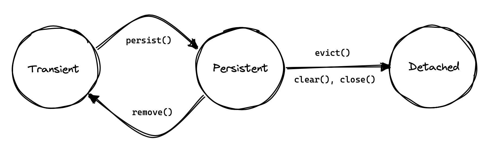

# [백엔드 기본기 Day11] Persistence Context — First-Level Cache와 Entity Identity

Day10에서 `Reservation`을 Entity로 매핑하고 Spring Data JPA 어댑터로 저장소를 갈아끼웠다. 그때 테스트에 `entityManager.flush()`와 `clear()`를 넣었지만 두 메서드가 무엇을 하는지는 설명하지 못했다. 이번에는 그 둘이 다루는 대상인 영속성 컨텍스트를 열어, 같은 `id`를 한 트랜잭션에서 두 번 조회할 때 SQL이 몇 번 나가고 어떤 객체가 돌아오는지 확인했다. 필드 변경이 `UPDATE`로 바뀌는 변경 감지는 Day12의 범위다.

> 같은 `id`를 두 번 조회하면 SELECT가 한 번 나갈 것이라 예측했지만, `save()` 직후에는 SELECT가 0번이었다. `save()`가 반환한 객체가 이미 1차 캐시에 있었기 때문이다. `clear()`로 캐시를 비운 뒤에는 SELECT가 정확히 1번 나갔고, 두 경우 모두 두 조회 결과는 `assertSame`을 통과하는 같은 인스턴스였다. 관찰은 하나의 테스트 트랜잭션 안으로 한정된다.

## 1. 개념 설명

| 용어 | 한줄뜻 | 현재 프로젝트 적용 지점 |
|---|---|---|
| 영속성 컨텍스트 | `EntityManager`가 현재 트랜잭션 동안 관리 중인 Entity를 붙잡아두는 공간 | 테스트 클래스의 `@Transactional` 메서드 하나 = 컨텍스트 하나 |
| 1차 캐시 | 영속성 컨텍스트 안에서 (Entity 타입, id)를 키로 Entity를 찾는 식별자 맵 | `findById()`가 SQL 전에 들르는 곳 |
| 관리 상태(managed) | 영속성 컨텍스트에 들어가 추적되고 있는 Entity의 상태 | `repository.save()`와 `findById()`가 반환한 객체 |
| `entityManager.clear()` | 영속성 컨텍스트(1차 캐시 포함)를 통째로 비움 | 호출 뒤 같은 id를 조회하면 SELECT가 다시 나감 |
| 참조 동일성 | 두 참조가 메모리상 같은 인스턴스를 가리키는 관계 | `assertSame(first, second)` |

### Persistence Context의 필요성

Day09의 `JdbcReservationRepository.findById()`는 호출될 때마다 SELECT를 실행하고, `mapRow()` 안에서 `new Reservation(...)`으로 객체를 새로 만들었다. 같은 `id`를 두 번 조회하면 값은 같지만 서로 다른 인스턴스 두 개가 생긴다.

이 구조에서는 두 가지가 깨진다.

- **중복 SQL.** 한 요청 안에서 같은 예약을 여러 번 읽으면 그 횟수만큼 DB에 다녀온다.
- **상태의 분열.** 한쪽 인스턴스에서 `cancel()`을 불러도 다른 쪽 인스턴스의 `confirmed`는 그대로다. 코드의 두 지점이 같은 예약을 서로 다른 상태로 보게 된다.

JPA는 이 문제를 조회 결과를 트랜잭션 동안 붙잡아두는 공간으로 푼다. 그 공간이 영속성 컨텍스트다. 같은 트랜잭션에서 같은 행을 가리키는 Java 객체를 **하나로 유지**하는 것이 이 장치의 첫 번째 역할이다.

### Persistence Context의 범위

영속성 컨텍스트는 전역 저장소가 아니다. Spring 환경에서 Repository와 테스트가 주입받는 `EntityManager`는 현재 트랜잭션에 묶인 컨텍스트로 연결된다.

오늘 테스트 클래스 `JpaReservationRepositoryTest`에는 클래스 수준 `@Transactional`이 붙어 있다. 그래서 테스트 메서드 하나가 트랜잭션 하나이고, 그 안의 `save()`·`flush()`·`findById()`는 모두 같은 영속성 컨텍스트를 본다.

```text
테스트 메서드 시작
→ 트랜잭션 시작, 영속성 컨텍스트 준비
→ save() · flush() · findById() … 모두 같은 컨텍스트 사용
→ 테스트 메서드 종료
→ 트랜잭션 종료, 컨텍스트 폐기
```

`@Transactional`이 이 경계를 어떻게 만드는지는 오늘 범위가 아니다. 이번 주에는 "주어진 래퍼"로 쓰고, 메커니즘은 Week C D1(트랜잭션 경계)에서 연다.

> **정리.** 영속성 컨텍스트 하나는 트랜잭션 하나에 대응한다. 오늘 관찰한 모든 캐시 동작은 한 테스트 메서드 안에서만 성립한다.

### First-Level Cache의 조회 순서

1차 캐시는 영속성 컨텍스트 안의 식별자 맵이다. 키는 `(Entity 타입, id)`이고 값은 관리 중인 인스턴스다.

```text
테스트 → repository.findById(id)
→ JpaReservationRepository가 SpringDataReservationRepository에 위임
→ Spring Data 기본 구현이 EntityManager에 id로 조회 요청
→ 영속성 컨텍스트가 (Reservation, id) 키로 1차 캐시 확인
   ├─ 있음 → SQL 없이 그 인스턴스를 그대로 반환
   └─ 없음 → H2에 SELECT
            → 결과 행으로 Reservation 인스턴스 생성
            → 1차 캐시에 (Reservation, id) → 인스턴스 등록
            → 그 인스턴스 반환
```

두 번째 조회가 "캐시 적중"으로 끝나면, 돌려받는 것은 값을 복사한 새 객체가 아니라 **첫 조회 때 등록된 바로 그 인스턴스**다. 그래서 1차 캐시는 성능 장치이기 전에 동일성 장치다.

캐시에 없을 때만 SELECT가 나간다는 점도 중요하다. 첫 조회가 반드시 DB로 간다는 보장은 없다. 첫 조회 시점에 이미 캐시에 들어 있으면 SELECT는 0번이다.

### Managed State의 시작 시점

오늘 가장 크게 빗나간 예측이 여기서 나왔다. 나는 `save()` 뒤 같은 `id`를 두 번 조회하면 "첫 조회는 DB, 두 번째는 캐시"라고 봤다. 실제 로그에는 `insert` 한 줄뿐이었다.

```text
save(reservation)
→ 반환된 saved는 이미 관리 상태, 1차 캐시에 등록
→ flush() : INSERT 실행, 컨텍스트는 그대로
→ findById(id) 1회차 : 캐시 적중, SQL 없음
→ findById(id) 2회차 : 캐시 적중, SQL 없음
```

Entity가 관리 상태가 되는 경로는 조회만이 아니다. `save()`로 저장한 객체도 그 순간부터 컨텍스트에 올라간다. 그러니 "1차 캐시에 올라가려면 DB에서 한 번 읽어야 한다"는 전제는 틀렸다.

Hibernate 공식 문서는 Entity 인스턴스가 영속성 컨텍스트에 대해 가질 수 있는 상태와 그 전이를 다음처럼 그린다.


<!-- velog 업로드: 이 줄 위 이미지 자리에 app/study_docs/assets/day11-web-hibernate-entity-lifecycle.png 파일을 드래그해 교체 -->

*출처: [A Short Guide to Hibernate 7 — 5.1. Persistence contexts](https://docs.hibernate.org/orm/7.4/introduction/html_single/Hibernate_Introduction.html#persistence-contexts) — Hibernate ORM 7 문서, Apache License 2.0*

한 가지는 구분해 둔다. `Reservation`의 `id`는 `GenerationType.IDENTITY`로 DB가 만든다. 오늘 로그는 `INSERT`가 `save()` 줄과 `flush()` 줄 중 어디서 나갔는지 나눠 보지 않았다. 아래 그림의 `INSERT` 위치는 "늦어도 `flush()`까지"로 읽는다.

### `clear()`와 `flush()`의 구분

두 메서드는 Day10부터 테스트에 함께 있었지만 하는 일은 반대 방향에 가깝다.

| 메서드 | DB에 SQL을 보내는가 | 1차 캐시를 비우는가 |
|---|---|---|
| `flush()` | 보낸다(대기 중인 변경을 SQL로 실행) | 비우지 않는다 |
| `clear()` | 보내지 않는다 | 통째로 비운다 |

`flush()`는 "컨텍스트 → DB" 방향으로 밀어내는 동작이고, 관리 중인 객체는 그대로 남는다. `clear()`는 컨텍스트 자체를 초기화해서 이후 조회를 **처음 조회하는 상태**로 되돌린다.

그래서 두 번째 실험에서는 `flush()` 뒤에 `clear()`를 넣었다. 예측은 "SELECT 1번, 두 번째는 추가 SQL 없음, 동일성은 여전히 참"이었고 로그가 그대로였다.

```sql
insert into reservation (confirmed, requester_name, room_name, id) values (?, ?, ?, default)
select r1_0.id, r1_0.confirmed, r1_0.requester_name, r1_0.room_name from reservation r1_0 where r1_0.id=?
```

`clear()`는 조회를 막는 장치가 아니었다. 캐시를 비워 첫 조회가 DB로 가게 만들고, 그 조회가 다시 캐시를 채웠다. 두 번째 조회는 방금 채워진 인스턴스를 받았다.

`flush()` 없이 `clear()`만 하면 아직 SQL이 되지 않은 변경이 컨텍스트와 함께 버려질 수 있다. 오늘은 항상 `flush()` 뒤에 `clear()`를 불렀고, 순서를 뒤집은 경우는 실행하지 않았다(미검증).

> **정리.** `flush()`는 내보내고 남긴다. `clear()`는 내보내지 않고 비운다. 테스트에서 `flush()` → `clear()` 순서를 쓰는 이유는 "DB에 쓴 다음, 캐시가 아니라 DB에서 다시 읽기" 위해서다.


<!-- velog 업로드: 이 줄 위 이미지 자리에 app/study_docs/assets/day11-first-level-cache.png 파일을 드래그해 교체 -->

### Reference Equality와 Value Equality

Java에는 "같다"가 두 가지 있다. `==`는 두 참조가 같은 인스턴스를 가리키는지(동일성), `equals()`는 두 객체가 같은 값으로 취급되는지(동등성)를 본다. JUnit의 `assertSame`은 전자, `assertEquals`는 후자를 검사한다.

| 검사 | 비교 대상 | 1차 캐시 검증에 쓸 수 있는가 |
|---|---|---|
| `assertSame(a, b)` | `a == b` (같은 인스턴스) | 쓸 수 있다 |
| `assertEquals(a, b)` | `a.equals(b)` | `equals()` 구현에 따라 달라진다 |

첫 단언은 `assertEquals`로 썼다가 `assertSame`으로 바꿨다. `Reservation`은 `equals()`를 재정의하지 않아서 `Object.equals()`의 참조 비교가 쓰이고, 지금은 `assertEquals`도 우연히 통과한다.

문제는 나중이다. 누군가 `equals()`를 `roomName`·`requesterName`·`id` 같은 필드 비교로 재정의하면, 서로 다른 인스턴스 두 개여도 `assertEquals`는 계속 초록불이다. 1차 캐시가 보장하는 것은 값이 같다는 사실이 아니라 **인스턴스가 하나**라는 사실이므로, 검증도 동일성으로 해야 한다.

> **정리.** 1차 캐시는 값이 아니라 (타입, id)로 같은 인스턴스를 돌려준다. 이것을 증명하는 단언은 `assertSame`이다.

### 보장 범위와 한계

오늘 관찰로 말할 수 있는 것과 없는 것을 나눈다.

- **보장(관찰함).** 같은 트랜잭션, 같은 영속성 컨텍스트 안에서 같은 `id`를 `findById()`로 두 번 조회하면 같은 인스턴스가 돌아왔다. `clear()` 유무와 관계없이 성립했다.
- **보장하지 않음(미검증).** 트랜잭션이 다르면 컨텍스트도 다르므로 같은 인스턴스를 기대할 근거가 없다. 오늘은 트랜잭션을 나눠 조회해 보지 않았다.
- **보장하지 않음(미검증).** `clear()` 전에 받은 인스턴스와 `clear()` 후에 받은 인스턴스를 비교하지 않았다. 테스트는 `clear()` 이후의 두 조회끼리만 비교한다.

"1차 캐시가 SELECT를 줄인다"도 조건부다. `findById()`처럼 id로 찾는 조회가 캐시를 먼저 보는 것을 확인했을 뿐, `findAll()` 같은 다른 조회 경로의 SQL 횟수는 세지 않았다.

### 현재 코드 연결

- 실험 코드: `JpaReservationRepositoryTest.repeatedFindByIdWithinSameTransactionReturnsSameInstance()`
- 컨텍스트 조작 도구: 같은 테스트 클래스에 주입한 `EntityManager entityManager`
- 조회 경로: `JpaReservationRepository.findById()` → `SpringDataReservationRepository`(Spring Data가 구현한 `JpaRepository<Reservation, Long>`)
- 같은 날 서비스 코드: `ReservationService.cancel()`은 `findById()` → `reservation.cancel()` → `reservationRepository.save(reservation)` 순서이고, 이 시점에는 `@Transactional`이 없다. 테스트와 달리 서비스 호출이 한 컨텍스트 안에서 실행되는지는 오늘 확인하지 않았다.

> **더 볼 것**
> - [Hibernate ORM User Guide — Persistence Context](https://docs.hibernate.org/orm/6.6/userguide/html_single/Hibernate_User_Guide.html#pc): 영속성 컨텍스트와 Entity 상태 전이, "repeatable read" 1차 캐시
> - 아직 안 본 것 — 관리 중인 객체의 필드 변경이 DB에 반영되는 변경 감지(Day12), `@Transactional`이 컨텍스트 경계를 만드는 방식(Week C D1)

## 2. 코드 구현

### 같은 `id` 2회 조회의 동일성 테스트

```java
Reservation reservation = new Reservation("B101", "Jinwoo");
Reservation saved = repository.save(reservation);
entityManager.flush();
Long id = saved.getId();

entityManager.clear();

Reservation first = repository.findById(id).orElseThrow();
Reservation second = repository.findById(id).orElseThrow();

assertSame(first, second);
```

실험 1은 이 코드에서 `entityManager.clear();` 한 줄이 없는 상태로 돌렸다. 로그에는 `insert`만 찍혔고 `assertSame`은 통과했다. 실험 2는 그 한 줄을 추가해 다시 돌렸고, `select`가 정확히 1번 추가됐다.

커밋된 최종본은 실험 2의 형태다. 소스에는 실험 1 시점의 주석 `// 2. 같은 id로 두 번 조회 — 여기서는 clear() 호출 금지!`가 그대로 남아 있는데, 이 금지는 두 `findById()` **사이**에 대한 것이다. 두 조회 사이에 `clear()`를 넣으면 비교하려는 조건 자체가 바뀐다.

`flush()`를 먼저 부른 이유도 있다. `clear()`가 대기 중인 `INSERT`를 버리지 않도록 DB로 먼저 내보내고, 그다음에 캐시를 비웠다.

### 자동 검증 결과

| 조건 | SELECT 횟수 | `assertSame(first, second)` |
|---|---|---|
| `save()`+`flush()` 뒤 `clear()` 없이 2회 조회 | 0번 | 통과 |
| `save()`+`flush()` 뒤 `clear()` 후 2회 조회 | 1번 | 통과 |

두 조건 모두 자동 테스트로 실행했고, SELECT 횟수는 Hibernate SQL 로그(`show-sql: true`)를 보고 셌다. 수동 HTTP 확인은 하지 않았다. 코드는 [9e3dfc3](https://github.com/enderpawar/8week_Spring_Study/commit/9e3dfc3a3956d03e68588499e7a54772a7a6d599)에 있다.

## 3. 스스로 답한 질문

### Q1. `save()` 직후 조회의 SELECT 횟수

**질문.** `save()` 직후, `clear()` 없이 같은 `id`로 `findById()`를 두 번 부르면 SELECT는 몇 번 나가는가?

**A1.** 처음에는 "SELECT 한 번, `first == second`는 true"라고 답했다. 동일성은 맞았고 SELECT 횟수는 틀렸다. 실제로는 0번이었다.

틀린 이유는 "첫 조회는 당연히 DB에서 읽는다"는 전제였다. `save()`가 반환한 객체는 그 시점부터 이미 관리 상태이고 1차 캐시에 들어 있다. 그래서 첫 번째 조회부터 캐시 적중이었다.

교정한 기준은 "SELECT 여부는 몇 번째 조회인지가 아니라 **그 시점에 캐시에 있는지**로 정해진다"이다. 이 기준으로 `clear()`를 넣은 실험 2를 다시 예측했고, 결과가 그대로 일치했다.

### Q2. Entity의 `final` 필드와 빈 기본 생성자

**질문.** Entity 필드를 `final`로 두고 빈 `protected` 기본 생성자를 함께 두면 어떻게 되는가?

**A2.** 이날 아침 인출은 복습큐에 밀려 있던 오답재시험 5문항이었다. 앞의 네 문항(`final`과 DB 행의 무관함, 싱글톤 Service의 인스턴스 필드, 같은 객체 2회 `save()`, 예외 상세의 로그 분리)은 통과했다. 이 문항만 남았다.

8/10에는 "된다"고 답했다. 이번에는 "불변이라 못 다룬다"는 방향까지는 갔지만 정확한 메커니즘에는 닿지 못했다.

교정된 답은 이것이 Hibernate의 런타임 문제가 아니라 **컴파일 단계의 문제**라는 것이다. `final` 필드는 모든 생성자 경로에서 초기화돼야 하는데, 빈 기본 생성자는 그 필드를 초기화하지 않는다. 그래서 컴파일러가 거부한다. 이 문항은 복습큐 +2로 다시 등록했다.

## 4. 학습 정리와 다음 범위

Day10까지 `findById()`는 "SELECT 한 번을 대신 써주는 메서드"였다. 오늘 그 설명이 깨졌다. `findById()`는 먼저 영속성 컨텍스트를 보고, 거기 없을 때만 SQL을 만든다. JPA가 트랜잭션 동안 관리하는 것은 SQL이 아니라 객체이고, SQL은 필요할 때만 생기는 결과다.

그리고 1차 캐시가 돌려주는 것은 "같은 값"이 아니라 "같은 인스턴스"다. 이 구분이 다음 날의 변경 감지로 이어진다. 인스턴스가 하나이기 때문에, 그 인스턴스의 필드를 바꾼 것이 곧 트랜잭션 안에서 그 예약의 상태를 바꾼 것이 된다.

**아직 남은 것**은 트랜잭션 경계를 넘을 때의 동일성이다. 오늘 관찰은 전부 한 테스트 트랜잭션 안이었고, 서비스 코드인 `ReservationService.cancel()`에는 아직 `@Transactional`이 없다. 서비스 호출에서 조회와 저장이 같은 컨텍스트를 쓰는지는 **나중에 확인할 것**으로 분류하고, 트랜잭션 경계를 여는 Week C D1로 넘긴다.

면접에서 다시 답해볼 항목을 남긴다.

- 같은 트랜잭션에서 같은 `id`를 조회한 두 객체가 다른 인스턴스라면 어떤 버그가 가능해지는가
- 테스트에서 `flush()` 없이 `clear()`만 호출하면 무엇을 잃을 수 있는가

<!-- 선택 복습 메모: 게시 화면에는 노출하지 않는다.
[직접 작성] 오늘 배운 것을 내 문장으로
- 1차 캐시가 "값이 같아서"가 아니라 "같은 트랜잭션·같은 id라서" 같은 참조를 돌려준다는 게 왜 중요한지:
- `clear()`를 실무에서 언제 써야 할지 (또는 왜 함부로 쓰면 안 되는지):
-->

---

오늘 공부한 소스코드: `app/src/test/java/com/example/studyroom/repository/JpaReservationRepositoryTest.java`
