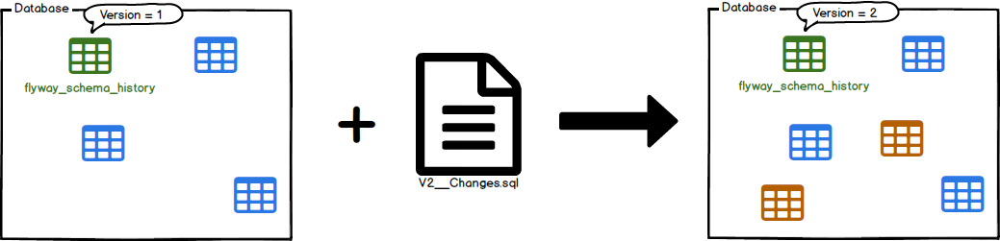

# [백엔드 기본기 Day14] 2주차 버퍼 — ddl-auto validate와 CHECK Constraint

Week B D7은 버퍼다. 새 개념을 배우기보다 한 주 동안 쌓인 설정과 부채를 정리하고, 독립과제로 그 주의 개념을 힌트 없이 한 번 관통시킨다. Day13 시험에서 교정한 "적용된 마이그레이션은 고치지 않는다"는 기준이 여기서 두 번 쓰였다.

> `ddl-auto`를 `none`에서 `validate`로 올려 Hibernate를 스키마 감시자로 바꿨고, `V2`에 `CHECK` 제약을 걸어 Day08부터 남아 있던 빈 문자열 부채를 DB 수준에서 막았다. 독립과제로 `cancel_reason` 컬럼을 `V3` → Entity → Service → Controller → 테스트까지 추가했고, `cancel()` 시그니처 변경이 컴파일 에러로 호출부를 하나씩 드러냈다. 마지막 검증 테스트에서 D5와 같은 변경 감지 함정을 다시 밟았다가 고쳤고, 최종 테스트 16개가 통과했다.

## 1. 버퍼 범위와 진행 방식

### D7에서 처리한 항목

| 순서 | 항목 | 결과 |
|---|---|---|
| ① 미완료 필수 유닛 | D1~D6 완료 여부 확인 | 없음 |
| ② 설정 마무리 | `ddl-auto: none` → `validate` | 전체 테스트 `BUILD SUCCESSFUL` |
| ③ 기술부채 상환 | Day08 빈 문자열 부채, Day04 메모리 저장소 부채 | `V2` `CHECK` 제약 추가, 메모리 저장소는 Day10에 해소됐음을 재확인 |
| ④ 주간 독립과제 | `cancel_reason` 컬럼 추가 | 골격 없이 요구사항만 받아 구현 |

독립과제는 처음 커밋([9e3dfc3](https://github.com/enderpawar/8week_Spring_Study/commit/9e3dfc3a3956d03e68588499e7a54772a7a6d599)) 시점에는 다음 세션으로 넘길 예정이었지만, 같은 날 이어서 끝내고 [2f870cf](https://github.com/enderpawar/8week_Spring_Study/commit/2f870cf97f51e956885b914505c09d54fe1b7ca3)에 커밋했다.

메모리 저장소 부채는 새로 고친 것이 아니다. Day10에서 `JpaReservationRepository`가 유일한 `@Repository` Bean이 됐고, `InMemoryReservationRepository`의 `@Repository`는 주석 처리된 상태였다. 이날은 그 사실을 확인하고 원장에 반영만 했다.

## 2. D7 코드 적용의 개념

### 용어 색인

| 용어 | 한줄뜻 | 현재 프로젝트 적용 지점 |
|---|---|---|
| `ddl-auto` | 기동 시 Hibernate가 스키마에 대해 할 일을 정하는 설정 | `application.yml:10`의 `validate` |
| `CHECK` 제약 | 행이 들어올 때 조건식이 거짓이면 거부하는 DB 제약 | `V2__add_name_check_constraints.sql` |
| 마이그레이션 불변 | 적용된 파일은 고치지 않고 새 버전을 쌓는 규칙 | `V1`은 그대로, `V2`·`V3` 추가 |
| 시그니처 변경 전파 | 메서드의 매개변수가 바뀌면 모든 호출부가 컴파일 에러로 드러남 | `cancel()` → `cancel(String)` |
| `@RequestParam` | 쿼리 파라미터나 폼 파라미터를 메서드 인자로 받는 애노테이션 | `ReservationController.cancel()`의 `cancelReason` |

### `ddl-auto` 모드와 스키마 소유권

**필요성.** Week B에서 스키마의 원본은 Flyway SQL 파일이다. 그런데 Hibernate도 Entity를 보고 DDL을 만들 수 있다. 두 도구가 모두 스키마를 바꿀 수 있으면, DB의 현재 모양이 어느 쪽에서 왔는지 추적할 수 없다.

그래서 Day10부터 `ddl-auto: none`으로 Hibernate의 DDL 권한을 막아뒀다. 문제는 `none`이 아무것도 하지 않는다는 점이다. Entity에 필드를 추가하고 마이그레이션을 빠뜨려도 기동은 성공하고, 오류는 그 필드를 실제로 읽고 쓰는 요청에서야 드러난다.

| 값 | 기동 시 Hibernate가 하는 일 | 이 프로젝트에서 |
|---|---|---|
| `none` | 아무것도 하지 않음 | Day10~Day13 |
| `validate` | 매핑과 실제 스키마를 대조, 불일치면 기동 실패. DDL은 만들지 않음 | Day14부터 |
| `update` / `create` / `create-drop` | Entity 기준으로 테이블·컬럼을 추가하거나 새로 만듦 | 사용하지 않음. 스키마 원본이 Flyway와 둘로 갈림 |

Spring Boot는 H2 같은 내장 DB를 쓰고 Flyway·Liquibase가 없으면 기본값을 `create-drop`으로, 그 밖의 경우는 `none`으로 잡는다. 이 프로젝트는 Flyway가 있으므로 설정하지 않아도 `none`이었고, 이날 명시적으로 `validate`를 선택했다.

**동작 순서.**

```text
애플리케이션 기동
→ Flyway가 V1, V2, V3 중 미적용 버전 실행
→ Hibernate가 @Entity 매핑 수집 (Reservation 필드 → 컬럼 이름·타입)
→ validate: 실제 스키마의 reservation 테이블과 대조
→ 일치하면 컨텍스트 기동 계속
→ 누락·타입 불일치가 있으면 기동 실패
```

변경 전 예측은 "Entity 필드랑 실제 DB 컬럼 타입·이름 비교해서 안 맞으면 기동 실패"였고, 방향은 맞았다. `none`과 `validate`는 둘 다 DDL을 만들지 않는다는 점에서 같다. `validate`는 거기에 **불일치 감시**만 더한다. 스키마를 만드는 권한은 끝까지 Flyway에만 있다.

**보장 범위와 한계.** 이날 확인한 것은 일치하는 경우다. V1+V2 적용 후, 그리고 V3와 `cancelReason` 필드를 함께 추가한 뒤 전체 테스트가 통과했다. 일부러 필드와 컬럼을 어긋나게 해서 기동이 실패하는 대조군은 실행하지 않았다(미검증).

`validate`가 보는 것은 매핑된 테이블과 컬럼의 존재, 타입이다. `CHECK` 제약 같은 DB 규칙까지 대조하지는 않는다. `V2`의 제약이 실제로 동작하는지는 별도 테스트로 확인해야 했다.

> **정리.** `validate`는 스키마를 만들지 않는 감시자다. 원본은 Flyway, Hibernate는 기동 시 "내 매핑이 원본과 맞는가"만 확인하고 틀리면 멈춘다.

### `NOT NULL`·`CHECK`·`@NotBlank`의 검증 계층

**필요성.** Day08에 H2 콘솔에서 `''`를 직접 넣었더니 `NOT NULL` 컬럼을 그대로 통과했다(`Update count: 1`). `''`는 값이 없는 것이 아니라 길이 0인 값이 있는 상태이기 때문이다. `@NotBlank`는 `''`를 막지만 HTTP 요청 경로에서만 동작하므로, 앱을 거치지 않은 INSERT는 보지 못한다.

**세 장치의 위치와 판정.**

| 장치 | 동작 위치와 막는 값 | 보지 못하는 것 |
|---|---|---|
| `@NotBlank` | 요청 바인딩 시점, `null`·`''`·공백 문자열 | HTTP를 거치지 않은 INSERT |
| `NOT NULL` | DB 행 저장 시점, `NULL` | `''` |
| `CHECK (room_name <> '')` | DB 행 저장 시점, `''` | `NULL`(조건 결과가 UNKNOWN이면 통과) |

마지막 행이 `NOT NULL`을 지우면 안 되는 이유다. SQL에서 `NULL <> ''`는 참도 거짓도 아닌 UNKNOWN이고, `CHECK`는 거짓일 때만 거부한다. 그래서 `NULL`은 `NOT NULL`이, `''`는 `CHECK`가 막는 식으로 두 제약이 나눠 맡는다.

```text
HTTP 요청 → @Valid/@NotBlank → Service → JPA INSERT → NOT NULL + CHECK
H2 콘솔·네이티브 쿼리 ──────────────────────→ INSERT → NOT NULL + CHECK
```

두 경로는 DB 앞에서 합쳐진다. 앱 검증은 사용자에게 400과 이유를 돌려주는 장치이고, DB 제약은 경로와 무관하게 데이터 자체를 지키는 마지막 장치다. 둘은 중복이 아니라 계층이 다르다.

**보장 범위와 한계.** `CHECK (room_name <> '')`는 길이 0인 문자열만 막는다. 공백만 있는 `'   '`를 거부하는지는 테스트하지 않았다(미검증). `@NotBlank`와 완전히 같은 규칙을 DB에 옮긴 것은 아니다.

### Migration 불변과 새 버전 추가

Day13 시험의 교정 기준을 그대로 적용했다. Flyway는 적용된 파일의 체크섬을 기동마다 장부값과 대조하고, 다르면 `FlywayValidateException`으로 기동을 거부한다. 따라서 스키마를 바꾸는 방법은 `V1__init.sql` 수정이 아니라 새 버전 추가다.

```text
V1__init.sql                    (Day08, 적용됨 → 수정 금지)
V2__add_name_check_constraints  (Day14, 빈 문자열 부채)
V3__cancel_reason               (Day14, 독립과제)
```

Flyway 공식 문서는 버전 1인 DB에 V2 파일을 더해 버전 2가 되는 migrate 과정을 다음처럼 그린다.


<!-- velog 업로드: 이 줄 위 이미지 자리에 app/study_docs/assets/day14-web-flyway-migrate.png 파일을 드래그해 교체 -->

*출처: [Migrations — Redgate Flyway Documentation](https://documentation.red-gate.com/flyway/flyway-concepts/migrations) — Copyright 1999 - 2026 Red Gate Software Ltd. All rights reserved.*

이 구조는 추가만 허용되는 로그와 같다. 이미 push한 커밋을 rebase하지 않고 새 커밋을 쌓는 것처럼, 과거 버전을 고정해야 모든 DB가 같은 순서로 같은 상태에 도달한다.

### 메서드 시그니처 변경의 전파

**필요성.** 독립과제에서 `cancel()`에 취소 사유를 받게 해야 했다. 선택지는 둘이었다.

| 방식 | 기존 호출부 | 결과 |
|---|---|---|
| 오버로드 `cancel(String)` 추가 | 그대로 컴파일됨 | 사유가 남는 취소와 안 남는 취소가 공존 |
| 시그니처 자체 변경 | 전부 컴파일 에러 | 모든 취소 경로가 사유를 넘겨야 함 |

"취소엔 항상 사유가 있어야 한다"는 도메인 판단으로 두 번째를 골랐다. 오버로드는 수정 범위가 작지만, 사유 없는 취소 경로가 남아 규칙이 코드에서 강제되지 않는다.

**동작 순서.** Java 컴파일러는 호출부마다 인자의 개수와 타입이 선언된 매개변수와 맞는지 검사한다. 선언을 바꾸면 이 검사가 모든 호출부에서 다시 실행된다.

```text
Reservation.cancel(String)으로 선언 변경
→ ReservationService의 reservation.cancel() 호출부 컴파일 에러
→ Service를 cancel(Long, String)으로 변경
→ ReservationController의 호출부 컴파일 에러
→ Controller 변경 후 테스트 컴파일 에러 4곳
→ 컴파일 통과 후 HTTP 계약 변경으로 MockMvc 테스트 2개 실패
```

마지막 줄이 이 전파의 경계다. 컴파일러는 Java 호출부만 검사한다. URL과 쿼리 파라미터로 이루어진 HTTP 계약이 바뀐 것은 컴파일 에러가 되지 않고, 요청을 실제로 보내는 테스트가 실행될 때에만 드러난다.

![클래스 다이어그램. 오른쪽 열에 위에서 아래로 «@RestController» ReservationController, «@Service» ReservationService, «@Entity» Reservation, «table» reservation이 놓여 있다. Controller의 cancel(id: Long, cancelReason: String)은 cancelReason에 @RequestParam @NotBlank 제약이 붙어 있고, Controller가 Service의 cancel(id, cancelReason)을, Service가 Reservation의 cancel(cancelReason: String)을 «call» 의존 화살표로 호출한다. Reservation은 confirmed와 cancelReason 필드, getCancelReason()을 가지며 «map»으로 reservation 테이블에 연결된다. 테이블에는 room_name과 requester_name의 <> '' 제약과 cancel_reason VARCHAR(100) [0..1]이 있다. 왼쪽 열의 ReservationControllerHttpTest, ReservationServiceTest, JpaReservationRepositoryTest가 각각 같은 높이의 Controller, Service, Reservation을 «call»한다. 노트는 ddl-auto: validate가 기동 시 필드와 컬럼을 대조한다는 것을 테이블에 연결한다.](../../../assets/day14-cancel-reason-layers.png)
<!-- velog 업로드: 이 줄 위 이미지 자리에 app/study_docs/assets/day14-cancel-reason-layers.png 파일을 드래그해 교체 -->

그림에서 의존 화살표는 위에서 아래로 향하고, 컴파일 에러는 그 반대 방향으로 올라왔다. 가장 아래의 `Reservation`을 바꾸자 그것을 호출하는 모든 클래스가 차례로 드러났다. 인터페이스나 DI가 없어도, 정적 타입 검사만으로 영향 범위가 목록이 된다.

> **정리.** 시그니처를 바꾸면 영향받는 Java 호출부는 컴파일러가 전부 찾아준다. 컴파일러가 못 보는 HTTP 계약 변경은 요청을 보내는 테스트만 잡는다.

### `@PathVariable`과 `@RequestParam`의 구분

**동작 위치.** 두 애노테이션은 요청의 서로 다른 부분에서 값을 꺼낸다.

| 애노테이션 | 값의 출처 | 이 프로젝트의 예 |
|---|---|---|
| `@PathVariable` | URL 템플릿의 `{변수}` 자리 | `/reservations/cancel/{id}`의 `id` |
| `@RequestParam` | 쿼리 문자열·폼 파라미터 | `?cancelReason=...` |

`@PathVariable`은 매핑 템플릿에 같은 이름의 자리가 있어야 값을 받을 수 있다. 처음에는 `cancelReason`을 `@PathVariable`로 선언했는데, 템플릿 `/reservations/cancel/{id}`에는 `{id}` 자리 하나뿐이었다.

`@RequestParam`은 기본적으로 필수다. 요청에 해당 파라미터가 없으면 Spring MVC가 Controller 메서드를 호출하기 전에 요청을 거부한다. 선택으로 만들려면 `required = false`나 `Optional`을 써야 한다.

**제약 애노테이션의 타입.** 같은 시도에서 `cancelReason`에 `@Positive`를 붙였다. `@Positive`는 숫자 값이 양수인지 보는 제약이라 `String`에 맞지 않는다. 문자열이 비었는지 보는 제약은 `@NotBlank`다.

**현재 코드 연결.** 최종 선언은 `@PathVariable @Positive Long id`와 `@RequestParam @NotBlank String cancelReason`이다. 식별자는 경로에, 요청마다 달라지는 부가 입력은 쿼리 파라미터에 두는 구분이다.

> **더 볼 것**
> - [Database Initialization :: Spring Boot](https://docs.spring.io/spring-boot/how-to/data-initialization.html): `ddl-auto` 값과 내장 DB에서의 기본값 규칙
> - [Migrations - Redgate Flyway](https://documentation.red-gate.com/flyway/flyway-concepts/migrations): 버전 마이그레이션과 스키마 이력
> - [`@RequestParam` — Spring Framework Reference](https://docs.spring.io/spring-framework/reference/web/webmvc/mvc-controller/ann-methods/requestparam.html): 기본 필수 여부와 `required = false`
> - [Mapping Requests — Spring Framework Reference](https://docs.spring.io/spring-framework/reference/web/webmvc/mvc-controller/ann-requestmapping.html): URI 템플릿 변수와 `@PathVariable`

## 3. D7 코드 적용

### `ddl-auto: validate` 전환

```yaml
jpa:
  hibernate:
    ddl-auto: validate # Hibernate는 스키마를 건드리지 않는다. 주인은 Flyway.
```

값 한 단어만 바꿨다. 주석은 `none` 시절 그대로인데, `validate`에서도 여전히 참이다. Hibernate는 스키마를 만들지 않고 대조만 한다.

### `V2` — `CHECK` Constraint와 세 번의 시도

```sql
ALTER TABLE reservation
    ADD CONSTRAINT room_name CHECK (room_name <> '');

ALTER TABLE reservation
    ADD CONSTRAINT requester_name CHECK (requester_name <> '');
```

처음엔 `CHECK NOT BLANK`로 썼다. `@NotBlank`는 Java Bean Validation 애노테이션이고 SQL에는 그런 키워드가 없다. 다음엔 `CHECK <> ''`로 비교 대상 컬럼을 빠뜨렸다. 두 번의 교정 끝에 `CHECK (컬럼 <> '')` 형태가 됐다.

앱 검증과 DB 제약이 계층이 다르다는 것은 Day08에 정리해뒀는데, 문법을 쓰는 단계에서 두 계층의 표현이 다시 섞였다.

검증 테스트는 Bean Validation을 완전히 우회하도록 짰다. `@NotBlank`가 먼저 막으면 DB 제약이 동작했는지 알 수 없기 때문이다.

```java
assertThrows(PersistenceException.class, () -> {
    entityManager.createNativeQuery(
        "INSERT INTO reservation (room_name, requester_name, confirmed) VALUES ('', ?, false)")
        .setParameter(1, "jinwoo")
        .executeUpdate();
    entityManager.flush();
});
```

`checkConstraintRejectsEmptyRoomName()`이 통과했다. Day08에 H2 콘솔로 뚫었던 경로가 이제 DB 수준에서 막힌다.

### `V3`와 Entity — `cancel_reason`의 NULL 허용

```sql
ALTER TABLE reservation
    ADD cancel_reason VARCHAR(100);
```

첫 판단은 NULL 허용 여부였다. `NOT NULL`을 걸면 아직 취소되지 않은 예약도 사유를 가져야 한다. `CHECK`로 조건부 제약을 걸까 고민하다가, 아무 제약도 걸지 않은 컬럼은 원래 nullable이라는 더 단순한 답으로 스스로 정리했다.

SQL을 쓰는 과정에서는 `ALTER TABLE`에 `CREATE TABLE`의 괄호 문법을 반복해서 끌어왔고, 세 번째 시도에서 교정했다.

Entity 쪽에서는 처음에 매개변수 없이 `this.cancelReason = cancelReason`을 대입하는 메서드를 썼다. 대입할 값의 출처가 없어 컴파일되지 않는 코드였고, 게터와 세터의 역할을 구분하는 질문을 거쳐 고쳤다. 최종 코드는 사유를 `cancel()`의 매개변수로 받는다.

```java
public void cancel(String cancelReason) { this.confirmed = false; this.cancelReason = cancelReason;}

public String getCancelReason() { return cancelReason; }
```

별도 세터를 두지 않고 `cancel()` 안에서만 사유를 채우므로, 사유는 취소라는 상태 변경과 함께만 바뀐다.

### 시그니처 변경을 따라간 수정

시그니처를 바꾸자 첫 에러가 Service에서 났다.

```text
ReservationService.java:25: error: method cancel in class Reservation cannot be applied to given types;
        reservation.cancel();
  required: String
  found:    no arguments
```

Service를 `cancel(Long id, String cancelReason)`으로 바꾸니 Controller가, Controller를 바꾸니 테스트 4곳(`JpaReservationRepositoryTest` 2곳, `ReservationServiceTest` 2곳)이 걸렸다. 어디가 영향받는지 외우고 있을 필요는 없었고, 컴파일 에러를 따라가면 됐다.

Controller에서는 두 번 막혔다. `cancelReason`을 `@PathVariable`로 선언했는데 URL 템플릿에 자리가 없었고, 거기 붙인 `@Positive`는 숫자용이었다. `@RequestParam` + `@NotBlank`로 바꾸자 이번엔 기존 MockMvc 테스트 2개가 깨졌다.

```java
mockMvc.perform(post("/reservations/cancel/{id}", 999_999L).param("cancelReason","테스트 사유"))
```

쿼리 파라미터가 필수가 됐는데 요청에 넣지 않았으니, 기대하던 404·400이 아니라 **다른 이유의 400**이 돌아온 것이다. 두 테스트에 `.param("cancelReason", ...)`을 추가해 원래 검증하려던 경로로 되돌렸다.

### 같은 Dirty Checking 함정의 재발

독립과제 마지막 검증 테스트 `checkCancelReason()`은 세 번 썼다. 1차는 assert가 없었다. 2차는 취소 사유를 저장 전과 후에 **같은 문자열**로 두 번 설정했다.

로드 스냅샷과 최종값이 같으면 dirty checking이 동작하든 말든 재조회 값은 같다. D5(Day12)에서 `confirm()`과 `cancel()`의 순서 때문에 두 번 다시 짠 것과 정확히 같은 함정이다. 몇 시간 전에 겪은 함정인데, 필드가 `confirmed`에서 `cancelReason`으로 바뀌자 알아보지 못했다.

3차에서 두 값을 다르게 바꿨다.

```java
reservation.cancel("임시 이유1");
Reservation saved = repository.save(reservation);
entityManager.flush();
Reservation managed = repository.findById(id).orElseThrow();

managed.cancel("임시 이유2");   // save() 호출 없음
entityManager.flush();
entityManager.clear();
Reservation reloaded = repository.findById(id).orElseThrow();

assertEquals(reloaded.getCancelReason(), saved.getCancelReason());
```

스냅샷은 `"임시 이유1"`, 최종값은 `"임시 이유2"`다. 변경 감지가 동작하지 않았다면 재조회 값은 `"임시 이유1"`로 남는다.

기대값을 `saved`에서 읽는 부분은 Day11의 1차 캐시 결과에 기대고 있다. 같은 트랜잭션·같은 `id`이므로 `saved`와 `managed`는 같은 인스턴스이고, `saved.getCancelReason()`도 `"임시 이유2"`다.

개념을 이해한 것과 그 개념을 새 코드에서 알아보는 것은 다른 능력이었다. 이번 주에서 가장 실질적인 발견이다.

## 4. 자동 검증 범위

| 확인한 것 | 방법 | 결과 |
|---|---|---|
| 매핑과 스키마 일치 | `ddl-auto: validate`로 전체 테스트 실행 | V1+V2, 이후 V3 적용 상태 모두 `BUILD SUCCESSFUL` |
| `CHECK` 제약이 `''` 거부 | `checkConstraintRejectsEmptyRoomName()` — 네이티브 쿼리로 앱 검증 우회 | `PersistenceException` |
| `cancel_reason`의 변경 감지 반영 | `checkCancelReason()` — `save()` 없이 flush 후 `clear()`와 재조회 | 서로 다른 사유 값으로 통과 |

최종 `./gradlew test` 전체 16개가 통과했다. 코드는 [9e3dfc3](https://github.com/enderpawar/8week_Spring_Study/commit/9e3dfc3a3956d03e68588499e7a54772a7a6d599)(`validate`, `V2`)과 [2f870cf](https://github.com/enderpawar/8week_Spring_Study/commit/2f870cf97f51e956885b914505c09d54fe1b7ca3)(`V3`, 독립과제)에 있다.

**미검증 범위**를 구분해둔다.

- 필드와 컬럼이 어긋났을 때 `validate`가 기동을 거부하는 대조군은 실행하지 않았다.
- 공백만 있는 문자열이 `CHECK`를 통과하는지는 확인하지 않았다.
- `cancelReason`을 빈 값으로 보낸 요청이 `@NotBlank`로 400이 되는지 확인하는 HTTP 테스트는 없다. 현재 Controller 테스트 2개는 파라미터를 채워 보내는 경로만 검증한다.

## 5. 주차 마무리와 다음 시작점

### Week B에서 바뀐 이해

Week B를 시작할 때 JPA를 "SQL을 대신 써주는 것"으로 알고 있었다. D3까지는 그 설명이 버텼지만, `findById()`가 SQL을 내보내지 않고 `save()`를 부르지 않아도 `UPDATE`가 나가는 것을 보고 무너졌다. JPA가 관리하는 것은 SQL이 아니라 트랜잭션 동안 객체가 어떤 상태에 있는가이고, SQL은 그 결과다.

D7에서는 스키마 쪽 소유권도 정리됐다. 스키마의 원본은 Flyway 파일이고, 파일은 추가만 한다. Hibernate는 `validate`로 원본과 매핑이 맞는지 감시만 하고, 데이터 규칙은 앱 검증과 DB 제약이 계층을 나눠 맡는다.

독립과제 뒤에는 `CLAUDE.md`의 주차 마무리 절차에 따라 이번 주 패턴을 `CODE_PATTERNS.md`의 P18~P21(1차 캐시, 변경 감지, `CHECK` 제약, 시그니처 변경 전파)로 승격하고, 대응하는 드릴 묶음 7을 `PATTERN_DRILLS.md`에 추가했다.

### 아직 남은 것과 다음 범위

**아직 남은 것**은 두 가지다. `@Transactional`은 이번 주 내내 테스트 클래스에 붙은 "주어진 래퍼"로만 썼고, 경계를 어떻게 만드는지는 설명하지 못한다. 처음부터 **Week C D1**에 배정해둔 범위다. 오류 응답에 오류 코드·타임스탬프·요청 식별자가 없는 문제는 **나중에 고칠 것**(Week D D5 또는 Week E D1)으로 남아 있다.

다음 시작점은 **Week C D1(Day15) — 트랜잭션 경계와 커밋·롤백**이다.

면접에서 다시 답해볼 항목을 남긴다.

- `ddl-auto: validate`와 Flyway를 함께 쓸 때 두 도구의 책임 분담
- 변경 감지를 검증하는 테스트가 아무것도 증명하지 못하게 되는 조건

<!-- 선택 복습 메모: 게시 화면에는 노출하지 않는다.
[직접 작성] 오늘 가장 크게 흔들렸던 개념 하나와, 왜 흔들렸는지:
[직접 작성] 다음에 독립과제를 할 때 스스로에게 줄 힌트 하나:
-->

---

오늘 공부한 소스코드: `app/src/main/resources/application.yml`, `app/src/main/resources/db/migration/V2__add_name_check_constraints.sql`, `app/src/main/resources/db/migration/V3__cancel_reason.sql`, `app/src/main/java/com/example/studyroom/domain/Reservation.java`, `app/src/main/java/com/example/studyroom/service/ReservationService.java`, `app/src/main/java/com/example/studyroom/controller/ReservationController.java`, `app/src/test/java/com/example/studyroom/repository/JpaReservationRepositoryTest.java`, `app/src/test/java/com/example/studyroom/controller/ReservationControllerHttpTest.java`
