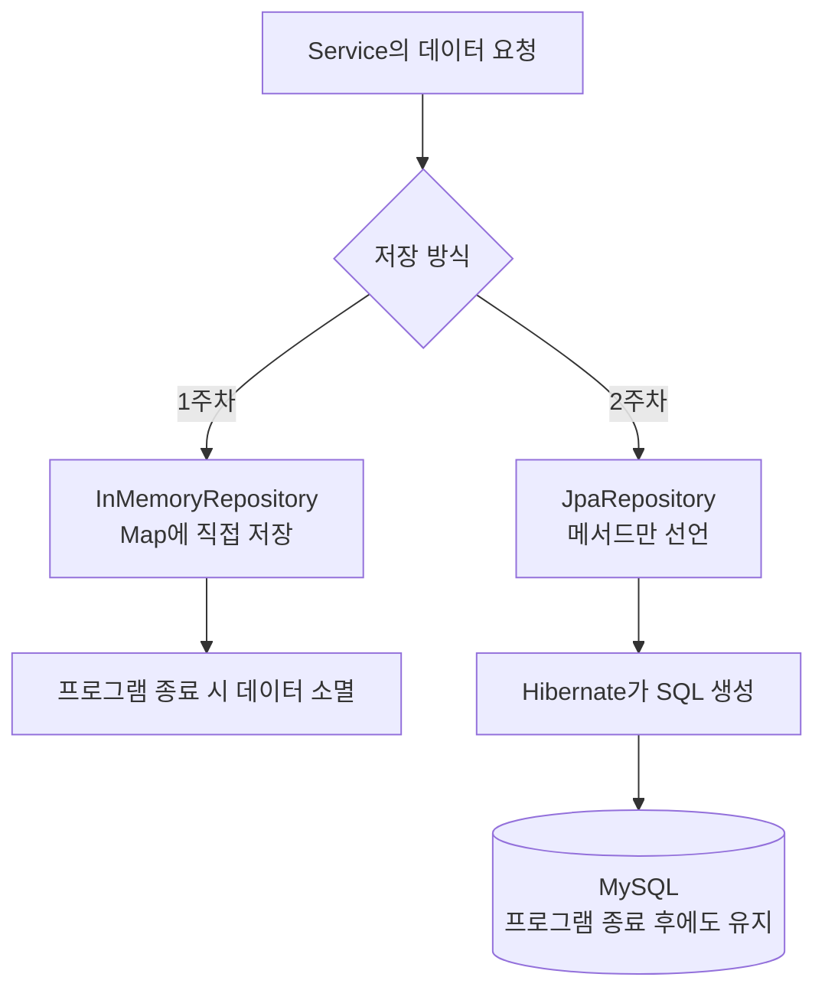
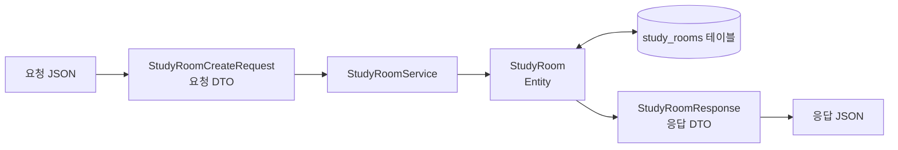
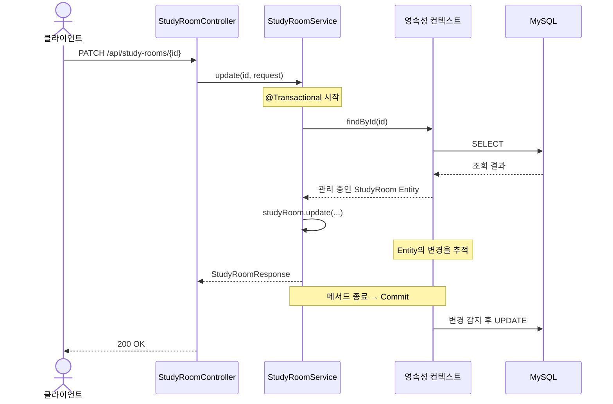
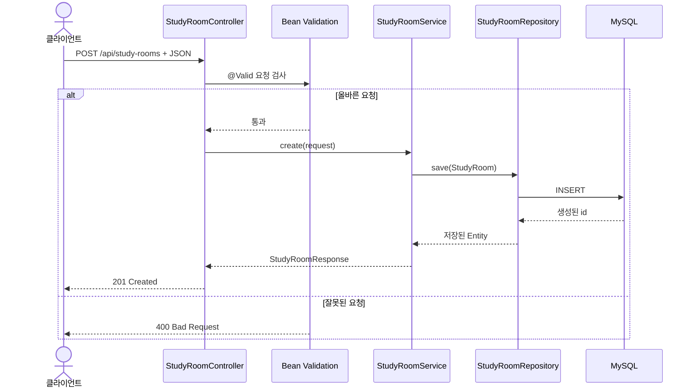

# 2주차 학습 가이드: JPA와 MySQL

이번 주차의 핵심은 코드를 외우는 것이 아니라 다음 한 문장을 이해하는 것입니다.

> Service가 Repository를 호출하면 JPA가 Entity를 SQL로 바꾸어 DB에 저장하고, 조회 결과를 다시 Entity로 만들어 준다.

## 1. 먼저 알아야 할 단어

### Database와 MySQL

Database는 데이터를 오래 보관하고 검색하는 시스템입니다. MySQL은 그중 하나인 관계형 데이터베이스 관리 시스템(RDBMS)입니다. 1주차의 `Map`은 애플리케이션을 종료하면 데이터가 사라지지만, MySQL에 저장한 데이터는 서버를 다시 실행해도 남습니다.

### Table, Row, Column

- **Table**은 같은 종류의 데이터를 모아 놓은 표입니다. `StudyRoom`은 `study_rooms` 테이블과 연결됩니다.
- **Row**는 표 안의 데이터 한 건입니다. 스터디룸 하나가 Row 하나입니다.
- **Column**은 데이터의 항목입니다. `name`, `location`, `capacity` 등이 Column입니다.
- **Primary Key**는 Row를 구별하는 고유 값입니다. 이 프로젝트에서는 `id`입니다.

### Entity

Entity는 DB 테이블과 연결되는 Java 객체입니다. `@Entity`는 JPA가 관리할 클래스라는 표시이고, `@Id`는 Primary Key 필드를 뜻합니다. Entity는 단순 응답 형식이 아니라 저장 상태와 변경을 JPA가 추적하는 객체입니다.

### JPA, Hibernate, Spring Data JPA

세 이름은 역할이 다릅니다.

- **JPA**: Java 객체와 관계형 DB를 연결하기 위한 표준 규칙
- **Hibernate**: JPA 규칙을 실제로 구현해 SQL을 생성하고 실행하는 도구
- **Spring Data JPA**: `JpaRepository` 같은 편리한 인터페이스를 제공하는 Spring 모듈

코드에서는 Spring Data JPA의 Repository를 호출하고, 내부에서는 Hibernate가 JPA 규칙에 따라 SQL을 실행한다고 이해하면 됩니다.

### ORM

ORM(Object-Relational Mapping)은 객체와 관계형 DB를 서로 연결하는 기술입니다. Java의 `StudyRoom.name`과 DB의 `study_rooms.name`을 매핑하는 것이 예입니다. SQL이 완전히 사라지는 것이 아니라, ORM이 상황에 맞는 SQL을 대신 만들어 줍니다.

### Repository

Repository는 데이터 저장과 조회를 담당하는 계층입니다. `StudyRoomRepository extends JpaRepository<StudyRoom, Long>`처럼 선언하면 `save`, `findById`, `findAll`, `delete` 같은 기본 기능을 구현 없이 사용할 수 있습니다.

### Transaction

Transaction은 여러 DB 작업을 하나의 작업 단위로 묶습니다. 모두 성공하면 Commit하고, 중간에 문제가 생기면 Rollback합니다. Service에 `@Transactional`을 붙이면 업무 로직 전체를 하나의 단위로 다룰 수 있습니다.

### 영속성 컨텍스트

영속성 컨텍스트(Persistence Context)는 JPA가 Entity를 관리하는 공간입니다. 같은 트랜잭션 안에서 조회한 Entity의 원본 상태를 기억하고, 필드가 바뀌었는지 추적합니다.

### 변경 감지(Dirty Checking)

트랜잭션 안에서 관리 중인 Entity의 값을 바꾸면, JPA는 트랜잭션이 끝날 때 원래 값과 비교해 UPDATE SQL을 실행합니다. 그래서 `StudyRoomService.update()`는 수정 후 `save()`를 다시 호출하지 않아도 됩니다.

### DTO와 Entity

- **Entity**는 DB 저장 구조와 JPA 상태 관리에 집중합니다.
- **DTO**는 HTTP 요청과 응답의 모양을 표현합니다.

Entity를 API 응답으로 직접 반환하면 DB 구조 변경이 API 계약에 영향을 주고, 노출하면 안 되는 필드까지 나갈 수 있습니다. 이 프로젝트는 `StudyRoomResponse.from(entity)`로 Entity를 응답 DTO로 변환합니다.

### Validation

`@NotBlank`, `@Min`, `@Size`는 요청 값의 기본 규칙을 검사합니다. Controller의 `@Valid`가 검사를 실행하고, 잘못된 값은 Service에 도착하기 전에 400 응답으로 처리됩니다.

## 2. 전체 구조도

아래 구조도는 Mermaid 문법으로 작성했습니다. GitHub, IntelliJ의 Mermaid 지원 Markdown 미리보기, VS Code 확장 등에서 그림으로 볼 수 있습니다.

### HTTP 요청에서 DB까지

```mermaid
flowchart LR
    Client["클라이언트"] -->|HTTP + JSON| Controller["StudyRoomController<br/>요청 수신·Validation"]
    Controller -->|Request DTO| Service["StudyRoomService<br/>업무 규칙·Transaction"]
    Service -->|Entity 저장·조회| Repository["StudyRoomRepository<br/>JpaRepository"]
    Repository --> JPA["JPA / Hibernate<br/>SQL 생성"]
    JPA -->|INSERT·SELECT·UPDATE·DELETE| DB[("MySQL")]
    DB --> JPA
    JPA --> Repository
    Repository -->|Entity| Service
    Service -->|Response DTO| Controller
    Controller -->|HTTP + JSON| Client
```



Controller가 Repository를 직접 호출하지 않는 이유는 HTTP 처리, 업무 규칙, 데이터 접근의 책임을 분리하기 위해서입니다.

### 1주차 저장소와 2주차 저장소 비교



Service가 Repository에 의존한다는 큰 구조는 유지되지만, Repository 뒤의 저장 기술이 `Map`에서 JPA/MySQL로 바뀌었습니다.

### Entity와 DTO의 경계



요청 DTO를 그대로 DB에 저장하거나 Entity를 그대로 응답하지 않고, Service에서 각각의 경계를 변환합니다.

### Transaction과 변경 감지



중요한 점은 `studyRoom.update()`가 SQL을 직접 실행하지 않는다는 것입니다. 관리 중인 Entity가 바뀌고 트랜잭션이 Commit될 때 JPA가 UPDATE를 실행합니다.

## 3. 요청별 코드 흐름

### 스터디룸 생성



직접 따라갈 파일: `StudyRoomController` → `StudyRoomService` → `StudyRoomRepository` → `StudyRoom`

### 스터디룸 조회

```text
GET /api/study-rooms/{id}
  → Controller가 PathVariable id를 받음
  → Service의 읽기 전용 Transaction 안에서 Repository.findById(id) 호출
  → 데이터가 없으면 StudyRoomNotFoundException
  → Entity를 StudyRoomResponse DTO로 변환
  → 200 OK 또는 404 Not Found
```

### 스터디룸 수정과 삭제

- 수정은 Entity의 `update()`를 호출한 뒤 변경 감지로 UPDATE합니다.
- 삭제는 먼저 존재 여부를 확인하고 `repository.delete(entity)`를 호출합니다.
- 두 작업 모두 DB 상태를 바꾸므로 쓰기용 `@Transactional`이 필요합니다.

## 4. 파일별 역할 지도

| 파일 | 한 가지 책임 |
|---|---|
| `application.yml` | MySQL 연결 정보와 JPA 설정 |
| `StudyRoom` | 테이블 매핑과 Entity의 상태 변경 |
| `StudyRoomRepository` | JPA 기반 저장·조회·삭제 |
| `StudyRoomService` | CRUD 업무 흐름과 Transaction 경계 |
| `StudyRoomController` | HTTP 요청·응답과 Validation 시작 |
| `StudyRoomCreateRequest` | 생성 요청 값과 검증 규칙 |
| `StudyRoomUpdateRequest` | 부분 수정 요청 값과 검증 규칙 |
| `StudyRoomResponse` | 외부에 공개할 응답 모양 |
| `GlobalExceptionHandler` | 예외를 일관된 HTTP 오류 응답으로 변환 |

## 5. 추천 학습 순서

1. `application.yml`에서 Java 애플리케이션과 MySQL의 연결 정보를 확인합니다.
2. `StudyRoom` 필드와 실제 `study_rooms` 테이블 Column을 비교합니다.
3. `requests.http`로 생성 → 전체 조회 → 단건 조회 → 수정 → 삭제를 실행합니다.
4. 콘솔에 출력되는 INSERT, SELECT, UPDATE, DELETE SQL을 요청과 연결합니다.
5. `StudyRoomService.update()`에 `save()`가 없는 이유를 변경 감지 흐름으로 설명합니다.
6. 잘못된 `capacity`로 요청해 Validation이 Service 이전에 막는지 확인합니다.
7. 테스트 설정이 MySQL 대신 H2를 사용하는 이유와 한계를 생각해 봅니다.

## 6. 다시 작성해 보는 순서

한 번에 전체 코드를 지우지 말고 아래 순서로 작은 성공을 반복하세요.

1. `application.yml`의 DataSource 설정
2. `StudyRoom` Entity와 JPA Annotation
3. `StudyRoomRepository`
4. `StudyRoomCreateRequest`, `StudyRoomUpdateRequest`
5. `StudyRoomResponse.from()`
6. `StudyRoomService`의 create와 find 메서드
7. `StudyRoomService.update()`와 변경 감지
8. `StudyRoomController`
9. `StudyRoomNotFoundException`, `GlobalExceptionHandler`

각 단계 뒤에 테스트를 실행하고, SQL 로그가 예상한 시점에 발생하는지 확인하세요.

## 7. 자주 헷갈리는 질문

**JPA를 사용하면 SQL을 몰라도 되나요?**  
아닙니다. 반복적인 SQL 작성을 줄여 주지만, 성능과 오류를 이해하려면 어떤 SQL이 실행되는지 알아야 합니다.

**Repository 구현 클래스가 없는데 어떻게 동작하나요?**  
애플리케이션 시작 시 Spring Data JPA가 Repository 인터페이스를 바탕으로 구현 객체를 생성해 Bean으로 등록합니다.

**조회에도 Transaction이 필요한가요?**  
JPA 조회와 영속성 컨텍스트의 범위를 명확히 하고 최적화 의도를 표현할 수 있습니다. 이 프로젝트는 클래스에 `@Transactional(readOnly = true)`를 두고 쓰기 메서드만 일반 Transaction으로 덮어씁니다.

**`ddl-auto: update`를 운영에서도 사용해도 되나요?**  
학습과 로컬 개발에는 편리하지만 운영에서는 예상하지 못한 스키마 변경 위험이 있습니다. 보통 Flyway 같은 Migration 도구로 변경 이력을 관리합니다.

**테스트가 H2에서 통과하면 MySQL에서도 반드시 통과하나요?**  
아닙니다. H2의 MySQL 호환 모드도 SQL 문법과 동작을 완전히 같게 만들지는 못합니다. 빠른 자동 테스트와 별도로 실제 MySQL 통합 확인이 필요합니다.

## 8. 스스로 답해 볼 완료 질문

1. Entity와 DTO를 분리하는 이유는 무엇인가?
2. JPA, Hibernate, Spring Data JPA의 역할은 어떻게 다른가?
3. `JpaRepository`가 대신 제공하는 기능은 무엇인가?
4. `@Transactional`을 Controller가 아니라 Service에 두는 이유는 무엇인가?
5. 영속성 컨텍스트는 Entity를 어떻게 관리하는가?
6. 수정 메서드에서 `save()` 없이 UPDATE가 실행되는 이유는 무엇인가?
7. InMemory Repository와 JPA Repository의 가장 큰 차이는 무엇인가?
8. H2 테스트와 실제 MySQL 테스트를 모두 고려해야 하는 이유는 무엇인가?

이 여덟 질문에 코드 없이 답할 수 있으면 2주차의 핵심 흐름을 이해한 것입니다.
