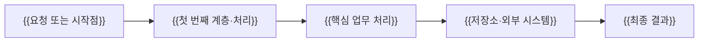
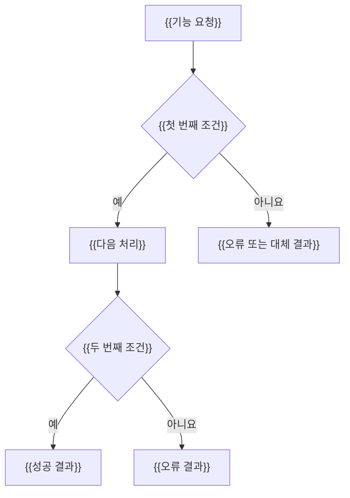
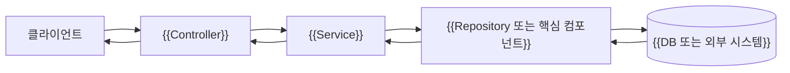
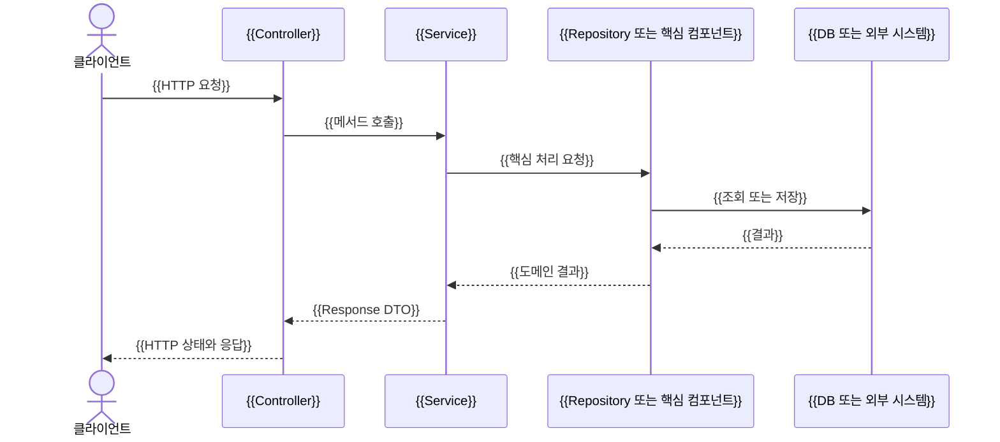

# {{N}}주차 학습 가이드: {{핵심 기술 또는 주제}}

<!--
사용 방법
1. 이 파일을 weekN/LEARNING_GUIDE.md로 복사한다.
2. {{중괄호 항목}}을 해당 주차 내용으로 교체한다.
3. 실제 구현 코드와 일치하지 않는 설명이나 흐름은 넣지 않는다.
4. Mermaid 구조도는 최소 3개(전체 구조, 핵심 처리, 요청 Sequence)를 작성한다.
5. 전문 용어는 처음 등장할 때 쉬운 말과 원어를 함께 적는다.
6. 아래 8개 대단원 구조는 유지한다.
-->

이번 주차의 핵심은 코드를 외우는 것이 아니라 다음 한 문장을 이해하는 것입니다.

> {{이번 주차 전체를 관통하는 원인 → 처리 → 결과를 한 문장으로 작성}}

## 1. 먼저 알아야 할 단어

<!-- 5~10개 정도의 핵심 용어를 "정의 → 왜 필요한가 → 현재 코드의 예" 순서로 설명한다. -->

### {{핵심 용어 1}} ({{영문 원어}})

{{처음 배우는 사람도 이해할 수 있는 설명}}

이 프로젝트에서는 `{{관련 클래스 또는 메서드}}`에서 확인할 수 있습니다.

### {{서로 비교해야 하는 용어 A와 B}}

- **{{용어 A}}**: {{역할과 사용 시점}}
- **{{용어 B}}**: {{역할과 사용 시점}}

둘의 차이는 {{한 문장 비교}}입니다.

### {{주의가 필요한 용어}}

{{흔한 오해, 보안·데이터·트랜잭션상 주의점}}

## 2. 전체 구조도

아래 구조도는 Mermaid 문법으로 작성했습니다. GitHub, IntelliJ의 Mermaid 지원 Markdown 미리보기, VS Code 확장 등에서 그림으로 볼 수 있습니다. 미지원 편집기에서는 코드 블록으로 보일 수 있습니다.

### {{기능 전체의 큰 흐름}}



{{그림에서 반드시 눈여겨볼 연결 관계를 1~2문장으로 설명합니다.}}

### {{성공과 실패가 갈리는 판단 흐름}}



{{현재 구현에서 실제로 발생하는 분기와 나중에 추가할 개념을 구분해 설명합니다.}}

### {{내부 컴포넌트 관계}}



{{각 계층의 책임과 경계를 짧게 설명합니다.}}

## 3. 요청별 코드 흐름

### {{핵심 요청 1}}



직접 따라갈 파일: `{{Controller}}` → `{{Service}}` → `{{Repository/Component}}` → `{{Entity/Domain}}`

### {{핵심 요청 2}}

```text
{{HTTP 요청}}
  → {{첫 번째 단계}}
  → {{두 번째 단계}}
  → {{성공 결과 또는 예외}}
```

{{첫 번째 요청과 다른 핵심 차이를 설명합니다.}}

### {{변경·삭제·예외 등 핵심 요청 3}}

- {{중요 동작 1}}
- {{중요 동작 2}}
- {{실패할 때의 응답과 이유}}

## 4. 파일별 역할 지도

| 파일 | 한 가지 책임 |
|---|---|
| `{{FileA}}` | {{책임}} |
| `{{FileB}}` | {{책임}} |
| `{{FileC}}` | {{책임}} |
| `{{FileD}}` | {{책임}} |
| `{{FileE}}` | {{책임}} |

<!-- 한 파일에 여러 책임을 나열하기보다 학습자가 기억해야 할 대표 책임 하나를 쓴다. -->

## 5. 추천 학습 순서

1. {{가장 먼저 실행해 눈으로 결과를 볼 활동}}
2. {{입력과 출력 또는 저장 결과 비교}}
3. {{핵심 클래스에 중단점을 걸어 관찰할 값}}
4. {{정상 흐름 확인}}
5. {{실패 조건을 만들어 오류 흐름 확인}}
6. {{SQL·로그·테스트 등 내부 동작 확인}}
7. {{완료 기준과 자동 테스트 연결}}

## 6. 다시 작성해 보는 순서

한 번에 전체 코드를 지우지 말고 아래 순서로 작은 성공을 반복하세요.

1. `{{가장 독립적인 DTO 또는 설정}}`
2. `{{Domain 또는 Entity}}`
3. `{{Repository 또는 기반 컴포넌트}}`
4. `{{Service의 가장 단순한 메서드}}`
5. `{{Controller의 가장 단순한 Endpoint}}`
6. `{{수정·검증·인증 등 핵심 로직}}`
7. `{{예외 처리}}`
8. `{{통합 테스트}}`

각 단계 뒤에 `{{테스트 명령}}`을 실행해 어느 단계에서 문제가 생겼는지 확인하세요.

## 7. 자주 헷갈리는 질문

**{{오해하기 쉬운 질문 1}}**  
{{현재 구현을 기준으로 한 짧고 정확한 답변}}

**{{두 기술 또는 개념의 차이를 묻는 질문}}**  
{{비교 답변}}

**{{현재 구현이 단순화한 부분에 관한 질문}}**  
{{학습용 선택임을 밝히고 실제 운영에서 추가할 내용을 설명}}

**{{오류 상태·실행 시점·저장 여부 등에 관한 질문}}**  
{{답변}}

## 8. 스스로 답해 볼 완료 질문

1. {{핵심 용어를 본인의 말로 설명하는 질문}}
2. {{두 개념을 비교하는 질문}}
3. {{특정 Annotation 또는 설정이 필요한 이유}}
4. {{요청이 계층을 이동하는 순서를 설명하는 질문}}
5. {{실패 조건과 오류 응답을 연결하는 질문}}
6. {{현재 설계의 장점 또는 한계를 묻는 질문}}
7. {{코드 한 부분을 제거하면 어떤 일이 생기는지 묻는 질문}}

이 질문들에 코드 없이 답할 수 있으면 {{N}}주차의 핵심 흐름을 이해한 것입니다.

<!--
완성 전 확인 목록
- [ ] 용어가 현재 주차 범위를 넘지 않는가?
- [ ] 모든 설명이 실제 코드와 일치하는가?
- [ ] Mermaid 화살표의 방향과 성공/실패 결과가 정확한가?
- [ ] 인증·트랜잭션·예외처럼 Controller 이전/이후에 끝나는 흐름을 정확히 표현했는가?
- [ ] Entity나 비밀번호 등 노출하면 안 되는 값이 응답 그림에 들어가지 않았는가?
- [ ] 실행 활동, 다시 쓰기 순서, 자가 질문이 서로 연결되는가?
- [ ] README에서 이 가이드로 이동할 수 있는 링크를 추가했는가?
-->
