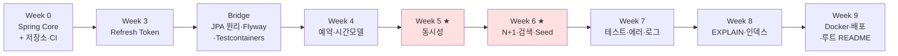
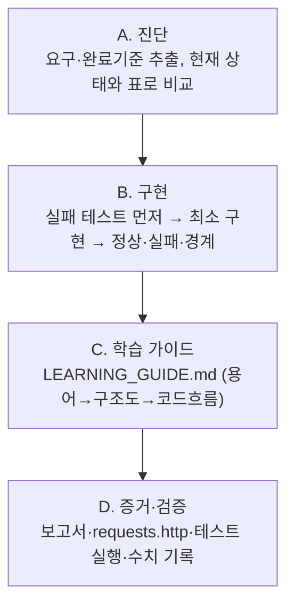

# 학습 로드맵 — 방학 백엔드 트랙

> 이 문서는 **"지금 어디 있고, 다음에 무엇을, 어떻게"** 를 한 화면에서 보는 관제판이다.
> 세부 명세는 [`../Study_plan.md`](../Study_plan.md)에 있고, 이 문서는 그 실행 순서와 학습법 요약이다.
> 기준일 2026-07-22 · 개강 전(~9/1)까지 42일.

---

## 0. 학습 원칙 (모든 구간 공통)

1. **강의를 보지 않는다.** 개념은 *동작을 재현하는 코드를 직접 실행해서* 익힌다. 보유 PDF(김영한)는 **막혔을 때만 찾아보는 사전**이지 교재가 아니다. "완독"은 어디에도 완료 기준이 아니다.
2. **깊이 > 개수, 측정 > 이름, 설명 가능 > 완성.** 기술 이름을 늘리지 말고, 하나를 재현·측정·설명할 수 있게 만든다.
3. **"완주"는 네 가지가 다 있어야 한다.**

   | 요소 | 뜻 |
   |---|---|
   | 동작 | 실제 DB·배포 환경에서 API가 돈다 |
   | 검증 | 정상·실패·경계·동시성 테스트가 통과한다 |
   | 증거 | 쿼리 수·동시성 결과·EXPLAIN 등 Before/After 수치가 남아 있다 |
   | 설명 | 핵심 선택과 실패 원인을 본인 말로 설명하고, 핵심 코드를 다시 쓸 수 있다 |

4. **면접 문장은 그때그때 모은다.** 매일 답한 것 중 쓸 만한 문장을 [`interview-notes.md`](interview-notes.md)에 누적한다.

---

## 1. 전체 학습 순서



★ = 이 프로젝트의 차별점. 시간이 밀려도 **자르지 않는다.**

| 기간 | 구간 | 한 줄 목표 | 핵심 증거 산출물 | 명령 |
|---|---|---|---|---|
| 7/22~7/24 | **Week 0** | Spring이 객체를 만들고 Proxy로 부가기능을 붙이는 원리 + Branch→PR→CI 흐름 | `spring-core-notes.md`, CI 통과 | `week 0 구현해` |
| 7/25~7/27 | **Week 3** | Refresh Token 저장·재발급·Rotation·로그아웃·`Clock` 만료 테스트 | 인증 테스트(기존 5개 유지+추가) | `week 3 구현해` |
| 7/28~8/1 | **Bridge** | 영속성 컨텍스트·LAZY·Transaction을 실험으로 증명 + Flyway·Testcontainers·CI 통합 | `jpa-core-notes.md`, `ddl-auto: validate` | `bridge 구현해` |
| 8/2~8/5 | **Week 4** | 예약 도메인 + 시간 모델링(반개구간 규칙) | `docs/week4/DESIGN_DECISIONS.md` | `week 4 구현해` |
| 8/6~8/10 | **Week 5 ★** | 동시 예약 100건을 재현하고 정확히 1건만 성공시킴 | `docs/week5/CONCURRENCY_REPORT.md` | `week 5 구현해` |
| 8/11 | Buffer A | Week 5 지연 흡수 전용 (안 밀렸으면 복습) | — | — |
| 8/12~8/16 | **Week 6 ★** | N+1 재현·개선(쿼리 수 Before/After) + 검색/페이징 + Seed Data | `docs/week6/N_PLUS_ONE_REPORT.md` | `week 6 구현해` |
| 8/17 | Buffer B | Week 6 지연 흡수 전용 | — | — |
| 8/18~8/21 | **Week 7** | 테스트 분류 + ErrorCode + Swagger + 로그 | `docs/week7/TEST_STRATEGY.md` | `week 7 구현해` |
| 8/22~8/24 | **Week 8** | 검색 쿼리 EXPLAIN → 인덱스 설계·측정 | `docs/week8/INDEX_REPORT.md` | `week 8 구현해` |
| 8/25~8/29 | **Week 9** | Docker + 실배포 + 채용용 루트 README 완성 | `docs/week9/DEPLOYMENT_RUNBOOK.md`, 배포 URL | `week 9 구현해` |
| 8/30~9/1 | Buffer C | 복습·면접 설명 연습·Velog 마무리 (기능 구현 금지) | — | — |

> Week 1·2는 완료된 기준선이며 `archive/`로 동결. Week 10~12(Redis·k6 등)는 개강 전 필수 범위가 아니다.

---

## 2. 각 구간을 굴리는 방식

`week N 구현해`를 요청하면 AI는 항상 같은 순서를 밟는다. 학습자는 이 흐름을 알고 각 단계에서 **직접 답할 부분**을 채운다.



- **AI가 하는 것**: 진단표, 실패 테스트, 최소 구현, 가이드 초안, 측정 실행.
- **본인이 하는 것**: `[직접 작성]` 답변, 실험 결과 해석, 면접 노트, "이 코드 왜 이렇게?"에 대한 설명. → 여기가 실제 실력이 되는 부분.

### 하루 루프

1. 어제까지의 완료 기준 중 안 된 것 확인.
2. 오늘 구간의 실패 테스트 → 통과 → 경계까지.
3. 관찰한 것(쿼리·로그·수치)을 해당 노트/보고서에 **본인 문장으로** 기록.
4. 면접에서 쓸 한 문장을 `interview-notes.md`에 추가.
5. Feature Branch → PR → CI 통과 후 병합.

---

## 3. 저장소에서 무엇이 어디에 있나

```
루트/
├─ app/                     ← 실제 빌드·배포되는 단 하나의 프로젝트 (인증부터 배포까지 누적)
│  └─ src/test/.../experiments/   ← Week 0 Spring Core 실험 + Bridge JPA 실험
├─ docs/weekN/              ← 주차별 설계결정·측정 보고서 (증거)
├─ archive/week1, week2     ← 학습 기록. 읽기 전용, 수정 금지
├─ study_docs/
│  ├─ LEARNING_ROADMAP.md   ← (이 문서)
│  ├─ spring-core-notes.md  ← Week 0 답변
│  ├─ jpa-core-notes.md     ← Bridge 답변
│  └─ interview-notes.md    ← 면접 문장 누적
├─ README.md                ← 채용 담당자용 (Week 9 완성)
└─ Study_plan.md            ← 전체 실행 명세
```

규칙: **Week 4부터 `weekN/` 폴더를 새로 만들지 않는다.** 코드는 `app/` 한 곳에 쌓고 문서만 `docs/weekN/`에 둔다. `archive/`는 버그가 있어도 고치지 않는다(고칠 건 `app/`에서). — `Study_plan.md` §3.3, §5.5.

---

## 4. 막혔을 때만 찾아볼 위치

문서는 처음부터 읽지 않는다. 실험에서 막힌 지점만 펴고, 읽은 위치를 노트에 링크로 남긴다.

| 막힌 주제 | 찾아볼 곳 |
|---|---|
| IoC/DI·컨테이너·Bean·Singleton·Component Scan·의존관계 주입 | `spring-basic.zip` 해당 장 |
| AOP·Proxy | `spring-start-v20260130/7. AOP.pdf` |
| 영속성 컨텍스트·변경 감지 (이미 정리한 것) | `archive/week2/LEARNING_GUIDE.md` (본인이 쓴 것) |
| 영속성 컨텍스트·Flush·Proxy·Fetching | Hibernate ORM User Guide |
| Repository·파생 Query·`@EntityGraph` | Spring Data JPA Reference |
| Transaction 경계·전파 | Spring Framework Reference — Data Access |
| 그 외 Spring Core | Spring Framework Reference — Core / Testing |

---

## 5. 시간이 밀리면 자르는 순서

위에서부터 자른다. 아래 다섯은 **절대 자르지 않는다** → 동시성·N+1·인덱스·테스트·CI·배포.

1. Week 11 k6 / Connection Pool
2. Week 10 Redis
3. Week 6 찜 기능(애초에 제외)
4. Refresh Token 고급 재사용 탐지
5. 부가적인 리뷰 수정·삭제

Buffer는 **바로 앞 구간의 지연 흡수 전용**이다. "나중에 몰아서"로 뒤 구간을 당겨 쓰지 않는다.

---

## 6. 진행 체크리스트

각 구간의 완료 기준 전체는 `Study_plan.md`의 해당 절에 있다. 여기서는 "이 구간을 넘어갈 수 있는가"만 체크한다.

- [ ] **Week 0** — 실험 6개 통과 + `spring-core-notes.md` 본인 답변 + `app/` 구조 전환 + PR에서 CI 통과
- [ ] **Week 3** — Refresh 재발급/Rotation/로그아웃/`Clock` 만료 테스트 통과, 기존 5개 유지, `app/`으로 이전 완료
- [ ] **Bridge** — JPA 실험 8개 통과 + `jpa-core-notes.md` + `ddl-auto: validate` 시작 + Testcontainers CI 통과
- [ ] **Week 4** — 시간 정책이 문서·Service·Query·Test에서 일치
- [ ] **Week 5 ★** — 100건 중 정확히 1건, DB에도 1건, 반복해도 동일
- [ ] **Week 6 ★** — 동일 데이터에서 쿼리 수 Before/After 수치, Seed Data 재현 가능
- [ ] **Week 7** — 테스트가 왜 Unit/Slice/Integration인지 설명, 민감정보 로그 미노출
- [ ] **Week 8** — 인덱스 전/후 EXPLAIN 보관, Flyway로 인덱스 추가
- [ ] **Week 9** — 외부 URL에서 Health Check·핵심 API 동작, 루트 README 완성

---

*다음 한 걸음: `week 0 구현해` — Spring Core 실험 6개를 `app/src/test/.../experiments/`에서 채우고, 답을 `spring-core-notes.md`에 남긴다.*
